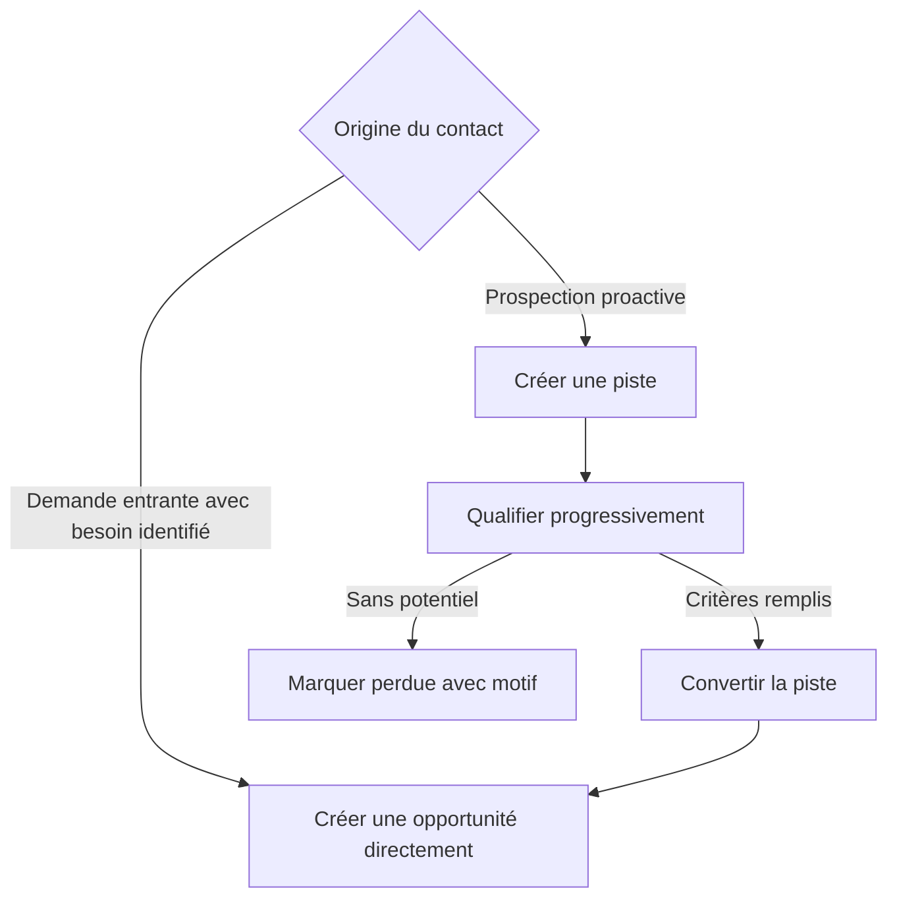
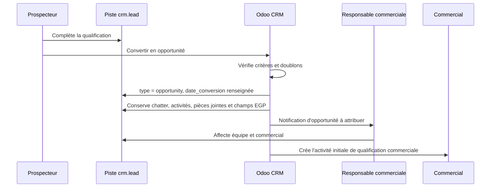
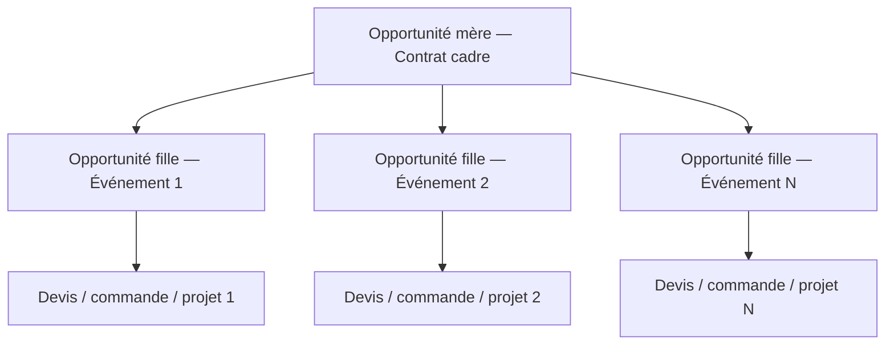
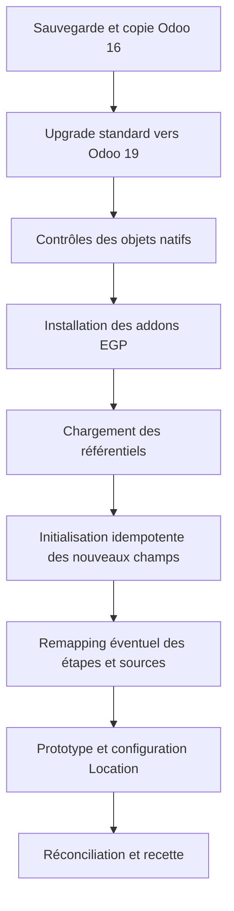

# Spécification fonctionnelle et technique

## Référentiel Contacts, Pistes et Opportunités — Odoo 19

| Élément | Valeur |
|---|---|
| Projet | Refonte de l'ERP Odoo 19 — Espace Grand Paris (EGP) |
| Périmètre | Contacts, prospection sortante, CRM Opportunités, interfaces Ventes/Projet/Facturation |
| Cible | Odoo 19, base multi-sociétés |
| Origine | Mise à niveau en cours depuis Odoo 16 |
| Statut | Révision 0.5 — retours client v0.4 : apporteur d'affaire, taxonomie des types d'événement, segment de marché, nombre d'événements annuels, validations de décisions |
| Préfixe technique proposé | `egp_` |
| Principe directeur | Standard Odoo 19 d'abord, extension par addons versionnés lorsque le standard ne suffit pas |

> **Objet du document.** Cette spécification consolide les trois Documents de Conception Fonctionnelle fournis pour les modules Contacts, Pistes et CRM — Opportunités. Elle transforme le besoin métier en une proposition d'implémentation Odoo 19 : modèles natifs étendus, référentiels configurables, vues, automatisations, sécurité, mise à niveau de la base et critères de recette.

> **Statut des décisions.** Les exigences explicitement présentes dans les DCF sont indiquées comme **Exigence DCF**. Les choix de modélisation Odoo sont indiqués comme **Décision d'architecture proposée**. Les éléments non tranchés dans les DCF sont indiqués **À valider**.

## Historique des versions

| Version | Date | Évolution principale | Statut |
|---|---|---|---|
| 0.1 | 2026-08-05 | Première consolidation des trois DCF | Archivée comme base de travail |
| 0.2 | 2026-08-09 | SIRET natif, nom natif, première hypothèse Rendez-vous, perte native, approbation Studio et réécriture de la mise à niveau Odoo 16 → 19 | Archivée comme base de travail |
| 0.3 | 2026-08-09 | Décisions client intégrées : multi-sociétés, filiales, qualification, sécurité équipe, paramètres administrables, import ADN manuel, projet enrichi depuis le CRM et réouverture de l’architecture Location/espaces | Archivée comme base de travail |
| 0.4 | 2026-08-09 | Étapes post-gain toutes `is_won` avec KPI ancrés sur `date_closed` ; exclusion des opportunités de type contrat cadre des prévisions et taux ; distinction explicite champs calculés événementiels vs champs mis à jour par cron ; clarification option/espaces en deux temps (intention commerciale sur le lead, engagement dans Location) ; reprise automatique des données de qualification dans le devis de location, indicateur de disponibilité en qualification et mise à jour des dates du devis via bandeau + bouton ; suppression de la colonne probabilité indicative ; nettoyage des dépendances d'addons ; complétude Contacts non stockée ; corrections de numérotation | Archivée comme base de travail |
| 0.5 | 2026-09-06 | Retours client v0.4 : apporteur d'affaire et trois schémas d'intermédiation (§7.2.1, §8.5) ; taxonomie hiérarchique des types d'événement fournie (§8.10) ; segment de marché (§8.11) ; nombre d'événements annuels ; précision du nombre de personnes ; validation des décisions EGP-DEC-003/005/009/029 et arbitrage EGP-DEC-010A/021 | Révision courante |

## Table des matières

1. [Résumé exécutif](#1-résumé-exécutif)
2. [Sources, périmètre et conventions](#2-sources-périmètre-et-conventions)
3. [Architecture fonctionnelle cible](#3-architecture-fonctionnelle-cible)
4. [Architecture des addons Odoo](#4-architecture-des-addons-odoo)
5. [Conception du référentiel Contacts](#5-conception-du-référentiel-contacts)
6. [Conception des Pistes](#6-conception-des-pistes)
7. [Conception des Opportunités](#7-conception-des-opportunités)
8. [Référentiels configurables](#8-référentiels-configurables)
9. [Vues, menus et ergonomie](#9-vues-menus-et-ergonomie)
10. [Processus et automatisations](#10-processus-et-automatisations)
11. [Sécurité, rôles et droits d'accès](#11-sécurité-rôles-et-droits-daccès)
12. [Reporting et indicateurs](#12-reporting-et-indicateurs)
13. [Mise à niveau Odoo 16 vers Odoo 19 et initialisation EGP](#13-mise-à-niveau-odoo-16-vers-odoo-19-et-initialisation-egp)
14. [Règles techniques et non fonctionnelles](#14-règles-techniques-et-non-fonctionnelles)
15. [Stratégie de tests et critères de recette](#15-stratégie-de-tests-et-critères-de-recette)
16. [Registre des décisions](#16-registre-des-décisions)
17. [Plan d'implémentation proposé](#17-plan-dimplémentation-proposé)
18. [Annexes](#18-annexes)

---

# 1. Résumé exécutif

## 1.1 Objectif métier

Le périmètre doit fournir une chaîne commerciale continue et traçable :


Les principes fonctionnels structurants sont les suivants :

- le module Contacts est le référentiel unique des organisations et personnes ;
- une piste représente exclusivement une action de prospection sortante ;
- une demande entrante qualifiée devient directement une opportunité ;
- une opportunité représente un besoin commercial réel ;
- les données permanentes ne sont jamais dupliquées dans le CRM ;
- les données collectées sur une piste sont conservées lors de sa conversion ;
- les suppressions métier sont interdites au profit de la perte ou de l'archivage ;
- les listes métier sont administrées, historisées et non créées librement par les utilisateurs.

Sources : DCF Contacts §1 à §5 ; DCF Pistes §1 à §6 ; DCF Opportunités §1 à §6.

## 1.2 Décision structurante : étendre les modèles natifs

> **Décision d'architecture proposée — validité forte.** Ne pas créer un modèle parallèle de piste ni un CRM séparé. Les pistes et opportunités seront portées par le modèle natif `crm.lead`, dont le champ natif `type` distingue `lead` et `opportunity`.

Cette approche présente quatre avantages déterminants :

1. la conversion standard transforme le même enregistrement de piste en opportunité ;
2. le chatter, les messages, activités, pièces jointes et abonnés restent attachés au même identifiant ;
3. les vues Kanban, activités, reporting CRM et intégrations Ventes sont réutilisées ;
4. la maintenance et les futures montées de version restent plus simples qu'avec un modèle métier parallèle.

La fiche Organisation/Contact reposera sur `res.partner`, étendu uniquement pour les données métier absentes du standard.

## 1.3 Décision structurante : les listes métier sont des modèles de référence

> **Décision d'architecture proposée.** Tout champ dont les valeurs doivent être modifiables par un administrateur fonctionnel sera un `Many2one` ou un `Many2many` vers un modèle de référence. Les `fields.Selection` codés en Python seront réservés aux états techniques stables qui ne doivent pas être administrés depuis l'interface.

Exemples :

- type de structure → `egp.structure.type` ;
- activité principale → `egp.business.activity` ;
- type d'événement → `egp.event.type` ;
- température → `egp.lead.temperature` ;
- niveau de maturité → `egp.maturity.level` ;
- type d'opportunité → `egp.opportunity.type`.

Les référentiels Odoo natifs seront réutilisés lorsqu'ils répondent au besoin : `res.partner.industry`, `utm.source`, `utm.medium`, `res.lang`, `crm.stage`, `crm.lost.reason`, `res.partner.category`.

## 1.4 Décision structurante : une suite d'addons plutôt qu'un addon monolithique

Le besoin est présenté comme un « module custom ». Techniquement, il est recommandé de livrer une suite cohérente d'addons et un méta-addon d'installation :

| Addon | Responsabilité |
|---|---|
| `egp_master_data` | Extensions Contacts, référentiels partagés, gouvernance et qualité des données |
| `egp_crm` | Extensions Pistes/Opportunités, qualification, pipelines, vues et sécurité CRM |
| `egp_crm_rental` | Intégration conditionnelle entre le CRM et l'application Location pour les espaces, périodes, options et disponibilités ; activée après clôture de `EGP-DEC-010A` et `EGP-DEC-020` |
| `egp_crm_sale_project` | Création orchestrée du projet et transfert contrôlé des informations CRM, interfaces Ventes/Documents et indicateurs financiers |
| `egp_commercial` | Méta-addon dépendant des addons retenus, sans logique métier |

Cette séparation évite d'imposer la dépendance Location tant que son modèle de données n'est pas confirmé, permet d'installer les référentiels sans forcer les dépendances Ventes/Projet et limite les impacts lors des évolutions.

## 1.5 Écarts principaux entre les DCF et le standard Odoo

| Sujet | Couverture proposée |
|---|---|
| Organisation/personne, coordonnées, langue, vendeur, secteur | Standard `res.partner` complété |
| Piste/opportunité, conversion, étapes, activités, chatter, perte | Standard `crm.lead` complété |
| Conversion avec conservation de l'historique | Standard Odoo, même enregistrement |
| Contrôle fin des critères de conversion | Développement ciblé dans `egp_crm` |
| Référentiels dépendants secteur/activité | Développement léger : modèle + domaine dynamique + contrainte |
| Rôles Prospecteur/Commercial/ADV/Direction | Groupes, ACL, règles d'enregistrement et contrôles serveur spécifiques |
| Espaces, périodes et disponibilité | Application Location à prototyper ; intégration isolée dans `egp_crm_rental`, sans supposer `appointment.resource` |
| Option commerciale sur un espace | État CRM + document/période de Location ou mécanisme de maintien d'option à confirmer par prototype |
| Contrat cadre mère/filles | Relations spécifiques sur `crm.lead` |
| Création du projet événementiel | Développement spécifique validé dans `egp_crm_sale_project`, pouvant réutiliser `sale_project` comme socle |
| KPI transverses CRM/Ventes/Projet/Facturation | Standard quand possible ; rapport SQL ou Spreadsheet dédié pour le reste |
| Historique des activités | Rapport natif utilisé en V1 ; journal custom uniquement si l'écart est démontré |
| Tableau de bord cockpit très personnalisé | Phase 2, après validation des KPI et de l'ergonomie |

# 2. Sources, périmètre et conventions

## 2.1 Documents sources

| Référence | Document | Usage dans cette spécification |
|---|---|---|
| DCF-CONTACTS | Document de Conception Fonctionnelle — Module Contacts — Odoo 19, V1.0 | Référentiel organisations/personnes, champs, listes, qualité et droits |
| DCF-PISTES | Document de Conception Fonctionnelle — Module Pistes — Odoo 19, V1.0 | Prospection sortante, pipeline, qualification, conversion et droits |
| DCF-CRM | Document de Conception Fonctionnelle — CRM Opportunités, V1.0 | Cycle de vente, événements, contrats cadres, options, finance et production |

## 2.2 Périmètre inclus

- extension de `res.partner` pour les organisations et les contacts ;
- référentiels métier communs ;
- gestion des pistes de prospection sortante ;
- conversion des pistes en opportunités ;
- création directe d'opportunités pour les demandes entrantes ;
- gestion des événements ponctuels et contrats cadres ;
- activités, rappels, alertes et règles de qualité ;
- vues Formulaire, Liste, Kanban, Activités, Calendrier, Recherche et Pivot/Graphique ;
- groupes, ACL, règles d'enregistrement, restrictions de suppression et validations serveur ;
- interfaces fonctionnelles avec Ventes, Projet, Documents et Facturation ;
- mise à niveau standard Odoo 16 vers Odoo 19, puis installation et initialisation des nouveaux champs EGP.

## 2.3 Hors périmètre de la version initiale

Sauf validation complémentaire, les éléments suivants ne sont pas conçus en détail dans cette version :

- planification détaillée des équipes, du matériel et des opérations de production ;
- production technique, restauration et logistique détaillées ;
- règles comptables, facturation et encaissement des acomptes ;
- moteur complet de tarification des espaces et prestations au-delà des capacités natives de Location ;
- portail client ;
- campagnes marketing automatisées ;
- intégration API ADN Data : la V1 retient uniquement un import manuel contrôlé ;
- tableau de bord OWL entièrement sur mesure ;
- application mobile spécifique.

La sélection des espaces dans le CRM, l'espace principal, les options et le besoin de visualisation de disponibilité restent dans le périmètre. Leur portage technique dans l'application Location doit être consolidé avant développement de l'addon d'intégration.

## 2.4 Niveaux de priorité

| Priorité | Définition |
|---|---|
| P0 — Indispensable | Bloque le processus, la sécurité, la mise à niveau ou la continuité des données |
| P1 — Souhaitée | Apporte un gain important de qualité ou de productivité |
| P2 — Évolutive | Optimisation pouvant être livrée après stabilisation du socle |

Cette convention reprend la grille des DCF : rouge indispensable, orange souhaitée, vert évolutive.

## 2.5 Conventions d'identification

| Objet | Préfixe |
|---|---|
| Exigence fonctionnelle | `EGP-FR-XXX` |
| Champ | `EGP-FLD-XXX` |
| Référentiel | `EGP-REF-XXX` |
| Vue | `EGP-VIEW-XXX` |
| Règle de gestion | `EGP-RG-XXX` |
| Automatisation | `EGP-AUTO-XXX` |
| Règle de sécurité | `EGP-SEC-XXX` |
| Test de recette | `EGP-TST-XXX` |

## 2.6 Glossaire

| Terme | Définition |
|---|---|
| Organisation | Personne morale ou entité cliente/prospect portée par une fiche société `res.partner` |
| Contact | Personne physique rattachée à une organisation via `parent_id` |
| Piste | Enregistrement `crm.lead` avec `type = 'lead'`, créé uniquement pour une prospection sortante |
| Opportunité | Enregistrement `crm.lead` avec `type = 'opportunity'`, correspondant à un besoin identifié |
| Conversion | Transformation native de la piste en opportunité sur le même enregistrement |
| Commercial référent | Utilisateur affecté au champ natif `user_id` après conversion ou création directe |
| Prospecteur | Utilisateur à l'origine et responsable de la qualification de la piste, mémorisé dans `egp_prospector_id` |
| Référentiel | Liste administrable portée par un modèle Odoo, avec code, libellé, ordre et archivage |
| Contrat cadre | Opportunité mère représentant un accord global, reliée à plusieurs opportunités filles événementielles |

---

# 3. Architecture fonctionnelle cible

## 3.1 Source de vérité de chaque famille de données

| Donnée | Source de vérité | Modèle principal | Règle |
|---|---|---|---|
| Identité de l'organisation | Contacts | `res.partner` société | Jamais ressaisie dans le CRM |
| Identité de la personne | Contacts | `res.partner` personne | Rattachée à l'organisation |
| Type de structure, secteur, activité | Contacts/référentiels | `res.partner` + référentiels | Réutilisé partout |
| Prospection sortante | Pistes | `crm.lead`, type `lead` | Pas de devis ni de négociation |
| Besoin commercial | Opportunités | `crm.lead`, type `opportunity` | Référentiel de la décision commerciale |
| Devis et commande | Ventes | `sale.order` | Le CRM ne duplique pas les versions de devis |
| Location d'espaces | Location | Produits louables et documents/périodes de location ; modèle exact à confirmer | Source de vérité de la disponibilité et des **engagements** de location (une fois un document Location créé) |
| Espaces et dates souhaités (intention) | CRM | Champs `egp_space_ids` / `egp_main_space_id` / `egp_event_start` / `egp_event_end`, cible technique à confirmer | Expriment un **besoin commercial** en qualification, avant toute réservation ; ne bloquent aucune disponibilité et ne dupliquent pas Location tant qu'aucun engagement n'existe |
| Production événementielle | Projet | `project.project` / `project.task` | Créée à la confirmation de commande et enrichie depuis le CRM par développement spécifique |
| Factures et paiements | Comptabilité | `account.move` / paiements | Données remontées en lecture dans le CRM |
| Documents | Pièces jointes/Documents | `ir.attachment` / `documents.document` | Liés à l'objet d'origine |

## 3.2 Frontières fonctionnelles

### Contacts

Le module Contacts contient les données permanentes et structurantes. Il ne contient pas de notes de négociation, de budget de dossier, de date d'événement ou d'état de vente.

### Pistes

Le module Pistes contient les informations nécessaires à la prospection et à une qualification initiale. Le Prospecteur n'émet pas de devis et ne négocie pas les conditions commerciales.

### Opportunités

Le CRM contient le besoin, la stratégie commerciale, les options, les risques, le prévisionnel et les prochaines actions. La sélection d'un espace dans le CRM exprime un besoin commercial. La disponibilité et l'engagement effectif de location doivent être portés par l'application Location selon l'architecture à consolider en `EGP-DEC-010A` et `EGP-DEC-020`. Après confirmation, le CRM reste la référence de la relation commerciale ; le Projet devient la référence de la production.

## 3.3 Origine des opportunités



**EGP-RG-001 — Origine obligatoire**

- Une piste ne peut avoir que les sources de prospection autorisées : réactivation, recherche commerciale ou ADN Data.
- Un formulaire web, un appel entrant, un e-mail entrant, une recommandation spontanée ou une nouvelle demande d'un client existant crée directement une opportunité.
- Le champ natif `source_id` porte la source détaillée ; le champ technique `egp_creation_mode` conserve la famille d'origine. La valeur `legacy_unknown` est réservée aux dossiers historiques dont le flux commercial initial ne peut pas être déterminé.

## 3.4 Représentation des pipelines

### Pipeline Pistes

| Séquence | Étape affichée | Code technique proposé | Sortie attendue |
|---:|---|---|---|
| 10 | Nouvelle | `LEAD_NEW` | Premier contact réalisé |
| 20 | En cours de qualification | `LEAD_QUALIFYING` | Qualification suffisante ou relance |
| 30 | En attente / À relancer | `LEAD_FOLLOW_UP` | Nouvel échange |
| 40 | Qualifiée | `LEAD_QUALIFIED` | Conversion |

> **Décision d'architecture proposée.** « Convertie » n'est pas une colonne persistante : la conversion change le type en opportunité et renseigne la date native `date_conversion`. « Perdue » utilise l'action native de perte et le référentiel `crm.lost.reason`, plutôt qu'une colonne de pipeline. Des filtres « Converties » et « Perdues » restituent les vues demandées par le DCF.

### Pipeline Opportunités

| Séquence | Étape affichée | Code technique proposé | `is_won` |
|---:|---|---|:---:|
| 10 | Nouvelle / À qualifier | `OPP_NEW` | Non |
| 20 | Qualifiée | `OPP_QUALIFIED` | Non |
| 30 | Proposition commerciale | `OPP_PROPOSAL` | Non |
| 40 | Négociation | `OPP_NEGOTIATION` | Non |
| 50 | Gagnée / Commande confirmée | `OPP_WON` | Oui |
| 60 | Acompte versé | `OPP_DEPOSIT_PAID` | Oui |
| 70 | Événement réalisé | `OPP_EVENT_DONE` | Oui |
| 80 | Clôturée | `OPP_CLOSED` | Oui |

L'action native « Perdu » porte le statut négatif à 0 %, avec motif obligatoire.

> **Décision validée — EGP-DEC-016.** La probabilité native Odoo est utilisée. Aucune probabilité fixe par étape n'est codée dans `crm.stage` — ce modèle ne possède d'ailleurs pas de champ de probabilité — et aucun champ `egp_default_probability` n'est créé. La colonne de probabilité indicative du DCF est supprimée de cette spécification pour éviter toute confusion avec le calcul automatisé d'Odoo.

> **Décision validée — EGP-DEC-042 (étapes post-gain visibles).** Le client souhaite un repérage visuel du cycle après la vente. Les quatre étapes `OPP_WON`, `OPP_DEPOSIT_PAID`, `OPP_EVENT_DONE` et `OPP_CLOSED` sont donc toutes marquées `is_won = True`. Comportement natif vérifié dans `crm.lead` :
>
> - la date de gain `date_closed` est renseignée **au premier passage** dans une étape `is_won` (`OPP_WON`) et **préservée** lors des transitions suivantes ; elle ne se réinitialise pas ;
> - la probabilité reste à 100 % sur l'ensemble de ces étapes, sans recalcul automatique à la baisse ;
> - les opportunités restent visibles dans le Kanban, ce qui répond au besoin de suivi visuel.
>
> Conséquences à respecter pour ne pas fausser les indicateurs :
>
> - la **date de gain et les cohortes de conversion** sont mesurées sur `date_closed` (entrée dans `OPP_WON`), jamais sur l'étape courante ;
> - les étapes `is_won` sont **exclues** de la règle « activité obligatoire » (EGP-FR-022) et du vieillissement/rotting ;
> - le suivi opérationnel de l'acompte, de la réalisation et de la clôture reste porté par la commande, le projet et les champs administratifs (`egp_admin_status_id`, `egp_admin_closure_date`) ; les étapes CRM n'en sont qu'un reflet visuel et ne constituent pas la source de vérité.

## 3.5 Équipes commerciales

Deux équipes CRM distinctes sont proposées :

| Équipe | Type d'enregistrements | Étapes |
|---|---|---|
| Prospection sortante | Pistes | `LEAD_*` |
| Commercial EGP | Opportunités | `OPP_*` |

Les étapes sont rattachées aux équipes par le champ natif `crm.stage.team_ids`, ce qui évite de mélanger les deux pipelines.

## 3.6 Multi-sociétés

> **Décision validée — EGP-DEC-001.** Les organisations et contacts externes sont partagés entre les sociétés Odoo en laissant `res.partner.company_id` vide, sauf exception légale ou organisationnelle explicitement documentée. Les opportunités, devis, locations, projets et factures portent leur société propre.

Cette stratégie évite de dupliquer une même organisation entre la SCIC, MLK Restauration et les autres entités, tout en conservant les règles multi-sociétés sur les transactions.

---

# 4. Architecture des addons Odoo

## 4.1 Dépendances natives

> **Principe.** Seules les dépendances directes sont déclarées. Les modules tirés transitivement ne sont pas re-listés : `egp_master_data` amène déjà `crm`/`utm`/`mail`, `sale_crm` amène `crm`+`sale`, et `sale_project` amène `sale_management`+`project`+`account`.

### `egp_master_data`

```python
'depends': [
    'contacts',
    'crm',
    'utm',
    'base_vat',
]
```

### `egp_crm`

```python
'depends': [
    'egp_master_data',
    'calendar',
    'base_automation',
]
```

### `egp_crm_rental` — conditionnel

```python
'depends': [
    'egp_crm',
    'sale_crm',
    'sale_renting',  # nom technique à confirmer sur l'édition Enterprise cible
]
```

Cet addon n'est finalisé qu'après le prototype Location. Aucune dépendance à l'application Rendez-vous n'est retenue dans le socle CRM.

### `egp_crm_sale_project`

```python
'depends': [
    'egp_crm',
    'sale_crm',
    'sale_project',
]
```

`documents` et `sign` restent des dépendances optionnelles uniquement si les fonctionnalités correspondantes sont retenues dans le lot. L'application **Approbations** n'est pas une dépendance : la validation simple des remises est configurée avec une règle d'approbation Studio. Studio est un outil de configuration de la base Enterprise et n'est pas ajouté comme dépendance fonctionnelle de l'addon.

## 4.2 Arborescence proposée

```text
addons/
├── egp_master_data/
│   ├── models/
│   │   ├── reference_mixin.py
│   │   ├── reference_models.py
│   │   ├── res_partner.py
│   │   └── res_config_settings.py
│   ├── security/
│   ├── data/
│   ├── views/
│   ├── upgrades/
│   └── tests/
├── egp_crm/
│   ├── models/
│   │   ├── crm_lead.py
│   │   ├── crm_stage.py
│   │   ├── crm_team.py
│   │   └── res_config_settings.py
│   ├── wizard/
│   ├── security/
│   ├── data/
│   ├── views/
│   ├── upgrades/
│   └── tests/
├── egp_crm_rental/
│   ├── models/
│   ├── security/
│   ├── views/
│   ├── upgrades/
│   └── tests/
├── egp_crm_sale_project/
│   ├── models/
│   │   ├── sale_order.py
│   │   ├── project_project.py
│   │   ├── account_move.py
│   │   └── crm_lead.py
│   ├── security/
│   ├── data/
│   ├── views/
│   ├── upgrades/
│   └── tests/
└── egp_commercial/
    └── __manifest__.py
```

## 4.3 Principes de développement

- aucun fork du code natif Odoo ;
- héritage Python par `_inherit` et vues XML héritées ;
- aucun champ basé sur le libellé d'une étape ou d'un référentiel ; la logique utilise des codes stables ;
- aucune suppression physique d'une valeur de référentiel déjà utilisée ;
- scripts de mise à jour futurs idempotents et versionnés ;
- toutes les validations de sécurité importantes sont réalisées côté serveur, pas uniquement dans les vues ;
- les champs calculés utilisés dans les filtres ou regroupements sont stockés et indexés lorsque pertinent ;
- un champ dont la valeur dépend de l'écoulement du temps (inactivité, période glissante, expiration d'option, passage en dormant) n'est jamais un simple champ calculé stocké par `@api.depends` : il est soit calculé à la volée, soit un champ régulier rafraîchi par lot via un `ir.cron`, car un `@api.depends` ne se redéclenche pas au seul passage du temps ;
- les méthodes d'automatisation sont réentrantes afin d'éviter les doublons d'activités ou de projets.

---
# 5. Conception du référentiel Contacts

## 5.1 Exigences fonctionnelles

**EGP-FR-001 — Unicité des organisations.** Une organisation ne doit exister qu'une seule fois dans Odoo. Avant toute création, l'utilisateur s'appuie sur la recherche et les alertes natives portant notamment sur le nom, le nom commercial, le SIRET/identifiant de registre, le site web et l'e-mail générique.

**EGP-FR-002 — Unicité des personnes.** Une personne ne doit exister qu'une seule fois. La recherche porte au minimum sur le nom complet, l'e-mail normalisé et le téléphone normalisé.

**EGP-FR-003 — Hiérarchie organisation/personne.** Une organisation est une fiche `res.partner` de type société. Chaque personne est une fiche `res.partner` de type personne et est rattachée à l'organisation par `parent_id`.

**EGP-FR-003A — Filiales et établissements.** Une filiale ou un établissement doté de sa propre personnalité juridique, de son propre identifiant légal ou de sa propre facturation est créé comme organisation distincte et peut être relié à son groupe de rattachement. Un simple site, bureau ou adresse d'exploitation sans personnalité juridique est créé comme adresse enfant de l'organisation, avec le type d'adresse natif adapté ; il ne crée pas une seconde organisation commerciale.

**EGP-FR-004 — Données permanentes.** Seules les informations durables sont modifiables dans Contacts. Les budgets, événements, négociations et historiques détaillés restent dans le CRM.

**EGP-FR-005 — Référentiels contrôlés.** Les types de structure, activités, relations, statuts et services sont sélectionnés dans des listes administrées.

**EGP-FR-006 — Archivage.** Une organisation ou personne ayant un historique n'est jamais supprimée par un utilisateur métier. Elle est archivée et reste liée aux objets historiques.

Sources : DCF Contacts §2, §3, §4 et règles CON-RG-001 à CON-RG-007.

## 5.2 Modèle natif `res.partner` réutilisé

| ID | Besoin DCF | Champ Odoo 19 | Type | Règle de mise en œuvre |
|---|---|---|---|---|
| EGP-FLD-CON-001 | Raison sociale / nom | `name` | Char | Obligatoire pour une société ou un contact |
| EGP-FLD-CON-002 | Organisation ou personne | `company_type`, `is_company` | Selection/Boolean | Standard ; utilisé dans les vues, pas comme état métier personnalisé |
| EGP-FLD-CON-003 | Société de rattachement | `parent_id` | Many2one `res.partner` | Obligatoire pour une personne professionnelle, sauf exception validée |
| EGP-FLD-CON-004 | Contacts rattachés | `child_ids` | One2many | Standard |
| EGP-FLD-CON-005 | Référence interne | `ref` | Char | Optionnelle ; peut recevoir un identifiant historique Odoo 16 |
| EGP-FLD-CON-006 | Propriétaire du compte | `user_id` | Many2one `res.users` | Obligatoire pour les organisations prospect/client selon la règle d'affectation |
| EGP-FLD-CON-007 | SIRET / identifiant de registre | `company_registry` | Char | Pour une organisation française, contient le SIRET ; pour les autres pays, l'identifiant légal équivalent. Aucun champ `egp_siret` n'est créé |
| EGP-FLD-CON-008 | TVA intracommunautaire | `vat` | Char | Contrôle standard `base_vat` |
| EGP-FLD-CON-009 | Site internet | `website` | Char URL | Nettoyage standard Odoo |
| EGP-FLD-CON-010 | Adresse | `street`, `street2`, `zip`, `city` | Char | Standard |
| EGP-FLD-CON-011 | Département | `state_id` | Many2one `res.country.state` | Pour la France, les départements sont chargés comme subdivisions |
| EGP-FLD-CON-012 | Pays | `country_id` | Many2one | France par défaut selon contexte de création |
| EGP-FLD-CON-013 | Téléphone principal/direct | `phone` | Char | Normalisation via les mécanismes téléphoniques Odoo disponibles |
| EGP-FLD-CON-014 | Mobile | `egp_mobile` | Char | Champ complémentaire Odoo 19 ; normalisation via `phone_validation` après extension de `_phone_get_number_fields` |
| EGP-FLD-CON-015 | E-mail | `email` | Char | Normalisé pour les contrôles de doublons |
| EGP-FLD-CON-016 | Langue | `lang` | Selection dynamique `res.lang` | Français par défaut ; hérite de l'organisation pour un contact |
| EGP-FLD-CON-017 | Fuseau horaire | `tz` | Selection | Standard |
| EGP-FLD-CON-018 | Fonction | `function` | Char | Conservé comme texte pour ne pas multiplier les référentiels de postes |
| EGP-FLD-CON-019 | Secteur d'activité | `industry_id` | Many2one `res.partner.industry` | Référentiel standard administré |
| EGP-FLD-CON-020 | Notes permanentes | `comment` | Html | Ne doit pas contenir le suivi commercial du dossier |
| EGP-FLD-CON-021 | Tags généraux | `category_id` | Many2many | Utilisation limitée ; la création libre est masquée aux utilisateurs métier |
| EGP-FLD-CON-022 | Archivage | `active` | Boolean | Contrôlé par rôle et méthode serveur |
| EGP-FLD-CON-023 | Société Odoo propriétaire | `company_id` | Many2one `res.company` | Vide pour les contacts partagés ; renseigné seulement en cas de cloisonnement |
| EGP-FLD-CON-024 | Date de création/modification | `create_date`, `write_date` | Datetime | Lecture seule, standard |
| EGP-FLD-CON-025 | Pièces jointes | chatter / `ir.attachment` | Relation implicite | Documents permanents rattachés à la fiche |

> **Précision.** Le SIRET français est saisi dans le champ natif `company_registry`. Les alertes natives sur la TVA et l'identifiant de registre sont conservées. Le module EGP n'ajoute ni champ SIRET parallèle, ni blocage serveur spécifique sur cette donnée.

## 5.3 Champs complémentaires sur `res.partner`

### 5.3.1 Champs Organisation

| ID | Nom fonctionnel | Nom technique proposé | Type | Obligatoire | Configuration / calcul | Source DCF |
|---|---|---|---|---|---|---|
| EGP-FLD-CON-101 | Nom commercial | `egp_trade_name` | Char | Non | Saisi | Contacts §3.1 A |
| EGP-FLD-CON-102 | Type de structure | `egp_structure_type_id` | Many2one `egp.structure.type` | Oui pour société | Référentiel configurable | CON-REF-001 |
| EGP-FLD-CON-103 | Activité principale | `egp_activity_id` | Many2one `egp.business.activity` | Oui pour société | Domaine selon `industry_id` | CON-REF-002/003 |
| EGP-FLD-CON-105 | Taille d'entreprise | `egp_company_size_id` | Many2one `egp.company.size` | Non | Référentiel configurable | Pistes §3.3 |
| EGP-FLD-CON-106 | Relation principale avec EGP | `egp_primary_relation_id` | Many2one `egp.partner.relation` | Oui selon périmètre | Référentiel configurable | CON-REF-004 |
| EGP-FLD-CON-107 | Relations complémentaires | `egp_relation_ids` | Many2many `egp.partner.relation` | Non | Référentiel configurable | Contacts §3.1 C |
| EGP-FLD-CON-108 | Statut de cycle client | `egp_client_status_id` | Many2one `egp.client.status` | Oui pour prospect/client | Mis à jour par processus CRM | Contacts §3.1 C |
| EGP-FLD-CON-109 | Grand compte | `egp_is_grand_account` | Boolean | Non | Peut être propagé depuis les signaux CRM après validation | Contacts/CRM |
| EGP-FLD-CON-110 | Client régulier | `egp_is_regular_customer` | Boolean stocké mis à jour par cron | Non | Recalcul périodique (cron) selon un nombre minimal d'événements sur une période glissante, seuils configurables par société ; dépend du temps, donc non calculable par un simple `@api.depends` | Contacts §3.1 C |
| EGP-FLD-CON-111 | Contrat cadre actif | `egp_has_active_framework` | Boolean calculé | Non | Vrai si une opportunité mère active/confirmée existe | Contacts §3.1 C |
| EGP-FLD-CON-112 | Contact principal | `egp_main_contact_id` | Many2one `res.partner` | Non à création ; attendu pour clients actifs | Domaine : enfant actif de la société | Contacts §5.6 |
| EGP-FLD-CON-113 | Région administrative | `egp_region_id` | Many2one `egp.administrative.region` | Non | Calcul depuis le département si table de correspondance chargée | Contacts §3.1 B |
| EGP-FLD-CON-114 | Taux de complétude | `egp_completeness_rate` | Float calculé non stocké | Non | Reporting qualité ; calcul à la volée pour éviter le recompute en cascade sur `res.partner`. La sélection des fiches incomplètes se fait par domaine, pas par champ stocké | CON-RG-006 |
| EGP-FLD-CON-115 | Fiche à compléter | `egp_is_incomplete` | Boolean calculé non stocké | Non | Dérivé des mêmes champs essentiels ; le filtrage « fiches incomplètes » repose sur un domaine de recherche, pas sur un champ indexé stocké | CON-RG-006 |

### 5.3.2 Champs Contact personne

Le nom complet de la personne est porté exclusivement par le champ natif `res.partner.name`. Aucun champ séparé Prénom/Nom n'est ajouté et aucun traitement de découpage des noms existants n'est exécuté.

> **Note de numérotation.** Les identifiants `EGP-FLD-CON-104` et `EGP-FLD-CON-116` à `EGP-FLD-CON-122` ne sont pas utilisés : ils correspondent à des champs écartés au fil des révisions (dont `CON-121`/`CON-122` retirés en V0.2, cf. §5.4). Les numéros ne sont pas réattribués afin de préserver la traçabilité des références entre versions.

| ID | Nom fonctionnel | Nom technique proposé | Type | Obligatoire | Règle |
|---|---|---|---|---|---|
| EGP-FLD-CON-123 | Service / département | `egp_department_id` | Many2one `egp.contact.department` | Non | Une valeur par contact |
| EGP-FLD-CON-124 | Canal de contact préféré | `egp_preferred_channel_id` | Many2one `egp.contact.channel` | Non | Référentiel configurable |
| EGP-FLD-CON-125 | Rôles de contact | `egp_contact_role_ids` | Many2many `res.partner.category` | Non | Domaine sur la catégorie racine « Rôles contact EGP » |
| EGP-FLD-CON-126 | Contact quitté / date de départ | `egp_departure_date` | Date | Non | Facilite l'archivage et l'historique |
| EGP-FLD-CON-127 | Motif d'archivage | `egp_archive_reason` | Char | Conditionnel | Obligatoire pour l'archivage métier d'une personne utilisée |

### 5.3.3 Données dérivées affichées sur la fiche

Les indicateurs suivants doivent être en lecture seule et calculés depuis les modules sources. Les smart buttons natifs seront réutilisés lorsqu'ils existent ; aucun chiffre ne sera recopié manuellement dans Contacts.

| Indicateur | Source | Mise en œuvre proposée |
|---|---|---|
| Nombre de pistes/opportunités | CRM | Smart button et action filtrée par entité commerciale |
| Nombre de devis/commandes | Ventes | Smart buttons natifs `sale_crm`/Ventes |
| Chiffre d'affaires signé/facturé | Ventes/Comptabilité | Agrégat calculé ou Spreadsheet ; pas de saisie |
| Nombre d'événements/projets | Projet/Événements | Smart button calculé dans l'addon d'intégration |
| Date du dernier événement | Projet/Événements | Champ calculé stocké si nécessaire au filtrage |
| Date de dernière activité commerciale | CRM | Calcul depuis les opportunités liées |

> **Arbitrage recommandé sur la page 8 du DCF Contacts.** La maquette illustrée montre des cartes de synthèse, de nombreux smart buttons et une colonne latérale. La version 1 conservera le formulaire natif, les smart buttons et le chatter standard. Une reproduction exacte de la colonne latérale nécessiterait une vue OWL plus coûteuse et sera considérée comme une évolution P2.

## 5.4 Règles de cohérence Contacts

**EGP-RG-010 — Type de fiche.** Les champs organisation sont masqués sur les personnes et inversement. Les contraintes restent appliquées côté serveur lors des imports et appels RPC.

**EGP-RG-011 — Rattachement d'une personne.** Une personne professionnelle active doit être rattachée à une organisation, sauf les particuliers et cas explicitement autorisés.

**EGP-RG-012 — Activité dépendante du secteur.** `egp_activity_id.industry_id` doit être égal à `industry_id`. Un changement de secteur efface ou signale une activité incompatible.

**EGP-RG-013 — Contact principal.** `egp_main_contact_id` doit être un enfant actif de l'organisation concernée.

**EGP-RG-014 — SIRET et identifiant légal natifs.** Pour une organisation française, le SIRET est renseigné dans `company_registry`. Pour une organisation étrangère, ce champ contient l'identifiant de registre équivalent. Le module EGP ne crée pas de champ SIRET parallèle, ne duplique pas la donnée et ne remplace pas les contrôles natifs ou ceux de la localisation française.

**EGP-RG-016 — Doublons de personne.** Une correspondance exacte d'e-mail normalisé ou de téléphone normalisé affiche une alerte. Elle ne bloque pas systématiquement, car une adresse générique ou un standard peut être partagé.

**EGP-RG-018 — Statut client.** Le passage Prospect → Client actif est déclenché par la première commande confirmée. Le passage à Dormant est automatisé uniquement après le délai configuré. Les indicateurs Grand compte et Client régulier restent indépendants du statut de cycle de vie.

**EGP-RG-018A — Client régulier.** Le booléen `egp_is_regular_customer` est recalculé à partir du nombre d'événements confirmés ou réalisés sur une période glissante. Le nombre minimal d'événements et la durée de la période sont configurables par société par un Administrateur Odoo. Les valeurs initiales doivent être fournies avant recette des KPI.

**EGP-RG-019 — Suppression.** `unlink()` est refusé aux groupes métier. Seul l'Administrateur Odoo peut supprimer une fiche manifestement erronée et sans dépendance ; sinon, archivage ou fusion.

> **Décisions validées.** `EGP-DEC-001`, `002`, `006`, `007` et `008` sont intégrées. Une entité juridique distincte est une organisation distincte ; un simple établissement/adresse sans personnalité juridique est une adresse enfant. Le statut de cycle de vie est séparé des segmentations Grand compte et Client régulier. L'onglet Événement du Contact n'affiche que des données calculées en lecture seule.

> **Exigences retirées en V0.2.** `EGP-RG-015` est supprimée : le contrôle du SIRET/registre repose sur le standard Odoo. `EGP-RG-017` est supprimée avec `EGP-FLD-CON-121` et `EGP-FLD-CON-122` : le nom reste le champ natif `name`.

## 5.5 Clarification sur la section « Événement » de la fiche Contact

Le DCF Contacts rappelle que les données événementielles ne doivent pas être stockées dans Contacts, mais sa page 8 mentionne « contacts événements », « espaces préférés », « types d'événements réalisés », « nombre d'événements annuels/budget ».

> **Décision validée — EGP-DEC-008.** Ces informations sont uniquement des indicateurs ou relations calculées en lecture seule. Les préférences et besoins propres à une affaire restent sur l'opportunité. Aucun budget commercial ni historique d'événement n'est ressaisi sur `res.partner`.

## 5.6 Clarification — Relation avec EGP unique ou multiple

La proposition actuelle distingue :

- `egp_primary_relation_id` : la relation principale utilisée pour les listes, filtres et segmentations courantes ;
- `egp_relation_ids` : les relations complémentaires lorsque la même organisation cumule plusieurs rôles.

Exemples :

| Organisation | Relation principale | Relations complémentaires possibles |
|---|---|---|
| Client achetant régulièrement des prestations | Client | Partenaire, Réseau |
| Prestataire qui loue aussi ponctuellement un espace | Prestataire | Client |
| Institution partenaire et cliente | Institution | Partenaire, Client |
| Agence apportant des affaires et achetant pour ses propres événements | Partenaire ou Client selon l'usage principal | Client, Réseau |

Les indicateurs natifs Odoo de client/fournisseur issus des transactions restent utilisés ; les relations EGP servent à la segmentation métier et ne les remplacent pas.

> **EGP-DEC-005 reste à valider.** La recommandation est de conserver une relation principale et des relations complémentaires. Une alternative plus simple consiste à ne garder qu'un Many2many, au prix d'une segmentation principale moins explicite.

# 6. Conception des Pistes

## 6.1 Portage sur le modèle natif `crm.lead`

Une piste EGP est un `crm.lead` répondant aux conditions suivantes :

```text
type = 'lead'
team_id = équipe « Prospection sortante »
active = True tant qu'elle est en cours
source_id ∈ sources autorisées de prospection
```

Le champ natif `user_id` peut représenter le responsable courant de l'enregistrement. Un champ spécifique `egp_prospector_id` est toutefois nécessaire pour conserver durablement l'identité du Prospecteur après attribution de l'opportunité au Commercial.

## 6.2 Champs natifs CRM réutilisés pour les pistes

| ID | Besoin | Champ natif | Commentaire |
|---|---|---|---|
| EGP-FLD-LEAD-001 | Nom de la piste | `name` | Obligatoire |
| EGP-FLD-LEAD-002 | Type piste/opportunité | `type` | `lead` pendant la prospection |
| EGP-FLD-LEAD-003 | Responsable courant | `user_id` | Prospecteur avant conversion, Commercial après affectation |
| EGP-FLD-LEAD-004 | Équipe | `team_id` | Équipe Prospection puis équipe Commerciale |
| EGP-FLD-LEAD-005 | Étape | `stage_id` | Étapes propres à l'équipe |
| EGP-FLD-LEAD-006 | Priorité | `priority` | Quatre niveaux natifs ; la vue peut n'en exposer que trois |
| EGP-FLD-LEAD-007 | Source | `source_id` | `utm.source`, administrable |
| EGP-FLD-LEAD-008 | Canal | `medium_id` | `utm.medium`, administrable |
| EGP-FLD-LEAD-009 | Campagne | `campaign_id` | Optionnel, utile à la réactivation/ADN Data |
| EGP-FLD-LEAD-010 | Organisation / contact | `commercial_partner_id`, `partner_id` | Facultatif pour un prospect inconnu ; obligatoire pour une réactivation de base clients. La logique réutilise l'entité commerciale du contact existant |
| EGP-FLD-LEAD-011 | Coordonnées de travail | `email_from`, `phone`, adresse | Synchronisées avec le contact selon le comportement standard |
| EGP-FLD-LEAD-012 | Description / notes | `description` | Qualification générale ; les échanges restent dans le chatter |
| EGP-FLD-LEAD-013 | CA potentiel | `expected_revenue` | Utilisé surtout après conversion ; non obligatoire sur piste |
| EGP-FLD-LEAD-014 | Probabilité | `probability` | Non pertinente pour le pipeline de piste, masquée si nécessaire |
| EGP-FLD-LEAD-015 | Date de conversion | `date_conversion` | Renseignée automatiquement par Odoo |
| EGP-FLD-LEAD-016 | Date dernière étape | `date_last_stage_update` | Standard, utile au vieillissement |
| EGP-FLD-LEAD-017 | Date de clôture | `date_closed` | Standard pour gagné/perdu |
| EGP-FLD-LEAD-018 | Motif de perte | `lost_reason_id` | Référentiel natif obligatoire lors de la perte |
| EGP-FLD-LEAD-019 | Activités | `activity_ids`, champs `activity_*` | Standard `mail.activity.mixin` |
| EGP-FLD-LEAD-020 | Messages et pièces jointes | chatter | Standard `mail.thread` |
| EGP-FLD-LEAD-021 | Doublons potentiels CRM | `duplicate_lead_ids` / compteur | Standard, complété par la règle EGP du besoin actif |

## 6.3 Champs complémentaires de qualification communs aux pistes et opportunités

Les champs suivants sont créés sur `crm.lead`. Ils restent présents après conversion sans mécanisme de copie, puisque l'enregistrement est conservé.

### 6.3.1 Identification et origine

| ID | Nom fonctionnel | Nom technique | Type | Règle |
|---|---|---|---|---|
| EGP-FLD-LEAD-101 | Prospecteur d'origine | `egp_prospector_id` | Many2one `res.users` | Renseigné à la création de la piste, conservé après conversion |
| EGP-FLD-LEAD-102 | Mode de création | `egp_creation_mode` | Selection technique | `outbound`, `inbound_direct`, `legacy_unknown`, `other` ; non administrable |
| EGP-FLD-LEAD-103 | Contacts secondaires | `egp_secondary_contact_ids` | Many2many `res.partner` | Contacts rattachés à la même entité commerciale |
| EGP-FLD-LEAD-104 | Référence ADN Data | `egp_adn_data_ref` | Char | Optionnelle, pour traçabilité d'import |

### 6.3.2 Qualification du besoin

| ID | Nom fonctionnel | Nom technique | Type | Obligatoire avant conversion |
|---|---|---|---|---|
| EGP-FLD-LEAD-110 | Type d'événement | `egp_event_type_id` | Many2one `egp.event.type` | Oui |
| EGP-FLD-LEAD-111 | Nombre de participants (personnes) | `egp_participant_count` | Integer | Oui, strictement positif |
| EGP-FLD-LEAD-112 | Date/période pressentie | `egp_event_period_note` | Char/Text | Oui si les dates ne sont pas connues |
| EGP-FLD-LEAD-113 | Début événement | `egp_event_start` | Datetime | Conditionnel |
| EGP-FLD-LEAD-114 | Fin événement | `egp_event_end` | Datetime | Conditionnel ; postérieure au début |
| EGP-FLD-LEAD-115 | Budget client | `egp_client_budget` | Monetary | Non |
| EGP-FLD-LEAD-116 | Devise budget | `company_currency` | Many2one `res.currency` calculé | Devise de la société ; budget exprimé dans cette devise |
| EGP-FLD-LEAD-117 | Espaces souhaités | `egp_space_ids` | Many2many vers le modèle d'espace retenu pour Location, cible à confirmer | Non sur piste ; sélection commerciale uniquement, sans engagement de location |
| EGP-FLD-LEAD-118 | Description du besoin | `egp_need_description` | Html | Oui avant conversion |
| EGP-FLD-LEAD-119 | Contraintes | `egp_constraints` | Html/Text | Non |
| EGP-FLD-LEAD-120 | Objectifs du client | `egp_client_objectives` | Html/Text | Non |
| EGP-FLD-LEAD-121 | Nombre d'événements annuels | `egp_annual_event_count` | Integer | Non ; volume annuel d'événements estimé du prospect, indicateur de potentiel récurrent |
| EGP-FLD-LEAD-122 | Segment de marché | `egp_market_segment_id` | Many2one `egp.market.segment` | Non ; classification marché de l'affaire, commune à la piste et à l'opportunité |

### 6.3.3 Qualification commerciale et signaux

| ID | Nom fonctionnel | Nom technique | Type | Règle |
|---|---|---|---|---|
| EGP-FLD-LEAD-130 | Température | `egp_temperature_id` | Many2one `egp.lead.temperature` | Obligatoire avant conversion |
| EGP-FLD-LEAD-131 | Grand compte potentiel | `egp_is_grand_account` | Boolean | Signal partagé avec l'opportunité |
| EGP-FLD-LEAD-132 | Contrat cadre potentiel | `egp_is_framework_potential` | Boolean | Signal partagé |
| EGP-FLD-LEAD-133 | Appel d'offres | `egp_is_tender` | Boolean | Signal partagé |
| EGP-FLD-LEAD-134 | Besoin multisites | `egp_is_multisite` | Boolean | Signal partagé |
| EGP-FLD-LEAD-135 | Événements récurrents | `egp_is_recurring_event` | Boolean | Signal partagé |
| EGP-FLD-LEAD-136 | Besoins multiples | `egp_has_multiple_needs` | Boolean | Signal partagé |

> **Décision V0.2.** `EGP-FLD-LEAD-137` est supprimé. Le booléen `egp_is_framework_potential` signale le potentiel sur la piste ; après conversion, le type d'opportunité « Contrat cadre » matérialise la confirmation.

### 6.3.4 État de qualification

| ID | Nom fonctionnel | Nom technique | Type | Calcul |
|---|---|---|---|---|
| EGP-FLD-LEAD-140 | État de qualification | `egp_qualification_state` | Selection calculée stockée | `incomplete`, `ready`, `converted` |
| EGP-FLD-LEAD-141 | Critères manquants | `egp_missing_qualification` | Text calculé | Liste lisible des données absentes |
| EGP-FLD-LEAD-142 | Date de qualification | `egp_qualified_date` | Datetime | Renseignée au premier passage à l'étape Qualifiée |
| EGP-FLD-LEAD-143 | Date de prochaine relance | `egp_follow_up_date` | Date | Complète les activités pour les filtres de masse |
| EGP-FLD-LEAD-144 | Inactivité en jours | `egp_inactive_days` | Integer stocké mis à jour par cron | Depuis dernière activité significative ; dépend du temps, mis à jour par lot |
| EGP-FLD-LEAD-145 | Piste inactive | `egp_is_inactive` | Boolean stocké mis à jour par cron | Seuil paramétrable ; positionné par le même cron que `egp_inactive_days` |
| EGP-FLD-LEAD-146 | Dérogation doublon | `egp_duplicate_override` | Boolean | Responsable commerciale uniquement |
| EGP-FLD-LEAD-147 | Justification de dérogation | `egp_duplicate_override_reason` | Text | Obligatoire si dérogation |

## 6.4 Critères de qualification avant conversion

**EGP-RG-020 — Conversion bloquante.** Le bouton de conversion est refusé tant que les critères obligatoires ne sont pas remplis.

Critères validés à partir du DCF Pistes :

1. organisation identifiée ;
2. contact principal identifié ou, à défaut, nom d'interlocuteur exploitable ;
3. au moins un téléphone ou un e-mail ;
4. type de structure et secteur de l'organisation ;
5. type d'événement ;
6. nombre de participants ;
7. date, période ou horizon suffisamment renseigné ;
8. description du besoin ;
9. température ;
10. activité suivante planifiée ou décision explicite de conversion immédiate.

> **Décision validée — EGP-DEC-011.** Cette liste constitue la règle de V1. Les évolutions ultérieures sont gérées par version de la spécification et du code, car elles conditionnent un contrôle serveur bloquant.

La validation est réalisée dans la méthode serveur appelée par le bouton de conversion. Un simple attribut `required` dans la vue n'est pas suffisant, car il ne protège ni les imports ni les appels API.

## 6.5 Conversion d'une piste



**EGP-RG-021 — Même enregistrement.** Aucun nouvel enregistrement CRM n'est créé dans le cas normal. L'identifiant de la piste devient l'identifiant de l'opportunité.

**EGP-RG-022 — Affectation.** `egp_prospector_id` est conservé ; `user_id` est remplacé par le Commercial référent lors de l'attribution. La modification est tracée dans le chatter.

**EGP-RG-023 — Droits après conversion.** Le Prospecteur peut consulter les opportunités issues de ses pistes. Cette origine ne lui donne qu'un droit de lecture. Si le même utilisateur est affecté comme `user_id` de l'opportunité, il dispose alors des droits de modification du responsable de l'opportunité, conformément à `EGP-DEC-014`.

## 6.6 Gestion des pistes perdues, relances et réactivation

- toute sortie métier sans conversion utilise l'action native « Marquer perdu » ;
- `lost_reason_id` est obligatoire ;
- la note de clôture native du wizard de perte est utilisée lorsqu'un commentaire est nécessaire et est conservée dans le chatter ; aucun champ `egp_loss_comment` n'est créé ;
- la date native `date_closed` porte la date de clôture ;
- une demande de rappel ultérieur n'est pas une perte : la piste reste active dans l'étape « À relancer » avec une activité future ;
- si le **même besoin** reprend après une perte, la piste peut être restaurée afin de conserver la continuité du dossier ;
- si une **nouvelle campagne, période, événement ou besoin** apparaît, une nouvelle piste est créée avec la source « Réactivation base clients » ;
- l'archivage administratif sans motif de perte est réservé aux erreurs, tests ou doublons et au rôle autorisé.

**EGP-RG-024 — Réactivation.** La restauration d'une piste perdue est réservée à la reprise du même besoin sans rupture significative. Un nouveau besoin donne lieu à un nouvel enregistrement.

**EGP-RG-025 — Réutilisation d'un Contact existant.** Une piste de réactivation ne doit pas obliger le Prospecteur à ressaisir les coordonnées présentes dans Contacts. Deux parcours sont fournis :

1. depuis une organisation ou un contact, l'action « Créer une piste de réactivation » crée la piste avec `partner_id`, l'organisation, l'e-mail, le téléphone, la source et le propriétaire préremplis ;
2. depuis une piste non liée, le bouton « Rechercher un contact existant » propose les correspondances par e-mail normalisé, téléphone, nom et organisation. La sélection rattache la piste au `res.partner` existant sans créer de doublon.

Pour un prospect réellement inconnu, les champs natifs `contact_name`, `email_from` et `phone` restent utilisables jusqu'à la conversion ou à la création explicite du Contact. Lors d'un import ADN Data, le rattachement à un Contact existant est proposé lorsqu'une correspondance fiable est trouvée.

## 6.7 Détection des pistes actives en doublon

Une alerte est calculée lorsqu'il existe une autre piste/opportunité active sur la même entité commerciale et un besoin comparable.

Clé fonctionnelle proposée :

```text
entité commerciale
+ type d'événement
+ période/date chevauchante ou description de besoin comparable
+ enregistrement actif non perdu
```

La comparaison textuelle du besoin ne sera pas bloquante automatiquement. Le système présente les dossiers potentiellement liés. **Décision validée — EGP-DEC-013 :** le blocage strict repose au minimum sur organisation + type d'événement + dates/période, avec dérogation de la Responsable commerciale et justification obligatoire.

---
# 7. Conception des Opportunités

## 7.1 Exigences fonctionnelles

**EGP-FR-020 — Deux modes de création.** Une opportunité est créée soit par conversion d'une piste qualifiée, soit directement lorsqu'une demande entrante contient déjà un besoin réel.

**EGP-FR-021 — Responsable unique.** Chaque opportunité possède un Commercial référent unique dans `user_id`.

**EGP-FR-022 — Activité obligatoire.** Toute opportunité active doit comporter une prochaine action planifiée, sauf étapes postérieures à l'événement ou dérogation explicitement définie.

**EGP-FR-023 — Projet commercial unique.** Une opportunité représente un besoin commercial unique. Un report met à jour l'opportunité existante ; une annulation la marque perdue.

**EGP-FR-024 — Plusieurs devis, une opportunité.** Les versions et alternatives de devis sont rattachées à la même opportunité via `sale.order.opportunity_id`.

**EGP-FR-025 — Option distincte de l'étape.** L'option sur un espace est une information de négociation et ne constitue pas une colonne du pipeline.

**EGP-FR-026 — Contrat cadre.** Une opportunité mère porte la relation globale ; chaque événement réalisé sous le contrat est une opportunité fille indépendante.

Sources : DCF CRM §1 à §6.

## 7.2 Identification de l'opportunité

| ID | Nom fonctionnel | Nom technique | Type | Règle |
|---|---|---|---|---|
| EGP-FLD-OPP-001 | Nom | `name` | Char natif | Obligatoire |
| EGP-FLD-OPP-002 | Type d'opportunité | `egp_opportunity_type_id` | Many2one `egp.opportunity.type` | Événement ponctuel, Contrat cadre, Événement sous contrat cadre |
| EGP-FLD-OPP-003 | Opportunité mère | `egp_framework_parent_id` | Many2one `crm.lead` | Seulement pour une opportunité fille |
| EGP-FLD-OPP-004 | Opportunités filles | `egp_framework_child_ids` | One2many | Lecture depuis la mère |
| EGP-FLD-OPP-005 | Client contractuel / agence | `partner_id.commercial_partner_id`, affiché via le champ d'interface `commercial_partner_id` | Société commerciale dérivée du contact natif | Entité contractante ; le code métier utilise la société commerciale du `partner_id`, pas le champ d'interface seul |
| EGP-FLD-OPP-006 | Contact principal contractuel | `partner_id` | Many2one natif | Contact de l'agence ou du client direct ; utilisé par défaut lors de la création du devis |
| EGP-FLD-OPP-007 | Contacts secondaires | `egp_secondary_contact_ids` | Many2many | Hérité de la piste et enrichissable |
| EGP-FLD-OPP-008 | Canal d'entrée | `source_id`, `medium_id` | Many2one natif | Obligatoire selon règles de création |
| EGP-FLD-OPP-009 | Commercial référent | `user_id` | Many2one natif | Obligatoire avant prise en charge |
| EGP-FLD-OPP-010 | Société Odoo | `company_id` | Many2one natif | Obligatoire pour opportunité transactionnelle |
| EGP-FLD-OPP-011 | Équipe commerciale | `team_id` | Many2one natif | Équipe Commercial EGP |
| EGP-FLD-OPP-012 | Priorité | `priority` | Selection native | Faible à très élevée |
| EGP-FLD-OPP-013 | Date de clôture prévisionnelle | `date_deadline` | Date native | Ne remplace pas la date d'événement |
| EGP-FLD-OPP-014 | Client final / bénéficiaire | `egp_end_customer_id` | Many2one `res.partner` société | Facultatif ; renseigné uniquement s'il diffère du client contractuel |
| EGP-FLD-OPP-015 | Contact du client final | `egp_end_customer_contact_id` | Many2one `res.partner` | Domaine : contact rattaché au client final |
| EGP-FLD-OPP-016 | Type d'intermédiation | `egp_intermediation_type` | Selection `direct`/`agency`/`introducer` | Détermine le schéma commercial décrit au §7.2.1 |
| EGP-FLD-OPP-017 | Apporteur d'affaire | `egp_business_introducer_id` | Many2one `res.partner` | Renseigné si un tiers a apporté l'affaire ; distinct du client contractuel et du client final |

### 7.2.1 Matérialisation Agence vs client final — EGP-DEC-003

La proposition distingue les rôles sans dupliquer les partenaires. Le champ `egp_intermediation_type` (EGP-FLD-OPP-016) formalise **trois schémas** :

**1. Vente directe (`direct`).** Le client contractant est aussi le bénéficiaire : `partner_id` = client final, `egp_end_customer_id` reste vide, `egp_business_introducer_id` vide.

**2. Agence contractante / intermédiation (`agency`).** L'agence signe le contrat et reçoit la facture pour le compte d'un bénéficiaire :

- `partner_id` = contact de l'agence ; sa société commerciale `partner_id.commercial_partner_id`, affichée par le champ d'interface natif `commercial_partner_id`, est l'entité qui demande le devis, passe la commande et reçoit la facture ;
- `egp_end_customer_id` = **client final ou bénéficiaire** de l'événement ;
- le devis est créé par défaut avec `partner_id` (l'agence) et la facturation suit ses règles d'adresses ; le client final ne devient jamais automatiquement destinataire de facturation.

**3. Apporteur d'affaire (`introducer`).** Un tiers (agence, partenaire, contact) apporte l'affaire mais **ne contracte pas** : le contrat est direct entre EGP et le client final :

- `partner_id` = client final (contractant et facturé) ;
- `egp_business_introducer_id` (EGP-FLD-OPP-017) = **apporteur d'affaire**, conservé pour la traçabilité de l'origine, le reporting et une éventuelle commission ;
- l'apporteur n'apparaît ni sur le devis ni sur la facture du client ; sa rémunération éventuelle est traitée séparément (règle de commission à définir avec Ventes/Comptabilité, hors socle CRM V1) ;
- dans les Contacts, l'apporteur porte la relation **Apporteur d'affaire** (§8.5).

Exemple intermédiation : Agence Alpha commande pour Marque Beta. `egp_intermediation_type = agency`, `partner_id = Contact Agence Alpha`, `commercial_partner_id = Agence Alpha`, `egp_end_customer_id = Marque Beta`.

Exemple apporteur : Agence Alpha signale l'affaire, EGP contracte directement avec Marque Beta. `egp_intermediation_type = introducer`, `partner_id = Contact Marque Beta`, `egp_business_introducer_id = Agence Alpha`, `egp_end_customer_id` vide.

> **Statut : proposition validée par EGP.** `EGP-DEC-003` est confirmée : client contractuel natif + `egp_end_customer_id`. Le cas où l'agence se positionne en **apporteur d'affaire** (et non en contractant) est traité par le schéma `introducer` ci-dessus (`egp_intermediation_type` + `egp_business_introducer_id`), la règle de commission éventuelle restant à cadrer avec Ventes/Comptabilité.

## 7.3 Bloc Événement

Les champs `egp_event_type_id`, `egp_event_start`, `egp_event_end`, `egp_event_period_note`, `egp_participant_count`, `egp_market_segment_id`, `egp_space_ids`, `egp_need_description`, `egp_constraints` et `egp_client_objectives` sont communs aux pistes et opportunités.

Le **nombre de personnes** attendues sur l'événement est porté par le champ commun `egp_participant_count` (EGP-FLD-LEAD-111) ; il est affiché dans le bloc Événement de l'opportunité et sert de référence pour vérifier l'adéquation avec la capacité des espaces envisagés. Aucun champ distinct n'est créé.

Champs complémentaires utilisés principalement après conversion :

| ID | Nom fonctionnel | Nom technique | Type | Règle |
|---|---|---|---|---|
| EGP-FLD-OPP-020 | Espace principal | `egp_main_space_id` | Many2one vers le modèle d'espace Location retenu, cible à confirmer | Doit appartenir à `egp_space_ids` |
| EGP-FLD-OPP-021 | Configuration | `egp_configuration_id` | Many2one `egp.event.configuration` | Référentiel configurable |
| EGP-FLD-OPP-022 | Montage prévu | `egp_setup_required` | Boolean | Non |
| EGP-FLD-OPP-023 | Démontage prévu | `egp_teardown_required` | Boolean | Non |
| EGP-FLD-OPP-024 | Début montage | `egp_setup_start` | Datetime | Conditionnel |
| EGP-FLD-OPP-025 | Fin démontage | `egp_teardown_end` | Datetime | Conditionnel |
| EGP-FLD-OPP-026 | Nombre de journées vendues | `egp_sold_day_count` | Float calculé | Calculé à partir de la période d'occupation validée |
| EGP-FLD-OPP-027 | Début d'occupation | `egp_occupancy_start` | Datetime calculé stocké | Début montage, sinon début événement |
| EGP-FLD-OPP-028 | Fin d'occupation | `egp_occupancy_end` | Datetime calculé stocké | Fin démontage, sinon fin événement |

**EGP-RG-030 — Cohérence des dates.** La fin d'événement est postérieure au début. Le début de montage est antérieur ou égal au début d'événement ; la fin de démontage est postérieure ou égale à la fin d'événement.

**EGP-RG-031 — Dates inconnues.** Une période textuelle peut être utilisée pendant la qualification. Des dates précises deviennent obligatoires avant le passage à l'étape validée par EGP, au plus tard avant confirmation de la commande.

### 7.3.1 Référentiel et disponibilité des espaces

> **Architecture réouverte en V0.3.** EGP souhaite vendre de la location d'espaces avec l'application **Location**. La première hypothèse `appointment.resource` n'est donc plus considérée comme validée. L'application Location gère des produits louables, des périodes et des commandes de location ; le modèle exact à relier au CRM doit être confirmé sur la base Odoo 19 Enterprise cible.

Deux variantes sont à prototyper :

1. **Espace = produit de location.** Chaque salle/lieu commercialisable est un produit ou une variante louable. `egp_space_ids` et `egp_main_space_id` pointent directement vers le produit de location.
2. **Espace métier lié à un produit de location.** Un modèle léger `egp.space` porte les informations propres au lieu — capacité, localisation, configurations permises — et possède un lien obligatoire vers le produit louable utilisé par Location. Cette variante n'est retenue que si le catalogue Location ne couvre pas proprement les données métier nécessaires.

Principes invariants :

- `egp_space_ids` décrit les espaces envisagés ; il ne doit pas créer seul un engagement de location ;
- `egp_main_space_id` est conservé pour le reporting et doit appartenir aux espaces envisagés ;
- si un seul espace est sélectionné, il est proposé automatiquement comme espace principal ;
- la période d'occupation couvre le montage et le démontage lorsqu'ils sont renseignés ;
- la source de vérité de la disponibilité doit rester unique et être celle de Location ;
- aucun double référentiel Rendez-vous + Location n'est créé.

Le prototype Location doit vérifier : disponibilité multi-jours, plusieurs salles dans une même affaire, capacité, temps de battement, périodes de montage/démontage, brouillon/devis/commande, annulation, report, affichage calendrier/Gantt et comportement d'une option non encore confirmée.

`EGP-DEC-010A` et `EGP-DEC-020` restent ouverts jusqu'à ce prototype. `EGP-DEC-010B` valide en revanche que les listes, capacités, configurations et prestations doivent être administrables ; leurs valeurs initiales restent à fournir.

## 7.4 Bloc Prestations

Le DCF demande un bloc générique permettant de combiner plusieurs familles de prestations.

| ID | Nom fonctionnel | Nom technique | Type | Règle |
|---|---|---|---|---|
| EGP-FLD-OPP-030 | Restauration souhaitée | `egp_catering_required` | Boolean | Active les types de restauration |
| EGP-FLD-OPP-031 | Types de restauration | `egp_catering_type_ids` | Many2many `egp.catering.type` | Vide si restauration non souhaitée |
| EGP-FLD-OPP-032 | Technique audiovisuelle | `egp_av_required` | Boolean | Active le niveau technique |
| EGP-FLD-OPP-033 | Niveau technique | `egp_technical_level_id` | Many2one `egp.technical.level` | Conditionnel |
| EGP-FLD-OPP-034 | Mobilier spécifique | `egp_furniture_required` | Boolean | Non |
| EGP-FLD-OPP-035 | Description mobilier | `egp_furniture_notes` | Text | Conditionnel |
| EGP-FLD-OPP-036 | Animation souhaitée | `egp_animation_required` | Boolean | Active les types d'animation |
| EGP-FLD-OPP-037 | Types d'animation | `egp_animation_type_ids` | Many2many `egp.animation.type` | Conditionnel |
| EGP-FLD-OPP-038 | Sécurité | `egp_security_required` | Boolean | Non |
| EGP-FLD-OPP-039 | Accueil | `egp_reception_required` | Boolean | Non |
| EGP-FLD-OPP-040 | Parking | `egp_parking_required` | Boolean | Non |
| EGP-FLD-OPP-041 | Autres prestations | `egp_other_service_notes` | Html/Text | Non |

Les produits effectivement vendus restent les lignes de devis `sale.order.line`. Les champs ci-dessus décrivent le besoin et servent à préparer l'offre ; ils ne remplacent pas le catalogue produit.

## 7.5 Bloc Qualification commerciale

| ID | Nom fonctionnel | Nom technique | Type | Règle |
|---|---|---|---|---|
| EGP-FLD-OPP-050 | Budget client | `egp_client_budget` | Monetary | Commun avec la piste |
| EGP-FLD-OPP-051 | CA prévisionnel | `expected_revenue` | Monetary natif | Saisi par le Commercial |
| EGP-FLD-OPP-052 | CA pondéré | `prorated_revenue` | Monetary natif calculé | Montant × probabilité |
| EGP-FLD-OPP-053 | Probabilité | `probability` | Float natif | Calcul natif Odoo ; aucune probabilité fixe custom n'est portée par l'étape |
| EGP-FLD-OPP-054 | Niveau de maturité | `egp_maturity_id` | Many2one `egp.maturity.level` | Référentiel configurable |
| EGP-FLD-OPP-055 | Concurrence | `egp_competition_notes` | Text | Description libre |
| EGP-FLD-OPP-056 | Concurrent retenu | `egp_competitor_id` | Many2one `res.partner` | Renseigné lors de la perte si connu |
| EGP-FLD-OPP-057 | Date de décision estimée | `egp_decision_date` | Date | Non |
| EGP-FLD-OPP-058 | Motifs de blocage | `egp_blocking_reasons` | Html/Text | Non |
| EGP-FLD-OPP-059 | Risques identifiés | `egp_risk_notes` | Html/Text | Non |

**Gestion native de la perte.** Le motif utilise `lost_reason_id`. Le commentaire éventuel utilise la note de clôture native du wizard de perte, enregistrée dans le chatter. La date de perte/clôture utilise `date_closed`. Les champs `egp_loss_comment` et `egp_lost_date` sont supprimés de la conception.

## 7.6 Gestion des options et engagements de location

> **Modèle en deux temps — clarification EGP-DEC-020 (source de vérité).** Il n'y a pas de double source de vérité, mais un enchaînement de deux phases distinctes :
>
> 1. **Intention commerciale (qualification).** Les dates, la période et les salles souhaitées sont saisies sur le `crm.lead` (`egp_event_start/end`, `egp_space_ids`, `egp_main_space_id`) dès la qualification. À ce stade, **aucune réservation n'existe dans Location** : ces champs expriment un besoin et ne détiennent donc aucune donnée dupliquée. Le `crm.lead` est la source de vérité de l'intention.
> 2. **Engagement (option/réservation).** Dès qu'une option ferme ou une réservation est matérialisée par un document Location, **la disponibilité et la période engagée deviennent la propriété de Location**. À partir de là, l'opportunité **reflète en lecture** le document Location via `egp_space_booking_ids` (related/computed), sans en détenir une copie éditable indépendante.
>
> Les champs `egp_option_start/end` et `egp_option_space_ids` ci-dessous ne servent qu'à la phase de **maintien d'option** tant qu'aucun document Location n'existe (« pré-réservation » non engageante). Après création du document Location, ils sont alimentés en lecture depuis celui-ci. Le comportement exact (maintien d'option custom ou objet Location natif) est fixé par le prototype (EGP-DEC-020).
>
> Deux mécanismes garantissent la fluidité entre les deux phases : la **vérification de disponibilité en qualification** (EGP-RG-034C, informative, sans réservation) et la **reprise automatique des données de qualification dans le devis de location** (EGP-RG-034B, pour éviter toute ressaisie par le Commercial).


| ID | Nom fonctionnel | Nom technique | Type | Règle |
|---|---|---|---|---|
| EGP-FLD-OPP-070 | Option en cours | `egp_option_active` | Boolean | Ne change pas l'étape |
| EGP-FLD-OPP-071 | Début d'option | `egp_option_start` | Datetime | Obligatoire si option active ; reflet du document Location une fois celui-ci créé |
| EGP-FLD-OPP-072 | Fin d'option | `egp_option_end` | Datetime | Obligatoire si option active ; reflet du document Location une fois celui-ci créé |
| EGP-FLD-OPP-073 | Espaces sous option | `egp_option_space_ids` | Many2many vers le modèle d'espace Location retenu | Obligatoire si option active ; reflet du document Location une fois celui-ci créé |
| EGP-FLD-OPP-074 | État d'option | `egp_option_status` | Selection `none`/`active`/`expiring`/`expired`/`confirmed`/`released` | Les valeurs `expiring`/`expired` dépendent du temps : elles sont rafraîchies par cron, pas par un simple `@api.depends` |
| EGP-FLD-OPP-075 | Date de décision sur option | `egp_option_decision_date` | Datetime | Traçabilité |
| EGP-FLD-OPP-076 | Commentaire option | `egp_option_notes` | Text | Non |
| EGP-FLD-OPP-077 | Document/période Location lié | `egp_space_booking_ids` | Relation technique à confirmer vers les objets Location | Lecture depuis l'opportunité ; source de vérité de la période engagée ; mapping validé par prototype |
| EGP-FLD-OPP-078 | Disponibilité des espaces envisagés | `egp_space_availability_state` | Selection `unknown`/`available`/`partial`/`conflict` calculé non stocké | Interrogation de Location à la volée pour la période qualifiée ; jamais un référentiel de disponibilité parallèle |
| EGP-FLD-OPP-079 | Dates de location synchronisées | `egp_rental_dates_synced` | Boolean calculé non stocké | Faux si les dates d'un devis de location lié divergent de l'opportunité ; déclenche le bandeau de mise à jour (EGP-RG-034D) |

**EGP-RG-032 — Option complète.** L'activation est refusée si les dates ou espaces sont absents.

**EGP-RG-033 — Expiration.** Une activité est créée avant échéance selon les paramètres administrables. Une option expirée sans décision est signalée au Commercial puis à la Responsable commerciale. L'automatisation ne confirme ni ne libère automatiquement l'espace sans décision humaine.

**EGP-RG-034 — Disponibilité.** La sélection d'un espace dans `egp_space_ids` ne réserve rien. Le mécanisme qui bloque une période doit être porté par Location ou par une extension minimale de maintien d'option liée à Location.

**EGP-RG-034A — Conflits.** `EGP-DEC-020` reste à consolider. Le prototype doit déterminer si un devis de location non confirmé bloque déjà la disponibilité, si une commande confirmée est nécessaire et comment représenter une option commerciale. Le comportement final pourra être : blocage strict, avertissement avec dérogation manager, ou maintien d'option custom synchronisé avec Location. Aucun choix n'est codé avant ce test.

**EGP-RG-034B — Reprise des données de qualification dans le devis de location.** Lorsque le Commercial déclenche la création du devis depuis l'opportunité (action native `sale_crm` « Nouveau devis »), les informations déjà saisies en qualification sont **transmises automatiquement** pour éviter toute ressaisie. La reprise est réalisée en surchargeant la préparation du `sale.order` créé depuis le `crm.lead` (contexte `default_*` et/ou valeurs préparées côté serveur), sans modifier le flux natif. Le mapping minimal attendu, à confirmer sur la base Location cible (EGP-DEC-020) :

| Donnée de qualification (opportunité) | Cible dans le devis de location |
|---|---|
| Client, contacts, société (`partner_id`, contacts, `company_id`) | En-tête du `sale.order` (déjà géré par `sale_crm`, à conserver) |
| Période qualifiée (`egp_event_start/end`, occupation montage/démontage) | Dates de location des lignes (`rental_start_date`/`rental_return_date` de l'app Location) |
| Espaces envisagés (`egp_space_ids`, `egp_main_space_id`) | Une ligne de devis de location par espace, à partir du produit louable correspondant |
| Besoins de prestations (`egp_catering_*`, `egp_av_*`, `egp_furniture_*`, `egp_animation_*`, autres) | Lignes de devis pré-remplies ou note structurée d'aide à la saisie de l'offre |
| Éléments commerciaux (`egp_client_budget`, conditions, remise à valider) | Champs et notes correspondants du devis, sans écraser une saisie manuelle existante |

La reprise n'écrase jamais une valeur déjà saisie manuellement sur un devis existant ; elle n'alimente que la création initiale. Les lignes générées restent modifiables : elles constituent une aide à la saisie, la source de vérité de l'offre demeurant les `sale.order.line`. L'évolution des dates **après** cette création initiale est traitée par EGP-RG-034D.

**EGP-RG-034C — Vérification de disponibilité en qualification.** Pendant la qualification, le Commercial doit pouvoir vérifier **simplement et sans quitter le CRM** si un espace est libre sur la période souhaitée, de manière Odoo-friendly et sans créer de second référentiel de disponibilité :

- un **smart button** « Vérifier la disponibilité » ouvre la vue **calendrier/Gantt de Location** filtrée sur les espaces envisagés (`egp_space_ids`) et la période qualifiée ; la source de vérité reste Location ;
- un **badge d'état** `egp_space_availability_state` (EGP-FLD-OPP-078) affiche visuellement le résultat (`available` vert / `partial` orange / `conflict` rouge / `unknown` gris) au moyen d'une décoration de champ standard ; il est **calculé à la volée** en interrogeant les réservations Location pour la période, et **non stocké** car il dépend du temps et de l'état des autres affaires (principe EGP-DEC-044) ;
- l'indicateur est purement informatif en qualification : il **ne pose ni option ni réservation** et ne bloque aucune période. Le blocage effectif relève de la phase d'engagement (EGP-RG-034 / EGP-RG-034A) une fois un document Location créé.

Le mode de calcul exact (appel au moteur de disponibilité Location vs lecture des documents de location existants) est fixé par le prototype (EGP-DEC-020).

**EGP-RG-034D — Évolution des dates après création du devis.** Après la reprise initiale (EGP-RG-034B), le devis de location est autonome : il n'est **pas** resynchronisé silencieusement à chaque modification de l'opportunité, afin de ne jamais écraser un travail commercial en cours. Le principe retenu, calqué sur le comportement natif d'Odoo lorsqu'une position fiscale devient incohérente, est un **rappel non bloquant avec confirmation humaine** :

- la **modification de la date reste saisie dans le CRM** (`egp_event_start/end` et occupation), ce qui garantit sa **traçabilité dans le chatter** de l'opportunité (champs `tracking=True`) ;
- un champ technique `egp_rental_dates_synced` (Boolean calculé non stocké) compare les dates de l'opportunité aux dates de location des devis liés non confirmés et détecte une **divergence** ;
- à l'ouverture d'un devis de location dont les dates divergent de l'opportunité, un **bandeau d'alerte** (widget `alert`, non bloquant) s'affiche avec un **bouton « Mettre à jour les dates de location »** ; l'ADV ou le Commercial déclenche explicitement la mise à jour, exactement comme le bouton natif proposé lors d'un changement de position fiscale ;
- l'action du bouton reporte les dates de l'opportunité sur les lignes de location du devis (`rental_start_date`/`rental_return_date`) et journalise l'opération dans le chatter du devis ;
- **aucune mise à jour automatique** n'est appliquée : le devis n'est modifié qu'après validation manuelle, ce qui préserve les ajustements déjà faits par le Commercial.

**Plusieurs devis liés.** La mise à jour est traitée **devis par devis, uniquement à l'ouverture du devis concerné**. Il n'y a **pas** de propagation groupée à tous les devis liés : chaque devis en brouillon affiche son propre bandeau lorsqu'il diverge et n'est resynchronisé que lorsque l'utilisateur l'ouvre et confirme via le bouton. Un devis jamais rouvert n'est pas modifié. Le champ `egp_rental_dates_synced` reflète cette divergence par devis.

Cas des documents **confirmés** : sur une commande de location confirmée, la modification de dates n'est pas un simple report de champ (impacts disponibilité, prix, logistique). Le bandeau signale l'écart et invite à traiter la commande selon la procédure d'engagement (EGP-RG-034 / EGP-RG-034A) ; la resynchronisation directe des dates y est **désactivée** ou soumise à un droit dédié, à trancher avec le prototype (EGP-DEC-020).

## 7.7 Signaux commerciaux

Les six signaux sont des booléens, conformément au DCF, et non des tags :

- `egp_is_grand_account` ;
- `egp_is_framework_potential` ;
- `egp_is_tender` ;
- `egp_is_multisite` ;
- `egp_is_recurring_event` ;
- `egp_has_multiple_needs`.

Ils sont repris lors de la conversion et restent modifiables par les rôles commerciaux autorisés. Leur passage à vrai peut générer une notification et un badge Kanban.

## 7.8 Contrats cadres — mécanisme mère/filles



### Champs complémentaires du contrat cadre

| ID | Nom fonctionnel | Nom technique | Type | Règle |
|---|---|---|---|---|
| EGP-FLD-OPP-080 | Date de début du contrat | `egp_framework_start_date` | Date | Mère uniquement |
| EGP-FLD-OPP-081 | Date de fin du contrat | `egp_framework_end_date` | Date | Mère uniquement |
| EGP-FLD-OPP-082 | Référence du contrat | `egp_framework_reference` | Char | Mère uniquement |
| EGP-FLD-OPP-083 | Montant cible du contrat | `egp_framework_target_amount` | Monetary | Non |
| EGP-FLD-OPP-084 | Nombre d'événements cible | `egp_framework_target_event_count` | Integer | Non |
| EGP-FLD-OPP-085 | Nombre d'événements réalisés | `egp_framework_event_count` | Integer calculé | Compte des filles pertinentes |
| EGP-FLD-OPP-086 | CA cumulé des filles | `egp_framework_signed_amount` | Monetary calculé | Somme validée des filles |

**EGP-RG-035 — Type mère.** Une opportunité mère doit être de type Contrat cadre et ne peut elle-même être rattachée à une autre mère.

**EGP-RG-036 — Type fille.** Une opportunité fille doit être de type Événement sous contrat cadre, partager la même entité commerciale et appartenir à une période compatible avec le contrat, sauf dérogation.

**EGP-RG-037 — Création d'une fille.** Un bouton « Créer un événement sous contrat » duplique uniquement les données générales pertinentes : client, contacts, conditions globales, signaux et source. Les dates, espaces, prestations, budget et devis restent propres à l'événement.

**EGP-RG-038 — Clôture de la mère.** La mère ne se clôture pas automatiquement lors du premier événement. Elle reste active jusqu'à expiration/résiliation et peut être clôturée lorsque les conditions administratives sont remplies.

**EGP-RG-038A — Exclusion des mères des prévisions et des taux.** Une opportunité mère de type `FRAMEWORK` ne représente pas un besoin transactionnel unique ; elle porte l'accord global et reste ouverte sur toute la durée du contrat. Pour éviter tout double comptage avec ses filles et toute distorsion des ratios, elle est **exclue par domaine** :

- des prévisions de CA (`expected_revenue`, `prorated_revenue`) et du CA signé ;
- du taux de transformation, du taux de perte et de la durée de cycle ;
- des vues et compteurs de pipeline « ouvert » standard.

Le domaine d'exclusion utilisé par les rapports et vues concernés est `[('egp_opportunity_type_id.code', '!=', 'FRAMEWORK')]`. Le pilotage propre aux contrats cadres est assuré par les indicateurs dédiés (EGP-KPI-OPP-020/021) et, si nécessaire, par une vue ou une étape distincte pour les mères. Le champ `expected_revenue` d'une mère n'est pas alimenté par la somme des filles ; le suivi cumulé passe par `egp_framework_signed_amount`.

## 7.9 Relations avec Ventes

L'addon natif `sale_crm` fournit le lien entre `sale.order` et `crm.lead`. Les devis et commandes doivent toujours être créés depuis l'opportunité ou liés à celle-ci.

| Besoin | Mise en œuvre |
|---|---|
| Plusieurs devis/versions | Plusieurs `sale.order` liés à la même opportunité |
| Dernier devis actif | Calcul ou filtre selon état/date ; ne pas supprimer les anciennes versions |
| Date de premier envoi | Champ calculé ou journal d'événement dans l'addon d'intégration |
| CA signé | Somme des commandes confirmées liées, avec règle d'exclusion des doublons/annulations |
| CA facturé | Somme des factures client validées liées aux commandes de l'opportunité |
| Acompte demandé/reçu | Calcul depuis factures/paiements selon le flux comptable validé |
| Remise exceptionnelle | Validation sur le devis/commande, pas duplication d'un montant dans le CRM |

> **À valider.** La règle de versionnement des devis doit préciser si les devis alternatifs sont tous conservés ouverts ou si les versions remplacées sont annulées. Le CA prévisionnel ne doit jamais additionner plusieurs versions d'une même offre.

## 7.10 Passage à la production

**EGP-RG-039 — Déclencheur validé.** Le projet événementiel est créé à la confirmation de la commande. Les éventuelles règles d'acompte ou de bon de commande peuvent conditionner une étape ultérieure ou, si le client le demande, le déclenchement lui-même ; ce point reste rattaché à `EGP-DEC-025`.

> **Décision validée — EGP-DEC-024.** Un développement spécifique dans `egp_crm_sale_project` est requis afin que le projet récupère les informations du CRM. Le standard `sale_project` peut être utilisé comme socle de création, mais il ne constitue pas à lui seul la spécification de transfert EGP.

Données minimales transférées lors de la création :

- société, client contractuel, client final éventuel et contacts ;
- référence de l'opportunité et de la commande ;
- type d'événement ;
- dates, horaires, montage/démontage ;
- espaces et espace principal selon le modèle Location retenu ;
- nombre de participants ;
- prestations vendues ;
- contraintes, objectifs client et documents de production validés.

Règles :

- la création est idempotente : une commande/opportunité ne crée pas deux projets principaux ;
- les informations commerciales sensibles — concurrence, marge cible, stratégie, commentaires de management — ne sont pas copiées ;
- le Projet reçoit un instantané initial des données validées ;
- après création, une mise à jour depuis le CRM utilise une action explicite et une liste de champs synchronisables, afin de ne pas écraser les données opérationnelles ;
- tout transfert ou rafraîchissement est tracé.

## 7.11 Champs calculés d'intégration

| ID | Nom fonctionnel | Nom technique proposé | Source | Modification |
|---|---|---|---|---|
| EGP-FLD-OPP-090 | Nombre de devis | `egp_quotation_count` | `sale.order` | Lecture seule |
| EGP-FLD-OPP-091 | Nombre de commandes | `egp_order_count` | `sale.order` | Lecture seule |
| EGP-FLD-OPP-092 | CA signé | `egp_signed_revenue` | Commandes confirmées | Lecture seule |
| EGP-FLD-OPP-093 | CA facturé | `egp_invoiced_revenue` | Factures validées | Lecture seule |
| EGP-FLD-OPP-094 | CA encaissé | `egp_paid_revenue` | Paiements rapprochés | Lecture seule ; calcul à valider |
| EGP-FLD-OPP-095 | Acompte demandé | `egp_deposit_requested` | Factures d'acompte | Lecture seule |
| EGP-FLD-OPP-096 | Acompte reçu | `egp_deposit_received` | Paiements | Lecture seule |
| EGP-FLD-OPP-097 | Projets liés | `egp_project_ids` | Projet/Ventes | Calculé |
| EGP-FLD-OPP-098 | Projet principal | `egp_main_project_id` | Projet/Ventes | Calculé ou affecté à la création |
| EGP-FLD-OPP-099 | Statut production | `egp_project_status` | Projet | Lecture seule |

Les formules financières exactes seront validées avec les spécifications Ventes et Comptabilité. Cette spécification interdit toute saisie manuelle de ces agrégats.

### 7.11.1 Champs administratifs proposés pour l'ADV

| ID | Nom fonctionnel | Nom technique proposé | Type | Source / règle |
|---|---|---|---|---|
| EGP-FLD-OPP-100 | Statut administratif | `egp_admin_status_id` | Many2one `egp.admin.status` | Référentiel configurable |
| EGP-FLD-OPP-101 | Dossier administratif complet | `egp_admin_complete` | Boolean | Modifiable par ADV/Responsable |
| EGP-FLD-OPP-102 | Date de complétude administrative | `egp_admin_complete_date` | Date | Modifiable par ADV/Responsable |
| EGP-FLD-OPP-103 | Date de clôture administrative | `egp_admin_closure_date` | Date | Modifiable par ADV/Responsable |
| EGP-FLD-OPP-104 | Notes ADV | `egp_adv_notes` | Text/Html | Modifiable par ADV/Responsable |

La référence du bon de commande client doit être portée prioritairement par le document Ventes concerné, par exemple le champ natif de référence client de `sale.order`, et non dupliquée systématiquement sur l'opportunité. Les montants d'acompte, facturés et encaissés restent calculés en lecture seule.

## 7.12 Règles de changement d'étape

| Transition | Contrôles bloquants proposés |
|---|---|
| Nouvelle → Qualifiée | Client/contact, type d'événement, période/date, participants, besoin qualifié |
| Qualifiée → Proposition | Informations minimales complètes ; première offre en préparation |
| Proposition → Négociation | Au moins un devis/proposition envoyé et tracé |
| Négociation → Gagnée | Accord client et commande/devis validé selon règle commerciale |
| Gagnée → Acompte versé | Acompte reçu si exigé ; sinon dérogation tracée |
| Acompte versé → Événement réalisé | Projet terminé ou validation opérationnelle explicite |
| Événement réalisé → Clôturée | Événement terminé, dossier administratif complet, date de clôture administrative renseignée et contrôles financiers conformes aux règles Ventes/Comptabilité |

> **Décisions validées — EGP-DEC-026 et EGP-DEC-027.** Les transitions sensibles sont exécutées par boutons/méthodes métier ou contrôlées dans `write()` sur `stage_id`. Le glisser-déposer Kanban est bloqué avec un message explicite lorsque les critères ne sont pas satisfaits. Les champs, cibles et règles de clôture du contrat cadre décrits au §7.8 sont retenus.

---

# 8. Référentiels configurables

## 8.1 Patron commun des modèles de référence

Tous les référentiels spécifiques héritent d'un modèle abstrait `egp.reference.mixin` contenant au minimum :

| Champ | Type | Usage |
|---|---|---|
| `name` | Char traduit | Libellé affiché |
| `code` | Char | Identifiant stable, unique et non modifié après usage |
| `sequence` | Integer | Ordre d'affichage |
| `active` | Boolean | Archivage sans perte de liens |
| `description` | Text | Définition métier/aide |
| `company_id` | Many2one `res.company` optionnel | Valeur globale si vide, spécifique si nécessaire |
| `color` | Integer optionnel | Badges/Kanban lorsqu'utile |

Règles communes :

- `ondelete='restrict'` sur les champs qui les utilisent ;
- lecture pour les utilisateurs métier ;
- création/modification/archivage réservés à l'Administrateur des référentiels ;
- suppression interdite dès qu'une valeur est utilisée ;
- code immuable après la première utilisation ;
- import initial par XML/CSV avec codes stables ;
- options `no_create` et `no_create_edit` dans les vues métier.

## 8.2 Référentiels natifs réutilisés

| ID | Besoin | Modèle Odoo | Gouvernance EGP |
|---|---|---|---|
| EGP-REF-001 | Secteur d'activité | `res.partner.industry` | Création réservée au référentiel admin |
| EGP-REF-002 | Source | `utm.source` | Valeurs initiales de prospection et sources entrantes |
| EGP-REF-003 | Canal | `utm.medium` | E-mail, téléphone, web, LinkedIn, salon, etc. |
| EGP-REF-004 | Langue | `res.lang` | Langues installées uniquement |
| EGP-REF-005 | Civilité | `res.partner.title` | Administrée |
| EGP-REF-006 | Motif de perte | `crm.lost.reason` | Obligatoire et non créable à la volée |
| EGP-REF-007 | Étape CRM | `crm.stage` | Gérée par Responsable/Admin selon sécurité |
| EGP-REF-008 | Rôles de contacts | `res.partner.category` sous racine EGP | Valeurs Décideur, Signataire, Contact principal, Contact secondaire |
| EGP-REF-009 | Tags CRM généraux | `crm.tag` | Usage limité aux besoins non couverts par les champs structurés |
| EGP-REF-010 | Catalogue des espaces louables | Catalogue Location, candidat `product.template` / `product.product` | Modèle final à confirmer par prototype ; administration par les Gestionnaires des espaces |

## 8.3 Référentiels spécifiques

| ID | Modèle | Objet | Valeurs initiales / statut |
|---|---|---|---|
| EGP-REF-101 | `egp.structure.type` | Type juridique/organisationnel | Liste CON-REF-001 |
| EGP-REF-102 | `egp.business.activity` | Activité principale dépendante du secteur | Liste CON-REF-002/003 |
| EGP-REF-103 | `egp.partner.relation` | Relation avec EGP | Liste CON-REF-004 |
| EGP-REF-104 | `egp.client.status` | Cycle de vie du client | Prospect, Client actif, Client dormant, Ancien client, Inactif — validé |
| EGP-REF-105 | `egp.company.size` | Taille d'entreprise | Valeurs à fournir |
| EGP-REF-106 | `egp.contact.department` | Service/département d'un contact | Liste CON-REF-005 |
| EGP-REF-107 | `egp.contact.channel` | Canal préféré | Téléphone, E-mail, Mobile/SMS, Visioconférence, Autre |
| EGP-REF-108 | `egp.administrative.region` | Région française | Table de correspondance à charger si retenue |
| EGP-REF-109 | `egp.event.type` | Type d'événement | Hiérarchique (catégorie via `parent_id`) ; liste fournie au §8.10 (EGP-DEC-009) |
| EGP-REF-111 | `egp.event.configuration` | Configuration de salle | Théâtre, classe, U, cocktail, banquet, etc. à valider |
| EGP-REF-112 | `egp.catering.type` | Types de restauration | Valeurs à valider avec MLK Restauration |
| EGP-REF-113 | `egp.technical.level` | Niveau audiovisuel/technique | Valeurs à valider |
| EGP-REF-114 | `egp.animation.type` | Types d'animation | Valeurs à valider |
| EGP-REF-115 | `egp.lead.temperature` | Température | Froid, Tiède, Chaud |
| EGP-REF-116 | `egp.maturity.level` | Maturité commerciale | Valeurs à valider |
| EGP-REF-117 | `egp.opportunity.type` | Type d'opportunité | Événement ponctuel, Contrat cadre, Événement sous contrat cadre |
| EGP-REF-118 | `egp.admin.status` | Statut administratif d'une opportunité | À proposer avec l'ADV ; référentiel configurable |
| EGP-REF-119 | `egp.market.segment` | Segment de marché | Corporate, Cultuel, Institutionnel, Education, Culture & Entertainment, Grand public, Privé |

## 8.4 Valeurs initiales — Types de structure

| Code proposé | Libellé |
|---|---|
| `COMPANY` | Entreprise |
| `ASSOCIATION` | Association |
| `LOCAL_AUTHORITY` | Collectivité territoriale |
| `STATE_ADMIN` | Administration / État |
| `PUBLIC_BODY` | Établissement public |
| `FOUNDATION` | Fondation |
| `COOPERATIVE` | Coopérative |
| `PROF_UNION` | Syndicat professionnel |
| `INTERNATIONAL_ORG` | Organisation internationale |
| `FEDERATION` | Groupement / Fédération |
| `GIE` | GIE — Groupement d'intérêt économique |
| `LIBERAL_PROFESSION` | Profession libérale |
| `SOLE_TRADER` | Indépendant / Auto-entrepreneur |
| `INDIVIDUAL` | Particulier |
| `OTHER` | Autre |

Source : DCF Contacts, CON-REF-001, p. 9-10.

## 8.5 Valeurs initiales — Relation avec EGP

| Code proposé | Libellé |
|---|---|
| `CUSTOMER` | Client |
| `PROSPECT` | Prospect |
| `PARTNER` | Partenaire |
| `BUSINESS_INTRODUCER` | Apporteur d'affaire |
| `SUPPLIER` | Fournisseur |
| `SERVICE_PROVIDER` | Prestataire |
| `INSTITUTION` | Institution |
| `PRESS_MEDIA` | Presse / Média |
| `EMBASSY` | Ambassade |
| `NETWORK` | Réseau |
| `OTHER` | Autre |

Source : DCF Contacts, CON-REF-004, p. 12-13.

> **Clarification EGP-DEC-005.** Ces valeurs sont configurables par l'Administrateur des référentiels. La relation principale facilite les filtres et campagnes ; les relations complémentaires permettent les cas multi-rôles. Les rôles Client/Fournisseur issus des transactions natives Odoo restent disponibles indépendamment.

## 8.6 Valeurs initiales — Services/départements de contact

| Code proposé | Libellé |
|---|---|
| `GENERAL_MANAGEMENT` | Direction générale |
| `COMMUNICATION_MANAGEMENT` | Direction communication |
| `COMMUNICATION` | Communication |
| `MARKETING` | Marketing |
| `SALES` | Commercial |
| `PURCHASING` | Achats |
| `EVENTS` | Événementiel |
| `TECHNICAL` | Technique |
| `IT` | Informatique |
| `HR` | Ressources humaines |
| `FINANCE` | Finance |
| `LEGAL` | Juridique |
| `LOGISTICS` | Logistique |
| `ADMINISTRATION` | Administration |
| `PRESIDENCY` | Présidence |
| `EXECUTIVE_OFFICE` | Cabinet |
| `OTHER` | Autre |

Source : DCF Contacts, CON-REF-005, p. 13.

## 8.7 Secteurs et activités

Le secteur utilise `res.partner.industry`. L'activité principale utilise `egp.business.activity` avec un lien obligatoire `industry_id`.

Les secteurs initiaux issus du DCF sont :

Événementiel ; Communication & Marketing ; Production & Divertissement ; Culture ; Cultuel ; Enseignement & Formation ; Institutionnel ; Santé ; Industrie ; Commerce & Distribution ; Banque & Assurance ; Immobilier ; BTP ; Informatique & Numérique ; Télécommunications ; Transport & Logistique ; Hôtellerie & Tourisme ; Restauration ; Agriculture & Agroalimentaire ; Sport ; Médias & Presse ; Énergie ; Environnement ; Recherche & Innovation ; Défense & Sécurité ; Justice ; Social & Médico-social ; Humanitaire ; Finance & Investissement ; Services aux entreprises ; Autre.

La liste complète des activités dépendantes est reprise en annexe A. Elle doit être chargée avec des codes stables et validée avant gel du référentiel.

## 8.8 Sources de prospection et canaux

Valeurs `utm.source` minimales :

| Code externe proposé | Libellé |
|---|---|
| `EGP_REACTIVATION` | Réactivation base clients |
| `EGP_RESEARCH` | Recherche commerciale |
| `EGP_ADN_DATA` | ADN Data |
| `EGP_WEB_FORM` | Formulaire web |
| `EGP_INBOUND_PHONE` | Appel entrant |
| `EGP_INBOUND_EMAIL` | E-mail entrant |
| `EGP_REFERRAL` | Recommandation |
| `EGP_EXISTING_CUSTOMER` | Nouvelle demande client existant |

Les trois premières sont autorisées pour les pistes. Les suivantes créent normalement une opportunité directe.

## 8.9 Statut client : normalisation proposée

Le DCF mélange dans « statut du client » des notions de cycle de vie — prospect, actif, dormant — et de segmentation — grand compte, régulier.

> **Décision validée — EGP-DEC-006.** Le référentiel `egp.client.status` contient uniquement : Prospect, Client actif, Client dormant, Ancien client, Inactif. Les notions Grand compte et Client régulier sont portées par des champs indépendants et peuvent coexister. Une organisation peut donc être simultanément **Client actif**, **Grand compte** et **Client régulier**.

## 8.10 Valeurs initiales — Types d'événement

> **Décision validée — EGP-DEC-009.** La liste est fournie par EGP. Le référentiel `egp.event.type` est **hiérarchique** : chaque type appartient à une **catégorie** (enregistrement parent via `parent_id`). La catégorie sert au regroupement, au filtrage et au reporting ; le type précis reste sélectionné sur la piste et l'opportunité (`egp_event_type_id`). Les codes anglais sont stables ; les libellés sont traduits et administrables. De nouvelles valeurs peuvent être ajoutées par l'Administrateur des référentiels.

| Catégorie (`code`) | Sous-types — libellé (`code`) |
|---|---|
| Congrès, conférences et rencontres (`EVT_CONFERENCE`) | Conférence (`CONFERENCE`), Convention (`CONVENTION`), Congrès (`CONGRESS`), Séminaire (`SEMINAR`), Journée d'étude (`STUDY_DAY`), Réunion (`MEETING`), Assemblée générale (`GENERAL_ASSEMBLY`), Formation (`TRAINING`), Workshop (`WORKSHOP`) |
| Salons & expositions (`EVT_TRADESHOW`) | Salon (`TRADE_SHOW`), Forum (`FORUM`), Exposition (`EXHIBITION`), Job dating (`JOB_DATING`), Showroom (`SHOWROOM`) |
| Réceptions & événements festifs (`EVT_RECEPTION`) | Cocktail (`COCKTAIL`), Soirée (`PARTY`), Afterwork (`AFTERWORK`), Gala (`GALA`), Cérémonie (`CEREMONY`), Vœux (`NEW_YEAR_GREETINGS`), Remise de prix (`AWARDS`) |
| Spectacles & événements (`EVT_SHOW`) | Concert (`CONCERT`), Spectacle (`SHOW`), Théâtre (`THEATER`), Stand-up (`STANDUP`), Festival (`FESTIVAL`), Showcase (`SHOWCASE`), Défilé (`FASHION_SHOW`) |
| Audiovisuel & production (`EVT_AUDIOVISUAL`) | Tournage (`FILMING`), Captation (`RECORDING`), Shooting (`PHOTO_SHOOT`), Émission/Streaming (`BROADCAST`), Répétition (`REHEARSAL`), Résidence artistique (`ARTISTIC_RESIDENCY`), Résidence technique (`TECHNICAL_RESIDENCY`) |
| Éducation & enseignement (`EVT_EDUCATION`) | Remise de diplômes (`GRADUATION`), Concours (`COMPETITIVE_EXAM`), Examen (`EXAM`), Cérémonie étudiante (`STUDENT_CEREMONY`), Forum étudiant (`STUDENT_FORUM`), Soirée étudiante (`STUDENT_PARTY`) |
| Institutionnel & citoyen (`EVT_INSTITUTIONAL`) | Élection (`ELECTION`), Réunion publique (`PUBLIC_MEETING`), Cérémonie officielle (`OFFICIAL_CEREMONY`), Rencontre institutionnelle (`INSTITUTIONAL_MEETING`) |
| Sport & bien-être (`EVT_SPORT`) | Événement sportif (`SPORTS_EVENT`), Compétition (`COMPETITION`), Cours collectifs (`GROUP_CLASSES`), Stage (`SPORTS_CAMP`) |
| Événement privé (`EVT_PRIVATE`) | Mariage (`WEDDING`), Anniversaire (`BIRTHDAY`), Baptême (`BAPTISM`), Fiançailles (`ENGAGEMENT`), Réception familiale (`FAMILY_GATHERING`), Enterrement (`FUNERAL`), Soirée privée (`PRIVATE_PARTY`) |
| Culte & rassemblement (`EVT_WORSHIP`) | Culte (`WORSHIP_SERVICE`), Temps de prière (`PRAYER`), Rassemblement (`GATHERING`), Célébration cultuelle (`RELIGIOUS_CELEBRATION`) |

## 8.11 Valeurs initiales — Segment de marché

> **Décision validée — EGP-DEC-009 (complément).** Un champ **Segment de marché** `egp_market_segment_id` (référentiel `egp.market.segment`, EGP-REF-119) est ajouté sur la piste et l'opportunité (EGP-FLD-LEAD-122). Il classe l'affaire selon le marché adressé, indépendamment du type d'événement.

| Code proposé | Libellé |
|---|---|
| `CORPORATE` | Corporate |
| `WORSHIP` | Cultuel |
| `INSTITUTIONAL` | Institutionnel |
| `EDUCATION` | Education |
| `CULTURE_ENTERTAINMENT` | Culture & Entertainment |
| `GENERAL_PUBLIC` | Grand public |
| `PRIVATE` | Privé |

---

# 9. Vues, menus et ergonomie

## 9.1 Architecture des menus

```text
Contacts
├── Contacts
├── Organisations
├── Personnes
├── Qualité des données
│   ├── Fiches incomplètes
│   ├── Doublons potentiels
│   ├── Organisations sans contact principal
│   └── Organisations sans propriétaire
└── Configuration EGP
    ├── Types de structure
    ├── Secteurs et activités
    ├── Relations avec EGP
    ├── Statuts client
    ├── Tailles d'entreprise
    ├── Services/départements
    └── Canaux préférés

CRM
├── Prospection
│   ├── Mes pistes
│   ├── Toutes les pistes
│   ├── Activités de prospection
│   └── Analyse de la prospection
├── Opportunités
│   ├── Mon portefeuille
│   ├── Toutes les opportunités
│   ├── Calendrier des événements
│   ├── Activités commerciales
│   └── Analyse du pipeline
├── Contrats cadres
├── Espaces
│   ├── Disponibilité / occupation
│   └── Réservations liées aux opportunités
└── Configuration EGP
    ├── Types d'événement
    ├── Catalogue des espaces — action Location, modèle à confirmer
    ├── Configurations
    ├── Restauration
    ├── Niveaux techniques
    ├── Animations
    ├── Températures
    ├── Maturités
    └── Paramètres commerciaux
```

La visibilité des menus dépend des groupes définis en section 11.

## 9.2 Vues Contacts

### EGP-VIEW-CON-001 — Formulaire Organisation

Vue héritée du formulaire natif `res.partner` avec les blocs suivants :

1. **En-tête standard** : image/logo, raison sociale, nom commercial, propriétaire du compte, statut actif ;
2. **Smart buttons** : opportunités, devis/commandes, projets/événements, factures, documents ;
3. **Coordonnées** : adresse, pays, site, téléphone, e-mail générique ;
4. **Classification EGP** : type de structure, secteur, activité dépendante, taille, relation principale et relations complémentaires, statut client, grand compte ;
5. **Informations légales** : SIRET/identifiant de registre dans `company_registry`, TVA ;
6. **Contacts rattachés** : liste des personnes, contact principal, fonctions et rôles ;
7. **Ventes/Achats/Comptabilité** : onglets natifs conservés selon applications installées ;
8. **Notes et documents permanents** ;
9. **Qualité** : taux de complétude, alertes de doublon, champs manquants en lecture seule.

Règles d'interface :

- champs personne invisibles si `is_company` ;
- référentiels avec `options="{'no_create': True, 'no_create_edit': True}"` pour les utilisateurs métier ;
- `egp_activity_id` filtré par `industry_id` ;
- archivage visible uniquement aux groupes autorisés ;
- bannière native d'alerte en cas de SIRET/registre déjà présent ;
- les informations calculées ne sont jamais éditables.

### EGP-VIEW-CON-002 — Formulaire Contact personne

Blocs : identité, organisation, fonction, service, rôles, coordonnées directes, canal préféré, langue, notes permanentes, historique calculé et documents.

Le formulaire n'affiche pas les champs de classification propres aux organisations, hormis les informations liées de la société en lecture seule.

### EGP-VIEW-CON-003 — Liste Organisations

Colonnes par défaut : raison sociale, nom commercial, type de structure, secteur, activité, relation principale, statut client, propriétaire, ville, département, contact principal, téléphone, e-mail, complétude.

Actions de masse : affecter un propriétaire, archiver — rôle autorisé uniquement —, exporter selon droits. La modification en ligne des référentiels structurants est désactivée.

### EGP-VIEW-CON-004 — Liste Contacts

Colonnes : nom complet, organisation, fonction, service, rôles, e-mail, téléphone, mobile, langue, actif.

### EGP-VIEW-CON-005 — Recherche Contacts

Champs de recherche : nom, nom commercial, SIRET/identifiant de registre (`company_registry`), TVA, e-mail, téléphone, site, ville, code postal, propriétaire, type de structure, secteur, activité, relation, statut, rôle, service.

Filtres partagés :

- organisations actives ;
- prospects ;
- clients actifs ;
- clients dormants ;
- grands comptes ;
- sans contact principal ;
- sans propriétaire ;
- sans secteur/activité ;
- fiches incomplètes ;
- archivées.

Regroupements : propriétaire, type de structure, secteur, activité, relation, statut, département, mois de création.

## 9.3 Vues Pistes

### EGP-VIEW-LEAD-001 — Action « Pistes »

Domaine :

```python
[('type', '=', 'lead'), ('team_id', '=', ref('egp_crm.team_outbound'))]
```

Contexte : création par défaut en piste, équipe Prospection sortante, source obligatoire et Prospecteur courant.

### EGP-VIEW-LEAD-002 — Kanban Pistes

Colonnes : Nouvelle, En cours de qualification, À relancer, Qualifiée.

Contenu de la carte :

- nom de la piste ;
- organisation et contact principal ;
- Prospecteur ;
- température ;
- source ;
- prochaine activité et retard ;
- date de relance ;
- badges Grand compte, Contrat cadre, Appel d'offres, Récurrent, Multisite ;
- indicateur de qualification incomplet/prêt ;
- ancienneté ou classe de vieillissement.

Les badges peuvent être réalisés par conditions QWeb dans le template Kanban. Une personnalisation OWL n'est pas requise pour la première version.

### EGP-VIEW-LEAD-003 — Formulaire Piste

**En-tête** : nom, étape, priorité, Prospecteur, source, température, prochaine activité.

**Boutons** :

- Convertir en opportunité ;
- Marquer perdue ;
- Réactiver ;
- Archiver — rôle autorisé ;
- Voir les doublons potentiels.

**Onglets/blocs** :

1. Informations générales ;
2. Organisation et contacts ;
3. Qualification du besoin ;
4. Signaux commerciaux ;
5. Activités et rendez-vous ;
6. Notes, messages et pièces jointes ;
7. Qualification/conversion, avec critères manquants ;
8. Perte, visible si perdue.

La fiche convertie est en lecture seule pour le Prospecteur d'origine. Si cet utilisateur est également affecté à l'opportunité, les droits de modification du responsable s'appliquent. Le formulaire propose aussi les actions « Rechercher un contact existant » et « Créer une piste de réactivation » selon le contexte.

### EGP-VIEW-LEAD-004 — Liste Pistes

Colonnes : entreprise, contact, Prospecteur, étape, température, source, création, dernière étape, prochaine activité, relance, ancienneté, grand compte, contrat cadre, appel d'offres, qualifiée.

### EGP-VIEW-LEAD-005 — Activités Pistes

Vue Activités native sur `crm.lead` avec le domaine Pistes. Elle sert de page opérationnelle : appels à faire, relances, e-mails, rendez-vous et activités en retard.

### EGP-VIEW-LEAD-006 — Recherche Pistes

Recherche : entreprise, contact, téléphone, e-mail, SIRET/registre, ville, Prospecteur, source, secteur, type de structure, type d'événement, température, étape et période de création.

Filtres Prospecteur : Mes pistes, Nouvelles, À relancer aujourd'hui, Activités en retard, Qualifiées, Chaudes/Tièdes/Froides, Sans activité, Sans téléphone, Sans e-mail, ADN Data, Réactivation, Recherche commerciale.

Filtres Responsable : Toutes, À convertir, Inactives, Sans activité, Grands comptes, Contrats cadres, Appels d'offres, Récurrentes, Multisites, Créées/converties cette semaine, Perdues.

## 9.4 Vues Opportunités

### EGP-VIEW-OPP-001 — Kanban Opportunités

Colonnes selon le pipeline commercial. Carte :

- nom de l'opportunité et client ;
- type d'événement ;
- date de l'événement ;
- Commercial référent ;
- CA prévisionnel et probabilité ;
- prochaine activité/retard ;
- date limite d'option ;
- badges Grand compte, Contrat cadre, Appel d'offres, Option, Acompte en attente, Dossier à risque ;
- société Odoo si l'utilisateur travaille en multi-sociétés.

### EGP-VIEW-OPP-002 — Formulaire Opportunité

Le formulaire est organisé autour du parcours du Commercial.

**Bandeau supérieur permanent** :

- client et contact ;
- Commercial ;
- étape ;
- date événement ;
- CA prévisionnel ;
- probabilité ;
- prochaine activité ;
- alertes d'option, activité en retard et critères manquants.

**Boutons et smart buttons** :

- Marquer gagnée / Marquer perdue ;
- Créer un devis ;
- Devis/commandes ;
- Location d'espaces / disponibilité ;
- Projets ;
- Factures ;
- Documents ;
- Créer un événement sous contrat cadre ;
- Demander/valider une dérogation commerciale si retenue.

**Onglets proposés** :

1. Synthèse ;
2. Client et interlocuteurs ;
3. Événement ;
4. Prestations ;
5. Offre et suivi commercial ;
6. Option ;
7. Documents ;
8. Production ;
9. Facturation et indicateurs ;
10. Historique/chatter.

Règles :

- les champs venant de Contacts sont affichés en lecture seule ou modifiés directement sur la fiche Contact via une action dédiée ;
- les champs Ventes/Facturation/Projet calculés sont en lecture seule ;
- les informations sensibles sont masquées selon groupes ;
- les blocs propres au contrat cadre sont affichés uniquement pour les types concernés ;
- les champs conditionnels de prestation sont masqués lorsque le booléen correspondant est faux.

### EGP-VIEW-OPP-003 — Liste Opportunités

Colonnes : opportunité, client, contact, Commercial, étape, type d'opportunité, type d'événement, date événement, CA prévisionnel, probabilité, CA signé, prochaine activité, option, grand compte, contrat cadre, société.

### EGP-VIEW-OPP-004 — Calendrier des événements

Vue calendrier commerciale fondée sur `egp_event_start` et `egp_event_end`, avec couleur par Commercial ou espace principal. Elle complète, sans la remplacer, la vue de disponibilité de l'application Location.

### EGP-VIEW-OPP-005 — Activités commerciales

Vue Activités native filtrée sur les opportunités actives. Elle comprend appels, rendez-vous, relances, tâches administratives, options à traiter et suivis de devis.

### EGP-VIEW-OPP-006 — Recherche Opportunités

Recherche : client, contact, opportunité, téléphone, e-mail, Commercial, devis/commande, type d'événement, espace, ville, département, source, contrat cadre.

Filtres par profil :

- Commercial : Mes opportunités, Prioritaires, Propositions envoyées, Négociations, Options, Sans activité, Activités en retard, Événements semaine/mois, À clôturer ;
- Responsable : Toutes, Grands comptes, Contrats cadres, Appels d'offres, Stagnantes, Sans activité, Options à échéance, Remises en attente, Dossiers à risque, Acomptes manquants ;
- Direction : Pipeline global, CA prévisionnel, CA signé, Perdues, Contrats cadres, analyses par commercial/secteur/espace/type.

Regroupements : Commercial, étape, mois d'événement, type d'événement, type d'opportunité, secteur, client, espace principal, source, société.

### EGP-VIEW-SPACE-001 — Disponibilité et occupation des espaces

Cette action s'appuie sur les données de l'application Location et sur le modèle d'espace retenu après prototype.

Exigences d'affichage :

- période jour, semaine, mois et plage personnalisée ;
- filtre par salle/lieu, société, état d'option et état de confirmation ;
- distinction lisible entre option active, location confirmée, indisponibilité technique et location libérée/annulée ;
- accès direct à l'opportunité, au client et au document Location ;
- prise en compte de la période d'occupation montage → démontage ;
- détection immédiate des chevauchements ;
- représentation par ligne d'espace lorsque la vue native/configurée le permet.

La V1 doit fournir au minimum la vue native Location pertinente et une liste filtrable. Une vue Gantt/XML complémentaire n'est ajoutée qu'après constat documenté d'un manque du standard et sans créer un second moteur de disponibilité.

## 9.5 Vues des référentiels

Chaque référentiel spécifique EGP dispose d'une vue Liste modifiable et d'un formulaire simple. Les valeurs archivées sont masquées par défaut. Le menu n'est visible qu'au groupe Administrateur des référentiels et à l'Administrateur Odoo. Les salles et lieux sont administrés dans Location par le groupe Gestionnaire des espaces ; un modèle `egp.space` n'est créé que si le prototype démontre que le produit louable ne suffit pas.

Pour `egp.business.activity`, la liste affiche le secteur, l'activité, le code, l'ordre et l'état actif. Un filtre/regroupement par secteur est fourni.

## 9.6 Ergonomie et accessibilité

- labels et aides en français ;
- informations obligatoires indiquées, mais enrichissement progressif conservé ;
- messages d'erreur métier listant précisément les critères manquants ;
- badges avec texte ou info-bulle, pas uniquement une couleur ;
- formulaires utilisables sans résolution d'écran particulière ;
- pas de logique métier dépendante de la couleur d'un Kanban ;
- ordre de tabulation et groupes de champs cohérents ;
- favoris personnels natifs Odoo autorisés ; filtres d'équipe chargés par XML.

---
# 10. Processus et automatisations

## 10.1 Principes d'automatisation

Les automatisations doivent :

- réduire les oublis sans remplacer la décision humaine ;
- être traçables dans le chatter ou dans un journal technique pertinent ;
- ne jamais supprimer une donnée métier ;
- ne pas créer plusieurs fois la même activité, notification ou projet ;
- respecter la société, l'équipe et les droits de l'utilisateur ;
- permettre la désactivation ou le réglage des délais depuis les paramètres ;
- être testables indépendamment de l'interface.

Modes techniques proposés :

| Mécanisme | Usage privilégié |
|---|---|
| Champ calculé / contrainte Python | Cohérence immédiate et critères bloquants |
| `create()` / `write()` / méthode métier | Affectation, historique, synchronisation contrôlée |
| Activité planifiée native | Prochaine action affectée à un utilisateur |
| Plan d'activités | Séquences simples et réutilisables |
| Action automatisée | Notifications simples sans logique complexe, si maintenable |
| Tâche planifiée `ir.cron` | Échéances, inactivité, options et relances relatives au temps |
| Hook Ventes/Projet | Événements transactionnels : devis envoyé, commande confirmée, projet créé |

> **Décision d'architecture mise à jour.** Les contrôles bloquants P0 sont versionnés dans le code, sauf la règle simple de validation des remises explicitement retenue dans Studio. Cette règle Studio doit être documentée, exportée avec la configuration de la base lorsque possible, reproduite en préproduction et incluse dans la recette de chaque mise à niveau.

## 10.2 Paramètres administrables

Les paramètres ci-dessous sont modifiables uniquement par un Administrateur Odoo. Les paramètres généraux sont exposés dans `res.config.settings` et stockés par société lorsque leur valeur peut différer ; les seuils propres à une étape sont portés par `crm.stage`.

| ID | Paramètre | Valeur initiale proposée | Statut / stockage |
|---|---|---:|---|
| EGP-PAR-001 | Délai du premier appel après création d'une piste | 1 jour ouvré | À confirmer ; configurable par société |
| EGP-PAR-002 | Délai d'inactivité d'une piste | 15 jours | Validé et configurable par société — EGP-DEC-012 |
| EGP-PAR-003 | Délai de relance après envoi d'un devis | 5 jours | Validé et configurable par société — EGP-DEC-017 |
| EGP-PAR-004 | Préavis de rappel avant fin d'option | 2 jours | Validé et configurable par société — EGP-DEC-019 |
| EGP-PAR-005 | Délai d'escalade après option expirée | 1 jour | Validé et configurable par société — EGP-DEC-019 |
| EGP-PAR-006 | Délai de passage client dormant | 12 mois | À confirmer ; configurable par société |
| EGP-PAR-007 | Seuil de remise nécessitant validation | Non défini | Condition de la règle Studio ; valeur fournie ultérieurement, non bloquante pour le socle |
| EGP-PAR-008 | Politique de doublon de besoin | Blocage + dérogation manager | Validé — EGP-DEC-013 |
| EGP-PAR-009 | Activité obligatoire sur dossiers post-événement | Non | À confirmer |
| EGP-PAR-010 | Règle de création du projet | Commande confirmée | Validé — EGP-DEC-023 |
| EGP-PAR-011 | Nombre minimal d'événements pour « Client régulier » | À fournir | Configurable par société — EGP-DEC-007 |
| EGP-PAR-012 | Fenêtre glissante pour « Client régulier » | À fournir en mois | Configurable par société — EGP-DEC-007 |

Le vieillissement des opportunités est configuré avec le champ natif `crm.stage.rotting_threshold_days` pour chaque étape commerciale. **EGP-DEC-018 est validée :** les seuils sont administrables par l'Administrateur Odoo et ne sont pas codés en dur.

## 10.3 Automatisations Contacts

| ID DCF / Spec | Déclencheur | Action attendue | Technique proposée | Priorité |
|---|---|---|---|---|
| CON-AUTO-001 | Création d'une organisation | Affecter le propriétaire selon créateur/règle d'équipe | `create()` + paramètre d'affectation | P0 |
| CON-AUTO-002 | Saisie/création d'une organisation | Afficher les alertes natives sur TVA et `company_registry` ; rechercher avant création | Standard Odoo, sans blocage EGP spécifique sur le SIRET | P0 |
| CON-AUTO-003 | Affichage/modification | Actualiser compteurs et agrégats | Smart buttons natifs + champs calculés ciblés | P0 |
| CON-AUTO-004 | Création d'un contact enfant | Hériter langue, adresse et propriétaire de l'organisation | Comportement natif + valeurs par défaut EGP | P1 |
| CON-AUTO-005 | Création d'une personne | Détecter doublon e-mail/téléphone selon capacités standard et règles validées | Standard complété seulement si nécessaire | P0 |
| CON-AUTO-006 | Création depuis le CRM | Réutiliser ou créer l'organisation/contact après recherche | Wizard de conversion/création natif complété | P0 |
| CON-AUTO-007 | Mise à jour Contact | Rendre l'information immédiatement disponible dans les modules | Architecture relationnelle native | P0 |
| CON-AUTO-008 | Validation de fiche | Contrôler les champs essentiels selon société/personne | Contraintes métier progressives | P1 |
| CON-AUTO-009 | Saisie | Vérifier formats e-mail, URL, téléphone et TVA selon le standard/localisation | Standard ; contraintes EGP seulement pour un besoin non couvert | P1 |
| CON-AUTO-010 | Sélection de référentiel | Interdire la création libre aux profils métier | ACL + options de vue + contrôle serveur | P0 |
| CON-AUTO-011 | Archivage | Conserver toutes les relations et demander un motif si requis | `action_archive()` surchargée | P0 |
| EGP-AUTO-CON-012 | Commande confirmée pour un prospect | Passer la relation/statut à Client actif | Hook Ventes, idempotent | P1 |
| EGP-AUTO-CON-013 | Absence d'activité/événement pendant le délai | Proposer ou appliquer le statut Dormant | Cron ; notification avant changement | P2 |
| EGP-AUTO-CON-014 | Fiche incomplète persistante | Ajouter à la vue qualité et notifier le propriétaire selon règle | Champ calculé + cron optionnel | P2 |

## 10.4 Automatisations Pistes

| ID | Déclencheur | Action | Technique | Priorité |
|---|---|---|---|---|
| EGP-AUTO-LEAD-001 | Création d'une piste | Affecter le Prospecteur, l'équipe Prospection et l'étape Nouvelle | `create()` | P0 |
| EGP-AUTO-LEAD-002 | Création sans activité | Créer « Premier appel » à l'échéance configurée | `create()` / plan d'activité | P0 |
| EGP-AUTO-LEAD-003 | Changement d'étape | Historiser et vérifier les conditions de sortie | `write()` + tracking | P0 |
| EGP-AUTO-LEAD-004 | Passage À relancer | Exiger une date/activité de relance | Méthode de transition | P0 |
| EGP-AUTO-LEAD-005 | Piste active sans activité | Créer alerte au Prospecteur ; escalade au manager si persistance | Cron quotidien | P0 |
| EGP-AUTO-LEAD-006 | Seuil d'inactivité atteint | Marquer `egp_is_inactive`, afficher dans vue et notifier | Calcul + cron | P1 |
| EGP-AUTO-LEAD-007 | Signal stratégique activé | Notifier la Responsable commerciale une fois | `write()` idempotent | P1 |
| EGP-AUTO-LEAD-008 | Tentative de passage Qualifiée | Calculer les critères et bloquer si incomplet | Méthode de transition | P0 |
| EGP-AUTO-LEAD-009 | Tentative de conversion | Vérifier qualification, doublons et autorisation | Surcharge du flux de conversion | P0 |
| EGP-AUTO-LEAD-010 | Conversion validée | Conserver Prospecteur, changer équipe/type, notifier le manager | Extension conversion native | P0 |
| EGP-AUTO-LEAD-011 | Attribution au Commercial | Créer activité « Qualification commerciale » et notifier | Méthode d'affectation | P0 |
| EGP-AUTO-LEAD-012 | Marquage perdu | Exiger le motif natif et utiliser la note de clôture native si nécessaire | Configuration/extension légère du wizard natif | P0 |
| EGP-AUTO-LEAD-013 | Motif de perte relançable + date | Créer une activité future ou une piste de réactivation selon décision | Wizard / cron | P2 |
| EGP-AUTO-LEAD-014 | Import manuel ADN Data | Utiliser le modèle d'import natif, affecter source/campagne/Prospecteur et rapprocher les Contacts existants | Import CSV/XLSX natif + modèle documenté ; aucune API V1 | P1 |

## 10.5 Automatisations Opportunités — cycle commercial

Les identifiants CRM-AUTO-001 à CRM-AUTO-013 reprennent ceux du DCF CRM.

| ID DCF | Déclencheur | Action cible | Implémentation proposée | Priorité |
|---|---|---|---|---|
| CRM-AUTO-001 | Création d'une opportunité | Affecter le Commercial, activité initiale, reprise des données, notification | `create()` / conversion / règle d'affectation | P0 |
| CRM-AUTO-002 | Changement d'étape | Historiser, contrôler et proposer la prochaine activité ; conserver le calcul de probabilité natif Odoo | `write()` ciblé + mécanismes natifs de probabilité | P0 |
| CRM-AUTO-003 | Devis envoyé | Mémoriser date, créer relance à J+N, recalculer si nouvelle version | Hook `sale.order` + activité idempotente | P0 |
| CRM-AUTO-004 | Option posée | Contrôler dates/espaces, créer ou mettre à jour l'objet Location ou le maintien d'option retenu, planifier rappel et alerter à expiration | `egp_crm_rental` après prototype Location + cron | P0 |
| CRM-AUTO-005 | Commande confirmée | Passer à Gagnée/Confirmée, créer/lier un projet unique, transférer les champs CRM autorisés, checklist et notifications | Hook `action_confirm()` + service spécifique `egp_crm_sale_project` | P0 |
| CRM-AUTO-006 | Remise > seuil | Bloquer l'action, demander validation et tracer la décision | Règle d'approbation Odoo Studio sur le bouton concerné | P0 |
| CRM-AUTO-007 | Opportunité inactive | Notifier Commercial, afficher À traiter, escalader si persistance | Rotting natif + cron d'escalade | P1 |
| CRM-AUTO-008 | Opportunité stagnante | Alerte et vue pilotage selon seuil par étape | `rotting_threshold_days` + notification | P1 |
| CRM-AUTO-009 | Grand compte = Oui | Notifier Responsable, badge, reporting Direction | `write()` idempotent | P1 |
| CRM-AUTO-010 | Contrat cadre potentiel = Oui | Notifier et proposer création/type Contrat cadre | `write()` + action contextuelle | P1 |
| CRM-AUTO-011 | Suivi financier | Rappels acompte, solde, paiement et impayé | À définir avec Ventes/Comptabilité | P0 transverse |
| CRM-AUTO-012 | Projet/événement terminé | Créer suivi client, enquête satisfaction et relance | Hook Projet + activités/Survey | P2 |
| CRM-AUTO-013 | Client dormant | Mettre à jour statut et l'intégrer à la réactivation | Cron Contacts/CRM | P2 |

## 10.6 Détail du suivi de devis

**EGP-RG-040 — Une relance active par version pertinente.** Lorsqu'un devis est envoyé :

1. le système identifie l'opportunité liée ;
2. il renseigne la date de premier/dernier envoi dans un journal ou champ calculé ;
3. il clôture ou annule la relance automatique liée au devis remplacé ;
4. il crée une activité « Relancer le devis » à J+N si aucune activité équivalente n'existe ;
5. il ne change pas automatiquement l'étape si le Commercial n'a pas validé l'envoi comme proposition commerciale.

## 10.7 Détail de la confirmation et du projet

**EGP-RG-041 — Idempotence.** La confirmation répétée, la réexécution d'un cron ou une restauration de transaction ne doit pas générer un deuxième projet.

Clé de protection proposée :

```text
opportunité + commande confirmée + type de projet événementiel
```

**EGP-RG-041A — Transfert CRM → Projet.** À la création, `egp_crm_sale_project` copie la liste de champs validée au §7.10, relie l'opportunité, la commande et le projet, et journalise le transfert. Le développement est obligatoire même si `sale_project` est utilisé pour créer le projet standard.

**EGP-RG-041B — Synchronisation ultérieure.** Une action explicite « Mettre à jour depuis le CRM » peut recopier uniquement les champs autorisés et encore modifiables. Elle ne doit pas écraser sans avertissement les données opérationnelles déjà enrichies dans le Projet.

**EGP-RG-042 — Annulation.** L'annulation ultérieure d'une commande ne supprime jamais le projet ni l'opportunité. Elle crée une alerte et impose une décision métier : annulation de l'événement, nouvelle version de commande ou maintien du projet.

## 10.8 Détail de la validation des remises

> **Décision V0.2 — mécanisme retenu.** La validation des remises exceptionnelles est réalisée avec une règle d'approbation Odoo Studio appliquée au bouton de confirmation du devis `sale.order`.

Fonctionnement cible :

1. le Commercial prépare le devis ;
2. la remise dépasse le seuil défini directement dans la condition de la règle Studio ;
3. le clic sur « Confirmer » déclenche une demande d'approbation ;
4. les membres du groupe `EGP / Approbateurs des remises` reçoivent l'activité ou la demande ;
5. un approbateur valide ou refuse ;
6. la décision est tracée dans le chatter ;
7. après approbation, l'action de confirmation peut être exécutée.

Gouvernance :

- les Commerciaux et approbateurs n'ont pas besoin d'accéder à Studio ;
- l'accès à Studio est réservé aux Administrateurs Odoo et aux comptes d'intégration explicitement habilités ;
- l'appartenance au groupe d'approbation ne confère aucun droit de configuration ;
- toute modification de la règle est testée en préproduction et documentée ;
- l'application générique **Approbations** n'est pas installée pour ce besoin et n'est pas ajoutée aux dépendances.

Points de contrôle obligatoires :

- préciser ultérieurement si le seuil porte sur la remise maximale d'une ligne, la remise moyenne, la remise globale réelle ou une combinaison ; cette valeur n'est pas bloquante pour les autres développements et la règle Studio reste inactive tant qu'elle n'est pas fournie ;
- tester les autres chemins possibles : signature portail, API, import, automatisation et action serveur ;
- si un chemin permet de confirmer sans exécuter le bouton protégé, ajouter un contrôle serveur complémentaire dans `sale.order.action_confirm()` ;
- vérifier qu'une modification du devis après approbation invalide l'approbation lorsque le seuil ou les montants changent.

## 10.9 Notifications

| Événement | Destinataire principal | Canal |
|---|---|---|
| Nouvelle piste affectée | Prospecteur | Activité + notification interne |
| Piste sans activité/inactive | Prospecteur puis Responsable | Activité / notification |
| Grand compte, contrat cadre, appel d'offres | Responsable commerciale | Notification interne, une fois par activation |
| Opportunité créée/convertie non attribuée | Responsable commerciale | Activité d'attribution |
| Opportunité attribuée | Commercial | Activité initiale + notification |
| Option proche de l'échéance | Commercial | Activité |
| Option expirée | Commercial puis Responsable | Notification/escalade |
| Opportunité stagnante | Commercial/Responsable selon délai | Notification |
| Remise exceptionnelle | Approbateur | Demande d'approbation |
| Commande confirmée | ADV + Production | Notification liée à l'opportunité/commande |
| Projet créé | Chef de projet | Activité/notification |
| Impayé | Commercial + Comptabilité | À définir dans le flux comptable |

Les e-mails externes automatiques ne sont pas inclus par défaut. Les notifications internes et activités sont privilégiées afin d'éviter des communications client non validées.

## 10.10 Journalisation

Les événements suivants sont suivis dans le chatter via `tracking=True` ou message explicite :

- création et origine ;
- changement d'étape ;
- changement de Prospecteur/Commercial ;
- activation/désactivation d'un signal stratégique ;
- qualification et conversion ;
- option posée, confirmée, libérée ou expirée ;
- demande et validation de remise ;
- perte, motif et concurrent ;
- création de devis, commande et projet ;
- archivage/réactivation ;
- dérogation de doublon ou de contrôle métier.

---
# 11. Sécurité, rôles et droits d'accès

## 11.1 Principes

La sécurité suit le principe du moindre privilège et combine quatre niveaux :

1. groupes utilisateurs ;
2. ACL par modèle — lecture, création, modification, suppression ;
3. règles d'enregistrement — périmètre des enregistrements visibles/modifiables ;
4. contrôles serveur — champs et transitions autorisés selon le rôle et l'état.

> **Point technique essentiel.** Les ACL Odoo sont additives et ne permettent pas de restreindre des droits déjà accordés par un autre groupe. Les règles d'enregistrement de groupes sont également combinées de manière permissive entre groupes. Il est donc interdit d'ajouter simplement une règle EGP restrictive tout en conservant une règle standard plus large qui donnerait accès au même enregistrement.

## 11.2 Groupes proposés

| ID technique | Rôle fonctionnel | Description |
|---|---|---|
| `egp_crm.group_egp_prospector` | Prospecteur | Crée et traite ses pistes de prospection sortante |
| `egp_crm.group_egp_salesperson` | Commercial | Traite ses opportunités et crée les offres |
| `egp_crm.group_egp_sales_manager` | Responsable commerciale | Accès global, affectation, arbitrage et validations commerciales |
| `egp_crm.group_egp_adv` | ADV | Lecture globale des opportunités et mise à jour administrative limitée |
| `egp_crm.group_egp_direction` | Direction | Lecture globale, reporting et validations explicitement accordées |
| `egp_crm.group_egp_discount_approver` | Approbateur des remises | Peut approuver/refuser une remise via la règle Studio, sans accès à Studio |
| `egp_crm.group_egp_space_manager` | Gestionnaire des espaces | Administre le catalogue Location des espaces et supervise les périodes/options ; attribué à la Responsable commerciale, à l'ADV et à l'Administrateur Odoo |
| `egp_master_data.group_egp_reference_admin` | Administrateur des référentiels | Gère les listes métier sans accès aux paramètres techniques Odoo |
| `base.group_system` | Administrateur Odoo | Administration complète, accès Studio et corrections exceptionnelles |

Des groupes complémentaires peuvent être créés pour les données sensibles :

- `group_egp_margin_reader` ;
- `group_egp_management_notes`.

**Gouvernance Studio.** Aucun groupe métier EGP n'accorde l'accès à Studio. Seuls les Administrateurs Odoo et les comptes d'intégration explicitement autorisés peuvent modifier les vues, automatisations, règles de sécurité ou règles d'approbation Studio.

## 11.3 Articulation avec les groupes standards Odoo

Les Prospecteurs et Commerciaux peuvent hériter du groupe standard de vente leur donnant les ACL et fonctionnalités CRM de base. La Responsable commerciale hérite du groupe d'administration commerciale.

Cependant, les règles standard CRM « documents personnels » et « tous les documents » doivent être revues dans l'environnement EGP. La solution proposée est :

1. conserver la règle globale multi-sociétés native ;
2. désactiver ou remplacer les règles CRM standard qui couvrent indistinctement pistes et opportunités ;
3. définir les règles EGP par rôle et par type d'enregistrement ;
4. ajouter explicitement les groupes EGP aux menus/actions utiles ;
5. tester les combinaisons de groupes pour éviter toute union de droits imprévue.

Cette modification concerne l'ensemble des utilisateurs CRM de la base et doit être validée lors de la recette sécurité.

## 11.4 Matrice fonctionnelle — Contacts

Légende : `R` lecture, `C` création, `W` modification, `A` archivage, `M` fusion, `D` suppression.

| Action | Prospecteur | Commercial | Resp. commerciale | ADV | Direction | Réf. admin | Admin Odoo |
|---|---:|---:|---:|---:|---:|---:|---:|
| Consulter organisations/contacts | R | R | R | R | R | R | R |
| Créer organisation/contact | C | C | C | C limité si besoin | — | — | C |
| Modifier données permanentes | W | W | W | W limité | — | Référentiels seulement | W |
| Affecter propriétaire du compte | Ses créations | Selon périmètre | Oui | Non | Non | Non | Oui |
| Archiver/réactiver | Non | Non | A | Non | Non | Non | A |
| Fusionner doublons | Non | Non | M | Non | Non | Non | M |
| Gérer référentiels | Non | Non | Lecture | Lecture | Lecture | C/W/A | C/W/A/D |
| Créer tags/rôles contrôlés | Non | Non | Selon décision | Non | Non | C/W/A | C/W/A/D |
| Supprimer une fiche | Non | Non | Non | Non | Non | Non | Exception uniquement |
| Exporter | Limité au périmètre visible | Limité | Oui | Limité | Oui | Référentiels | Oui |

> **Écart documenté.** Le DCF Contacts ne mentionne pas le Prospecteur dans sa matrice, mais le DCF Pistes lui confie la création et l'enrichissement des entreprises/contact. La matrice ci-dessus étend donc au Prospecteur les droits nécessaires, sous réserve de validation.

## 11.5 Matrice fonctionnelle — Pistes

| Action | Prospecteur | Commercial | Resp. commerciale | ADV | Direction | Admin Odoo |
|---|---:|---:|---:|---:|---:|---:|
| Consulter ses pistes | Oui | Non | Oui | Non | Oui | Oui |
| Consulter toutes les pistes | Non | Non | Oui | Non | Oui | Oui |
| Consulter une opportunité issue de sa piste | Oui, lecture | Selon règles Opportunités | Oui | Selon opportunité | Oui | Oui |
| Modifier l'opportunité convertie si elle lui est affectée | Oui, comme responsable `user_id` | Oui si affecté | Oui | Non | Non | Oui |
| Créer une piste | Oui | Non | Oui | Non | Non | Oui |
| Modifier une piste active | Ses pistes | Non | Toutes | Non | Non | Oui |
| Changer le Prospecteur | Non | Non | Oui | Non | Non | Oui |
| Passer Qualifiée | Ses pistes si critères | Non | Oui | Non | Non | Oui |
| Convertir | Ses pistes si critères | Non | Oui | Non | Non | Oui |
| Marquer perdue | Ses pistes | Non | Oui | Non | Non | Oui |
| Archiver administrativement | Non | Non | Oui | Non | Non | Oui |
| Déroger au contrôle de doublon | Non | Non | Oui avec motif | Non | Non | Oui |
| Supprimer | Non | Non | Non | Non | Non | Oui, correction exceptionnelle |
| Reporting | Personnel | Opportunités uniquement | Complet | Administratif | Complet lecture | Complet |

## 11.6 Matrice fonctionnelle — Opportunités

| Action | Prospecteur | Commercial | Resp. commerciale | ADV | Direction | Admin Odoo |
|---|---:|---:|---:|---:|---:|---:|
| Consulter opportunités issues de ses pistes | Lecture | — | Oui | Oui | Oui | Oui |
| Consulter ses opportunités affectées | Oui si `user_id` | Oui | Oui | Oui | Oui | Oui |
| Consulter les opportunités de son équipe | Lecture seule | Lecture seule | Oui | Oui | Oui | Oui |
| Consulter toutes les opportunités | Non | Non hors équipe | Oui | Oui | Oui | Oui |
| Créer directement | Non | Oui | Oui | Non | Non | Oui |
| Modifier données commerciales | Si affecté `user_id` | Les siennes | Toutes | Non | Non | Oui |
| Modifier champs administratifs autorisés | Non | Limités | Oui | Oui, liste proposée §11.9 | Non | Oui |
| Changer de Commercial | Non | Non | Oui | Non | Non | Oui |
| Changer d'étape | Si affecté, selon règles | Les siennes selon règles | Toutes | Étapes administratives seulement si retenu | Non | Oui |
| Poser/libérer une option | Si affecté | Les siennes | Oui | Selon rôle Gestionnaire des espaces | Non | Oui |
| Créer un devis | Si affecté et habilité Ventes | Les siennes | Oui | Selon organisation | Non | Oui |
| Valider remise exceptionnelle | Non | Non | Oui | Non | Oui si approbateur | Oui |
| Marquer perdue | Si affecté | Les siennes | Oui | Non | Non | Oui |
| Archiver | Non | Ses opportunités clôturées selon procédure | Oui | Non | Non | Oui |
| Modifier marge/notes management | Non | Selon groupe | Oui | Non | Lecture selon groupe | Oui |
| Supprimer | Non | Non | Non | Non | Non | Exception uniquement |

## 11.7 ACL proposées

Les ACL restent générales au modèle ; la distinction piste/opportunité est réalisée par règles d'enregistrement et contrôles serveur.

| Modèle | Prospecteur | Commercial | Resp. commerciale | ADV | Direction | Réf. admin | Admin |
|---|---|---|---|---|---|---|---|
| `res.partner` | R/C/W | R/C/W | R/C/W | R/C/W | R | R | R/C/W/D |
| Référentiels `egp.*` | R | R | R | R | R | R/C/W | R/C/W/D |
| `crm.lead` | R/C/W, pas D | R/C/W, pas D | R/C/W/D technique | R/W, pas C/D | R | — | R/C/W/D |
| `crm.stage` | R | R | R/C/W | R | R | R/C/W | R/C/W/D |
| `crm.lost.reason` | R | R | R | R | R | R/C/W | R/C/W/D |
| `sale.order` | R selon besoin | Droits Ventes | Droits manager | Droits ADV | R | — | complet |
| `project.project` | R selon conversion | R commercial | R | R | R | — | complet |

ACL complémentaires pour Location — modèles exacts à confirmer par prototype :

| Modèle / objet | Prospecteur | Commercial | Resp. commerciale | ADV | Direction | Gestionnaire espaces | Admin Odoo |
|---|---|---|---|---|---|---|---|
| Catalogue des espaces louables | R | R | R/C/W/A | R/C/W/A | R | R/C/W/A | Complet |
| Documents/périodes de Location | R si dossier visible | R/C/W sur ses affaires selon droits Ventes | R/C/W global société | R/C/W administratif | R | R/C/W/A global société | Complet |

La Responsable commerciale, l'ADV et l'Administrateur Odoo appartiennent au groupe Gestionnaire des espaces conformément à `EGP-DEC-041`. Les opérations de Location restent soumises aux droits standards Ventes/Location et aux règles EGP définies après prototype.

La suppression accordée au groupe manager par une ACL standard doit être neutralisée par une surcharge `unlink()` pour respecter le besoin EGP. La suppression reste possible pour le superutilisateur ou l'Administrateur Odoo dans un contexte explicitement autorisé.

## 11.8 Règles d'enregistrement CRM

### EGP-SEC-001 — Règle globale multi-sociétés

```python
[('company_id', 'in', company_ids + [False])]
```

Cette règle est globale et s'applique à tous les rôles.

### EGP-SEC-002 — Prospecteur, lecture

```python
[
    '|',
    '&', ('type', '=', 'lead'), ('egp_prospector_id', '=', user.id),
    '&', ('type', '=', 'opportunity'),
         '|', ('egp_prospector_id', '=', user.id), ('user_id', '=', user.id),
]
```

L'origine Prospecteur donne un accès en lecture. L'affectation `user_id = user.id` peut donner l'accès en écriture prévu ci-dessous.

### EGP-SEC-003 — Prospecteur, modification/création

```python
[
    '|',
    '&', ('type', '=', 'lead'), ('egp_prospector_id', '=', user.id),
    '&', ('type', '=', 'opportunity'), ('user_id', '=', user.id),
]
```

La méthode serveur interdit le changement non autorisé de Prospecteur, de société et de type. Sur une opportunité affectée, les mêmes restrictions métier que pour un Commercial s'appliquent.

### EGP-SEC-004 — Commercial, lecture et modification

Règle de lecture :

```python
[
    ('type', '=', 'opportunity'),
    '|', ('user_id', '=', user.id), ('team_id.member_ids', 'in', [user.id]),
]
```

Règle de modification :

```python
[('type', '=', 'opportunity'), ('user_id', '=', user.id)]
```

**Décision validée — EGP-DEC-028.** Un Commercial voit en lecture les opportunités des membres de sa même équipe de vente, mais ne modifie que celles qui lui sont affectées.

### EGP-SEC-005 — Responsable commerciale

```python
[('company_id', 'in', company_ids + [False])]
```

Accès global sur le périmètre des sociétés autorisées.

### EGP-SEC-006 — ADV

L'ADV lit toutes les opportunités de ses sociétés. Une règle de modification donne accès aux mêmes enregistrements, mais le serveur n'accepte que les champs administratifs explicitement autorisés au §11.9.

### EGP-SEC-007 — Direction

La Direction dispose d'une lecture globale sur les pistes/opportunités des sociétés autorisées. Les approbations sont réalisées par une méthode dédiée et un groupe d'approbateur ; aucun droit générique d'écriture sur `crm.lead` n'est accordé. Cette décision clôt `EGP-DEC-030`.

### EGP-SEC-008 — Espaces et Location

- les espaces et leur disponibilité sont consultables par les rôles commerciaux ;
- la Responsable commerciale, l'ADV et l'Administrateur Odoo sont Gestionnaires des espaces ;
- un Commercial peut agir sur une location uniquement dans le périmètre de ses opportunités et selon les droits standards Location/Ventes ;
- l'affichage de disponibilité peut montrer un créneau occupé sans exposer le client ou l'opportunité lorsque l'utilisateur n'a pas accès au dossier source ;
- les ACL et règles exactes sont finalisées après identification des modèles techniques de Location ;
- toute élévation technique utilisée par le service d'intégration est limitée à l'opération nécessaire et journalisée.

## 11.9 Contrôle des champs modifiables

Les vues `readonly` ne constituent pas une protection. Les contrôles suivants sont implémentés dans les méthodes serveur :

- un Prospecteur ne peut modifier qu'une piste dont il est le Prospecteur d'origine, ou une opportunité dont il est le responsable `user_id` ;
- un Commercial ne peut modifier que l'opportunité qui lui est affectée ;
- les opportunités de la même équipe sont visibles en lecture seule ;
- l'ADV ne peut modifier que la liste explicite de champs ci-dessous ;
- la Direction est en lecture seule, sauf méthodes d'approbation explicites ;
- le changement de Commercial, de société, de type, de parent de contrat cadre ou de montants sensibles est réservé aux groupes autorisés ;
- les champs calculés et hérités sont toujours protégés ;
- les modifications effectuées par une tâche planifiée ou un service système utilisent un contexte technique explicite et audité.

### 11.9.1 Liste initiale proposée pour l'ADV — EGP-DEC-029

Sur `crm.lead` :

- `egp_admin_status_id` ;
- `egp_admin_complete` ;
- `egp_admin_complete_date` ;
- `egp_admin_closure_date` ;
- `egp_adv_notes` ;
- ajout de messages et pièces jointes administratives dans le chatter, selon les droits associés.

Sur les documents Ventes, dans le respect des ACL standards :

- référence client / bon de commande du document concerné ;
- pièces jointes administratives ;
- états ou dates purement administratifs validés avec l'ADV.

Ne sont jamais modifiables par cette liste : client, Commercial, société, type d'opportunité, besoin, dates événement, espaces commerciaux, CA prévisionnel, remises, marge, motif de perte, montants facturés/encaissés calculés et données comptables.

> **Configuration recommandée.** Pour la V1, la liste est versionnée dans le code et couverte par des tests de sécurité. Elle n'est pas librement configurable par un utilisateur métier. Une configuration dynamique par l'Administrateur Odoo via `ir.model.fields` est techniquement possible, mais elle ajoute un risque de sécurité et n'est retenue qu'en évolution. `EGP-DEC-029` reste à valider sur le contenu précis de la liste.

## 11.10 Données sensibles

Champs sensibles proposés :

| Donnée | Groupes autorisés |
|---|---|
| Marge et rentabilité | Responsable commerciale, Direction, Administrateur, groupe Marge |
| Seuils/remises exceptionnelles | Commercial en lecture limitée ; approbateurs en écriture |
| Notes de management `egp_management_notes` | Responsable, Direction, Administrateur |
| Commentaires d'évaluation commerciale | Responsable/Direction selon décision |
| Données comptables détaillées | ADV/Comptabilité/Direction selon modules |

La visibilité d'un champ est restreinte par l'attribut `groups` sur la définition ou les vues, complétée par des contrôles de lecture/écriture lorsque la confidentialité l'exige.

## 11.11 Archivage, fusion et suppression

- l'action d'archivage de `res.partner` est autorisée uniquement à la Responsable commerciale et à l'Administrateur ;
- la fusion des partenaires utilise l'assistant standard, accessible seulement aux groupes autorisés ;
- la fusion doit conserver CRM, devis, commandes, projets, documents et messages ;
- `crm.lead.unlink()` est refusé aux rôles métier, y compris au manager commercial ;
- les référentiels sont archivés, jamais supprimés s'ils sont référencés ;
- une tentative interdite produit un message métier clair et est journalisée si nécessaire.

## 11.12 Export de données

Le DCF prévoit des exports limités pour certains rôles. L'export standard respecte les règles d'enregistrement mais n'offre pas toujours une granularité métier par champ suffisante.

Proposition :

- Prospecteur et Commercial : export uniquement des enregistrements visibles, sans champs sensibles ;
- ADV : export des champs administratifs nécessaires ;
- Responsable/Direction/Admin : export global selon leur périmètre ;
- utiliser les groupes de permission d'export disponibles dans la base, complétés si nécessaire par une surcharge contrôlée des champs exportables ;
- tester séparément l'export CSV/XLSX, les vues Spreadsheet et les appels API.

**Décision validée — EGP-DEC-031.** Cette politique d'export par rôle constitue la règle de V1.

---
# 12. Reporting et indicateurs

## 12.1 Principes

- un indicateur possède une définition, une source, une formule, un périmètre temporel et un propriétaire métier ;
- les tableaux de bord n'introduisent pas de seconde source de vérité ;
- les champs de regroupement sont structurés et stockés ;
- les valeurs financières proviennent de Ventes/Comptabilité ;
- les droits du rapport sont au moins aussi restrictifs que ceux des enregistrements sources ;
- les KPI opérationnels sont séparés des rapports décisionnels.

## 12.2 Reporting natif réutilisable

Odoo CRM fournit les vues Liste, Kanban, Pivot et Graphique permettant notamment les analyses par :

- équipe, Commercial, Prospecteur et étape ;
- source, canal et campagne ;
- période de création, conversion et clôture ;
- CA prévisionnel, probabilité et CA pondéré ;
- gain/perte et motif de perte ;
- secteur, type de structure, type d'événement et autres champs stockés ajoutés au modèle.

Les favoris et regroupements partagés sont chargés par XML ; les utilisateurs conservent leurs favoris personnels.

## 12.3 KPI Prospection

| ID | Indicateur | Formule / source | Couverture |
|---|---|---|---|
| EGP-KPI-LEAD-001 | Nouvelles pistes | Nombre de pistes créées sur la période | Standard domaine `type=lead` + historique conversion |
| EGP-KPI-LEAD-002 | Pistes actives | Pistes actives non perdues/non converties | Standard + domaine |
| EGP-KPI-LEAD-003 | Pistes qualifiées | Première date de qualification dans la période | Champ `egp_qualified_date` |
| EGP-KPI-LEAD-004 | Pistes converties | `date_conversion` dans la période | Natif |
| EGP-KPI-LEAD-005 | Pistes perdues | Pertes dans la période | Natif + motif |
| EGP-KPI-LEAD-006 | Taux de qualification | Pistes qualifiées / pistes créées du périmètre | Mesure calculée |
| EGP-KPI-LEAD-007 | Taux de conversion | Pistes converties / pistes créées du périmètre | Mesure calculée |
| EGP-KPI-LEAD-008 | Délai avant premier contact | Première activité réalisée − création | À consolider via journal d'activités |
| EGP-KPI-LEAD-009 | Délai de qualification | Date qualification − création | Champs stockés |
| EGP-KPI-LEAD-010 | Nombre moyen de relances | Activités de relance réalisées / pistes | Journal/report activité |
| EGP-KPI-LEAD-011 | Pistes sans activité | Pistes actives sans activité future | Champs activité natifs |
| EGP-KPI-LEAD-012 | Vieillissement | <15 j, 15–30 j, 30–60 j, >60 j | Champ/classe calculée |
| EGP-KPI-LEAD-013 | Performance par source | Créées, qualifiées, converties par `source_id` | Pivot |
| EGP-KPI-LEAD-014 | Potentiel stratégique | Volumes des six signaux | Pivot/graphique |

> **Décision validée — EGP-DEC-032.** La V1 utilise d'abord le rapport natif des activités CRM. Aucun journal `egp.crm.activity.log` n'est développé au démarrage. Après recette, un écart documenté entre les KPI attendus et le rapport natif pourra déclencher une évolution ciblée.

## 12.4 KPI Opportunités

> **Exclusion des contrats cadres (EGP-RG-038A).** Sauf mention contraire, tous les indicateurs de ce tableau excluent les opportunités mères de type `FRAMEWORK` via le domaine `[('egp_opportunity_type_id.code', '!=', 'FRAMEWORK')]`, afin d'éviter le double comptage avec les opportunités filles. Le CA de gain est mesuré sur `date_closed` (première entrée en étape `is_won`), conformément à EGP-DEC-042.

| ID | Indicateur | Formule / source | Couverture |
|---|---|---|---|
| EGP-KPI-OPP-001 | Opportunités créées | Nombre de créations directes + conversions sur période | Champs origine/date |
| EGP-KPI-OPP-002 | Taux de transformation | Opportunités gagnées / opportunités créées du périmètre | CRM |
| EGP-KPI-OPP-003 | Taux de perte | Opportunités perdues / opportunités créées | CRM |
| EGP-KPI-OPP-004 | Durée moyenne du cycle | Date de gain/perte − date de création ou conversion | CRM |
| EGP-KPI-OPP-005 | Ancienneté du pipeline | Aujourd'hui − création/conversion pour dossiers ouverts | Calcul |
| EGP-KPI-OPP-006 | Temps par étape | Historique de durée d'étape | Tracking natif à valider pour agrégation |
| EGP-KPI-OPP-007 | CA prévisionnel | Somme `expected_revenue` des opportunités ouvertes | Natif |
| EGP-KPI-OPP-008 | CA pondéré | Somme `prorated_revenue` | Natif |
| EGP-KPI-OPP-009 | CA signé | Somme des commandes confirmées non annulées | Ventes |
| EGP-KPI-OPP-010 | CA facturé | Factures client validées liées | Comptabilité |
| EGP-KPI-OPP-011 | CA encaissé | Montants rapprochés selon règle validée | Comptabilité |
| EGP-KPI-OPP-012 | Valeur moyenne gagnée | CA signé / opportunités gagnées | Transverse |
| EGP-KPI-OPP-013 | Écart prévisionnel/signé | CA prévisionnel initial ou courant − CA signé | Nécessite définition de la date de référence |
| EGP-KPI-OPP-014 | Valeur devis sans réponse | Devis envoyés non confirmés/annulés | Ventes |
| EGP-KPI-OPP-015 | Valeur négociations | `expected_revenue` étape Négociation | CRM |
| EGP-KPI-OPP-016 | Opportunités forte probabilité | Ouvertes avec probabilité >80 % | CRM |
| EGP-KPI-OPP-017 | Options à échéance | Options actives expirant dans la fenêtre | Champs option |
| EGP-KPI-OPP-018 | Acomptes manquants | Commandes confirmées exigeant acompte non reçu | Ventes/Comptabilité |
| EGP-KPI-OPP-019 | CA par espace/type/secteur | Somme CA signé groupée | `egp_main_space_id` + Ventes |
| EGP-KPI-OPP-020 | Contrats cadres actifs | Mères actives dans leur période | CRM |
| EGP-KPI-OPP-021 | Performance contrat cadre | Événements et CA des filles / cible | CRM/Ventes |
| EGP-KPI-OPP-022 | Répartition par société | SCIC, MLK Restauration, autres | `company_id` |
| EGP-KPI-OPP-023 | Taux d'occupation prévisionnel des espaces | Temps engagé / temps disponible par espace et période | Location ; modèle technique confirmé par EGP-DEC-010A/020 |

## 12.5 KPI Qualité Contacts

| ID | Indicateur | Source |
|---|---|---|
| EGP-KPI-DQ-001 | Doublons potentiels organisations | Service de détection |
| EGP-KPI-DQ-002 | Doublons potentiels personnes | Service de détection |
| EGP-KPI-DQ-003 | Fiches sans secteur | `industry_id` vide |
| EGP-KPI-DQ-004 | Fiches sans activité principale | `egp_activity_id` vide |
| EGP-KPI-DQ-005 | Organisations sans contact principal | `egp_main_contact_id` vide |
| EGP-KPI-DQ-006 | Organisations sans propriétaire | `user_id` vide |
| EGP-KPI-DQ-007 | Taux moyen de complétude | Moyenne `egp_completeness_rate` |
| EGP-KPI-DQ-008 | Contacts sans e-mail | `email` vide |
| EGP-KPI-DQ-009 | Créations et archivages mensuels | `create_date`, date d'archivage à journaliser |

## 12.6 Tableaux de bord par rôle

### Prospecteur — activité quotidienne

- nouvelles pistes ;
- appels/relances du jour ;
- activités en retard ;
- pistes sans activité ;
- pistes chaudes ;
- pistes qualifiées à convertir ;
- progression hebdomadaire ;
- vieillissement du portefeuille.

### Commercial — « Mon portefeuille »

- actions du jour ;
- opportunités prioritaires ;
- options à échéance ;
- devis sans réponse ;
- événements de la semaine/du mois ;
- CA prévisionnel, pondéré et signé ;
- dossiers stagnants ;
- acomptes manquants ;
- dossiers à clôturer.

### Responsable commerciale — pilotage

- volumes et conversions par Prospecteur/Commercial ;
- taux de transformation/perte ;
- durée de cycle ;
- CA prévisionnel/signé par période ;
- grands comptes, contrats cadres et appels d'offres ;
- options, remises, inactivité et stagnation ;
- charge d'activités et portefeuilles.

### Direction — décisionnel

- CA signé, facturé, encaissé et prévisionnel ;
- analyse par société, secteur, type d'événement, espace et Commercial ;
- tendance mensuelle/trimestrielle/annuelle ;
- motifs de perte ;
- nouveaux/récurrents/dormants ;
- contrats cadres actifs ;
- taux d'occupation prévisionnel calculé depuis les périodes et engagements de l'application Location.

## 12.7 Architecture de reporting proposée

| Niveau | Outil | Usage |
|---|---|---|
| Opérationnel | Filtres, Kanban, Activités, listes | Quotidien |
| Analyse CRM | Pivot/Graphique natifs sur `crm.lead` | Hebdomadaire/mensuel |
| Analyse transverse | Odoo Spreadsheet / dashboards | CRM + Ventes + Comptabilité |
| KPI non couverts | Modèle de rapport SQL `_auto = False` | Calculs stabilisés et volumétrie importante |
| Exports périodiques | Spreadsheet ou action planifiée validée | Direction, sous contrôle des droits |

Tout modèle SQL devra intégrer explicitement `company_id`, les règles d'accès et une stratégie de rafraîchissement si une vue matérialisée est retenue.

## 12.8 Définitions à figer avant recette des KPI

- dénominateur du taux de conversion : cohortes de création ou clôtures de la période ;
- date de référence du CA prévisionnel ;
- traitement des opportunités historiques antérieures à l'installation des champs EGP ;
- exclusion des tests, doublons et opportunités annulées administrativement ;
- règle de comptabilisation des devis alternatifs ;
- règle de CA signé pour contrats cadres ;
- définition d'un client régulier et dormant ;
- mesure des appels/e-mails/rendez-vous ;
- date de gain : passage étape Gagnée ou commande confirmée ;
- périmètre société et devise.

---
# 13. Mise à niveau Odoo 16 vers Odoo 19 et initialisation EGP

## 13.1 Principe directeur

La mise à niveau des objets natifs Odoo 16 vers Odoo 19 relève du processus d'upgrade Odoo. Les enregistrements existants ne sont pas exportés puis recréés par les addons EGP.

En particulier, le module EGP ne migre pas lui-même :

- les organisations et contacts `res.partner` ;
- les pistes et opportunités `crm.lead` ;
- le chatter `mail.message` ;
- les activités `mail.activity` ;
- les pièces jointes `ir.attachment` ;
- les devis, commandes, projets, factures et leurs relations natives.

Le périmètre EGP après l'upgrade est limité à l'installation des nouveaux addons, au chargement des référentiels, à l'initialisation des nouveaux champs et aux éventuels remappings rendus nécessaires par le nouveau processus cible.

## 13.2 Répartition des responsabilités

| Opération | Responsable principal | Résultat attendu |
|---|---|---|
| Upgrade technique Odoo 16 → 19 | Service/processus d'upgrade Odoo | Modèles et données standards conservés |
| Adaptation d'un module custom existant | Intégrateur, uniquement s'il est découvert | Code compatible Odoo 19 |
| Audit des champs/vues/actions Studio | Intégrateur | Liste des personnalisations à conserver, remplacer ou supprimer |
| Installation des addons EGP | Intégrateur | Nouveaux modèles, champs, vues et droits disponibles |
| Chargement des référentiels EGP | Intégrateur + métier | Codes et valeurs validés |
| Initialisation des nouveaux champs EGP | Script EGP idempotent | Données enrichies lorsque la source est fiable |
| Contrôles de réconciliation | Intégrateur + métier | Absence de perte et écarts expliqués |

À la date de la présente révision, aucun module Python custom Odoo 16 n'est identifié dans le périmètre Contacts/CRM. Cette hypothèse doit être confirmée par l'inventaire de la base et du dépôt.

## 13.3 Audit préalable

L'audit avant upgrade vérifie au minimum :

1. modules installés et éditions utilisées ;
2. champs `x_studio_*`, vues Studio, automatisations, actions serveur et règles d'approbation ;
3. équipes, étapes CRM, sources, canaux, tags et motifs de perte ;
4. groupes, ACL et règles d'enregistrement ;
5. volumétrie par modèle et société ;
6. liens CRM ↔ devis ↔ commandes ↔ projets ↔ factures ;
7. pièces jointes, Documents et activités ouvertes ;
8. intégrations externes — import manuel ADN Data, formulaires web et éventuelles API existantes ;
9. emplacement actuel du SIRET et qualité de `company_registry` ;
10. données existantes pouvant alimenter les nouveaux champs EGP.

L'audit ne déclenche aucune transformation de données. Il produit une matrice d'initialisation et une liste d'exceptions.

## 13.4 Séquence de mise à niveau



Aucun nettoyage destructif, fusion de contacts ou réécriture d'historique n'est intégré automatiquement à cette séquence. Les opérations de qualité de données sont traitées séparément et validées au cas par cas.

## 13.5 Matrice d'initialisation des nouveaux champs

| Donnée existante | Champ cible | Traitement après upgrade | Règle |
|---|---|---|---|
| Nom du partenaire | `res.partner.name` | Aucun | Conservé par l'upgrade standard ; aucun découpage Prénom/Nom |
| SIRET déjà dans `company_registry` | `company_registry` | Aucun | Champ natif conservé |
| SIRET présent dans une autre source identifiée | `company_registry` | Backfill ponctuel | Uniquement après audit et sans écraser une valeur existante |
| Type de structure | `egp_structure_type_id` | Mapping par code | Seulement si une valeur source fiable existe |
| Activité principale | `egp_activity_id` | Mapping secteur/activité | Valeur non mappée laissée vide et journalisée |
| Statut client | `egp_client_status_id` | Calcul ou mapping | Selon règle métier validée |
| Prospecteur d'origine | `egp_prospector_id` | Déduction contrôlée | Depuis donnée historique fiable ; sinon vide |
| Mode de création | `egp_creation_mode` | Déduction contrôlée | `outbound`/`inbound_direct` seulement si démontrable ; sinon valeur historique neutre ou vide selon décision |
| Température | `egp_temperature_id` | Mapping | Aucune valeur inventée |
| Type d'événement | `egp_event_type_id` | Mapping | Aucune valeur libre créée |
| Espaces historiques | `egp_space_ids` | Mapping vers le modèle d'espace Location retenu | Seulement après validation de l'architecture et si une source structurée existe |
| Étape CRM | `stage_id` | Remapping explicite si le pipeline change | Mapping validé, jamais fondé uniquement sur le libellé |
| Contrat cadre | champs mère/filles | Initialisation ciblée | Seulement pour des dossiers identifiés et validés |

Les champs calculés sont recomputés après l'initialisation. Les données impossibles à déduire restent vides et sont présentées dans un rapport de complétude.

## 13.6 Mécanisme technique d'initialisation

Pour la première installation des addons EGP, l'initialisation est réalisée par un mécanisme explicitement déclenché et idempotent :

- `post_init_hook` limité aux traitements sûrs ; ou
- assistant/commande d'initialisation exécuté après installation ;
- traitement par lots avec journal du nombre de lignes lues, modifiées, ignorées et en erreur ;
- utilisation des codes/XML IDs des référentiels, jamais des identifiants numériques ;
- absence de création automatique d'une valeur de référentiel non validée ;
- possibilité de simulation avant écriture ;
- fichier d'exceptions exportable.

Les répertoires `upgrades/<version>/` des addons seront utilisés pour les futures mises à jour de ces addons, pas comme mécanisme principal de leur première installation.

## 13.7 Étapes CRM et données historiques

Si le pipeline Odoo 19 cible diffère des étapes Odoo 16, un mapping contrôlé met à jour `stage_id` sans recréer les opportunités.

| Situation | Traitement |
|---|---|
| Étape source clairement équivalente | Affecter l'étape cible par code de mapping |
| Étape source ambiguë | Laisser dans une étape de revue et journaliser |
| Dossier déjà gagné/perdu | Préserver le statut natif, les dates et le motif |
| Activité ouverte | Conserver via l'upgrade standard ; vérifier utilisateur et échéance |
| Chatter/pièces jointes | Conserver via l'upgrade standard ; contrôle de volumétrie uniquement |

## 13.8 Réconciliation

Le rapport de contrôle compare avant/après au minimum :

| Contrôle | Attendu |
|---|---|
| Organisations et contacts actifs/archivés | Même volumétrie, écarts Odoo documentés |
| Pistes et opportunités par état | Même volumétrie avant initialisation des nouveaux critères |
| Messages, activités et pièces jointes | Aucun écart inexpliqué |
| Devis/commandes liés au CRM | Liens conservés |
| Projets et factures liés | Liens conservés |
| `company_registry` renseignés | Valeurs préservées ; backfills listés |
| Nouveaux champs initialisés | Nombre modifié/ignoré/en erreur documenté |
| Valeurs de référentiel non mappées | Liste explicite, aucune création libre |
| Étapes CRM remappées | 100 % mappées ou exceptions acceptées |
| Droits et multi-sociétés | Tests avec utilisateurs représentatifs |

## 13.9 Bascule et critères Go/No-Go

- sauvegarde complète et test de restauration ;
- répétition de l'upgrade sur une copie récente ;
- validation de la volumétrie et des liens natifs avant installation EGP ;
- initialisation EGP rejouable sans doublon ;
- aucun écrasement d'une donnée existante sans règle explicite ;
- aucune valeur de référentiel inconnue créée automatiquement ;
- règles de sécurité et approbations Studio testées ;
- disponibilité des espaces testée sur le prototype Location ;
- écarts fonctionnels et financiers expliqués ;
- validation métier des échantillons Contacts, Pistes, Opportunités, options, contrats cadres et dossiers perdus.

---

# 14. Règles techniques et non fonctionnelles

## 14.1 Compatibilité et maintenabilité

- cible unique : Odoo 19 ;
- code compatible avec l'API ORM de la version cible ;
- aucun monkey patch ni modification de fichier natif ;
- chaque vue hérite d'un XML ID stable ;
- aucune recherche de record par nom traduit dans le code ;
- données initiales chargées avec XML IDs et codes stables ;
- scripts de mise à jour inclus à chaque évolution destructive ou transformation de données des addons EGP ;
- dépendances minimales et déclarées ;
- fonctionnalités Enterprise optionnelles isolées autant que possible ;
- documentation technique tenue dans le dépôt avec cette spécification.

## 14.2 Conventions de nommage

| Objet | Convention | Exemple |
|---|---|---|
| Addon | `egp_<domaine>` | `egp_crm` |
| Champ | `egp_<nom>` | `egp_event_type_id` |
| Modèle | `egp.<domaine>.<objet>` ou nom court cohérent | `egp.event.type` |
| Groupe | `group_egp_<role>` | `group_egp_prospector` |
| Vue | `view_<model>_<type>_egp` | `view_crm_lead_form_egp` |
| Action | `action_egp_<objet>` | `action_egp_leads` |
| Règle | `rule_egp_<role>_<périmètre>` | `rule_egp_salesperson_opportunities` |
| Cron | `ir_cron_egp_<action>` | `ir_cron_egp_option_alerts` |
| Donnée | code anglais stable, libellé traduit | `LEAD_QUALIFIED` / « Qualifiée » |

## 14.3 Modèle de référence — exemple indicatif

```python
from odoo import fields, models


class EgpEventType(models.Model):
    _name = "egp.event.type"
    _description = "EGP Event Type"
    _order = "sequence, name, id"

    name = fields.Char(required=True, translate=True)
    code = fields.Char(required=True, index=True, copy=False)
    parent_id = fields.Many2one(
        "egp.event.type", string="Catégorie", index=True, ondelete="restrict"
    )
    sequence = fields.Integer(default=10)
    active = fields.Boolean(default=True)
    description = fields.Text(translate=True)
    company_id = fields.Many2one("res.company", index=True)

    _code_uniq = models.Constraint(
        "UNIQUE(code, company_id)",
        "The reference code must be unique per company.",
    )
```

Le code final doit gérer le cas des valeurs globales `company_id = False` afin d'éviter deux valeurs globales de même code, selon la stratégie de contrainte retenue.

## 14.4 Champs configurables — règle d'interface

Exemple de champ métier :

```xml
<field name="egp_event_type_id"
       options="{'no_create': True, 'no_create_edit': True}"
       domain="['|', ('company_id', '=', False), ('company_id', '=', company_id)]"/>
```

Cette option limite la création depuis le widget, mais la sécurité réelle est assurée par les ACL du modèle de référence.

## 14.5 Contraintes et validations

Les validations sont réparties comme suit :

| Type | Exemple | Mécanisme |
|---|---|---|
| Structurelle | fin événement > début | contrainte Python/SQL |
| Référentielle | activité rattachée au secteur | contrainte Python |
| Processus | conversion seulement si critères complets | méthode métier |
| Sécurité | Commercial ne change pas le responsable | contrôle `write()` |
| Identifiant légal | SIRET dans `company_registry` | contrôles et alertes natifs ; aucune contrainte EGP de blocage |
| Temporelle | option avec date de fin | contrainte + méthode |
| Multi-sociétés | espace/référentiel compatible | `check_company`/domaine/contrainte |

Les messages d'erreur doivent indiquer l'enregistrement, le champ ou la condition à corriger.

## 14.6 Indexation et performance

Champs à indexer ou stocker selon la volumétrie :

- `egp_prospector_id` ;
- `egp_creation_mode` ;
- `egp_event_type_id` ;
- `egp_event_start`, `egp_event_end` ;
- `egp_temperature_id`, `egp_maturity_id` ;
- `egp_opportunity_type_id`, `egp_framework_parent_id` ;
- `egp_qualification_state`, `egp_qualified_date` ;
- `egp_is_inactive` ;
- `egp_option_active`, `egp_option_end`, `egp_option_status` ;
- `egp_client_status_id`, `egp_structure_type_id`, `egp_activity_id` ;
- champs natifs `company_registry`, e-mail et téléphone utilisés par les recherches/alertes disponibles.

Les champs calculés transverses ne doivent pas exécuter une recherche par enregistrement dans une boucle. Utiliser `read_group`, requêtes agrégées ou calculs batch.

Les crons traitent par lots, avec une fenêtre temporelle et une limite, puis se replanifient si nécessaire.

## 14.7 Traçabilité

`tracking=True` est activé seulement sur les champs métier nécessitant un historique, afin de ne pas saturer le chatter. Liste minimale :

- Prospecteur et Commercial ;
- équipe et étape ;
- type d'opportunité/contrat cadre ;
- date événement ;
- CA prévisionnel et probabilité ;
- température/maturité ;
- six signaux stratégiques ;
- option et échéance ;
- qualification ;
- motif de perte natif et note de clôture dans le chatter ;
- statut du projet et principaux jalons.

Les initialisations massives utilisent un contexte évitant une explosion de messages techniques, tout en conservant un journal synthétique de reprise.

## 14.8 Import et API

- les imports utilisent les codes de référentiels ou XML IDs, jamais seulement les libellés ;
- les contraintes de conversion et de sécurité s'appliquent également aux imports/API ;
- un import de piste impose `egp_creation_mode='outbound'`, une source autorisée et un Prospecteur ;
- **EGP-DEC-035 est validée :** ADN Data est intégré en V1 par import manuel CSV/XLSX avec un modèle documenté ; aucune API ADN Data n'est développée ;
- le fichier d'import contient une clé externe ou une référence ADN stable pour permettre la réexécution sans doublon ;
- avant création d'un Contact, le processus tente le rapprochement avec les partenaires existants par e-mail, téléphone et organisation ;
- les erreurs sont retournées ligne par ligne avec la cause ;
- les créations par formulaire web utilisent l'opportunité directe et une source dédiée ;
- les endpoints custom éventuels hors ADN Data sont authentifiés, journalisés et limités au strict besoin.

## 14.9 Multi-sociétés

- tous les modèles transactionnels utilisent `company_id` et `check_company=True` lorsque pertinent ;
- les référentiels sont globaux par défaut, avec possibilité de valeur propre à une société ;
- les domaines incluent les valeurs globales et les valeurs de la société active ;
- les contacts partagés ont `company_id=False` ;
- un utilisateur ne peut affecter une opportunité à une société non autorisée ;
- les agrégats financiers sont calculés dans la devise de la société ou convertis dans une devise de reporting explicitement définie ;
- les tests couvrent le changement de société active et les utilisateurs multi-sociétés.

## 14.10 Protection des données et RGPD

Cette spécification ne remplace pas la politique RGPD, mais impose :

- minimisation des données personnelles ;
- absence d'adresse personnelle sauf nécessité justifiée ;
- notes permanentes sans données sensibles inutiles ;
- respect des listes noires/e-mailing et consentements gérés par les modules concernés ;
- accès aux données personnelles limité aux rôles utiles ;
- archivage plutôt que duplication ;
- conservation et anonymisation définies dans un document transverse ;
- possibilité de retrouver toutes les données liées à un contact via les outils de confidentialité Odoo installés.

## 14.11 Journal technique et supervision

Les crons et intégrations produisent des logs structurés incluant : identifiant de règle, société, enregistrement, action, résultat et erreur. Les erreurs fonctionnelles attendues ne génèrent pas de trace Python inutile ; elles remontent dans une vue d'exceptions ou une activité administrateur.

Les événements critiques à superviser :

- échec de création de projet ;
- devis/commande sans opportunité lorsque le lien est requis ;
- valeur d'initialisation ou de référentiel non mappée ;
- activité automatique en doublon ;
- erreur de calcul financier ;
- option expirée non traitée ;
- cron interrompu ;
- violation répétée de doublon ou de sécurité.

## 14.12 Volumétrie et archivage

Le volume exact sera relevé lors de l'inventaire. Les choix suivants sont retenus par défaut :

- les pistes/opportunités perdues restent dans la base et sont exclues des actions actives par domaine ;
- les messages et pièces jointes ne sont pas purgés par le module ;
- les référentiels inutilisés sont archivés ;
- les rapports lourds utilisent des agrégats ou vues SQL ;
- les index sont ajoutés après mesure des requêtes, pas systématiquement sur tous les booléens ;
- les données de test d'upgrade et d'initialisation sont identifiées et exclues ou supprimées avant production par une procédure validée.

## 14.13 Qualité de code

- tests unitaires et transactionnels Odoo ;
- lint Python/XML selon le dépôt ;
- méthodes courtes et responsabilités séparées ;
- pas de `sudo()` par défaut dans la logique métier ;
- `sudo()` limité aux calculs ou services explicitement justifiés ;
- contrôles d'accès avant les opérations privilégiées ;
- chaînes traduisibles ;
- aucune donnée métier codée en dur hors données XML initiales ;
- commentaires orientés raison métier, non répétition du code ;
- revue de code obligatoire pour sécurité, initialisation des données et finance.

---
# 15. Stratégie de tests et critères de recette

## 15.1 Niveaux de tests

| Niveau | Objet |
|---|---|
| Tests unitaires | Calculs, contraintes, services de doublons, domaines et transitions |
| Tests transactionnels Odoo | Création/modification/conversion/automatisations avec groupes réels |
| Tests d'intégration | CRM ↔ Contacts ↔ Ventes ↔ Projet ↔ Comptabilité |
| Tests d'upgrade et d'initialisation | Conservation des objets natifs, mapping ciblé, volumétrie, liens et réexécution idempotente |
| Recette métier | Scénarios utilisateurs avec données représentatives |
| Tests de sécurité | Lecture, modification, export, API, multi-sociétés, combinaisons de groupes |
| Tests de performance | Vues principales, crons, calculs et imports sur volumétrie réaliste |

## 15.2 Jeux de données de référence

La recette comporte au minimum :

- une organisation entreprise avec plusieurs contacts ;
- une association ;
- une collectivité ;
- un particulier ;
- une organisation multi-sites ;
- un client partagé entre deux sociétés Odoo ;
- une piste par source de prospection ;
- une piste incomplète, une qualifiée, une perdue et une convertie ;
- une opportunité directe entrante ;
- une opportunité avec plusieurs devis ;
- une option active, proche de l'échéance et expirée ;
- un contrat cadre avec deux opportunités filles ;
- une commande confirmée avec projet ;
- un dossier gagné, réalisé, clôturé et perdu ;
- un doublon exact et un doublon ambigu.

## 15.3 Cas de recette Contacts

| ID | Scénario | Résultat attendu |
|---|---|---|
| EGP-TST-CON-001 | Créer une organisation avec les champs essentiels | Fiche créée, propriétaire affecté, référentiels contrôlés |
| EGP-TST-CON-002 | Créer une personne rattachée | Adresse/langue proposées, organisation correcte |
| EGP-TST-CON-003 | Choisir une activité d'un autre secteur | Refus ou effacement avec message clair |
| EGP-TST-CON-004 | Renseigner le SIRET d'une organisation française | Valeur enregistrée dans `company_registry` ; aucun champ `egp_siret` |
| EGP-TST-CON-005 | Renseigner un `company_registry` déjà utilisé | Alerte native de doublon et accès à la fiche existante ; aucun blocage custom EGP |
| EGP-TST-CON-006 | Créer un contact avec e-mail déjà utilisé | Alerte non bloquante ou blocage selon règle validée |
| EGP-TST-CON-007 | Définir un contact principal d'une autre société | Refus |
| EGP-TST-CON-008 | Modifier l'adresse de l'organisation | Donnée disponible dans les modules liés sans ressaisie |
| EGP-TST-CON-009 | Archiver un contact utilisé | Historique conservé, motif demandé, liens intacts |
| EGP-TST-CON-010 | Prospecteur tente d'archiver | Accès refusé |
| EGP-TST-CON-011 | Responsable fusionne deux doublons | Une fiche subsiste, toutes les dépendances sont conservées |
| EGP-TST-CON-012 | Utilisateur métier tente de créer un type de structure depuis le widget | Création impossible |
| EGP-TST-CON-013 | Référentiel admin archive une valeur utilisée | Valeur masquée pour nouvelles saisies, anciens liens visibles |
| EGP-TST-CON-014 | Contact partagé consulté depuis deux sociétés | Une seule fiche, visibilité conforme aux sociétés autorisées |
| EGP-TST-CON-015 | Calcul de complétude | Pourcentage et indicateur incomplet conformes aux règles |

## 15.4 Cas de recette Pistes

| ID | Scénario | Résultat attendu |
|---|---|---|
| EGP-TST-LEAD-001 | Prospecteur crée une piste Recherche commerciale | Type lead, équipe, source et Prospecteur corrects |
| EGP-TST-LEAD-002 | Création sans activité | Activité Premier appel créée une seule fois |
| EGP-TST-LEAD-003 | Commercial tente de créer une piste | Refus |
| EGP-TST-LEAD-004 | Source entrante sélectionnée sur une piste | Refus ou proposition de création directe d'opportunité |
| EGP-TST-LEAD-005 | Passage À relancer sans date/activité | Refus |
| EGP-TST-LEAD-006 | Passage Qualifiée avec critères manquants | Refus et liste des champs manquants |
| EGP-TST-LEAD-007 | Conversion d'une piste complète | Même ID, type opportunity, date conversion et champs conservés |
| EGP-TST-LEAD-008 | Vérifier chatter après conversion | Messages, activités, pièces jointes et abonnés présents |
| EGP-TST-LEAD-009 | Attribution après conversion | `user_id` Commercial, `egp_prospector_id` inchangé, activité créée |
| EGP-TST-LEAD-010 | Prospecteur modifie l'opportunité convertie non affectée | Refus ; la lecture reste possible |
| EGP-TST-LEAD-010A | Le même utilisateur est affecté à l'opportunité convertie | Modification autorisée dans le périmètre du responsable |
| EGP-TST-LEAD-011 | Marquer perdue sans motif | Refus |
| EGP-TST-LEAD-012 | Marquer perdue avec motif et note de clôture native | Dossier perdu, note dans le chatter, `date_closed` renseignée, historique conservé |
| EGP-TST-LEAD-013 | Créer une piste identique active | Alerte/blocage selon politique |
| EGP-TST-LEAD-014 | Responsable déroge au doublon | Autorisé avec justification tracée |
| EGP-TST-LEAD-015 | Piste sans activité atteint le délai | Alerte au Prospecteur, puis escalade selon règle |
| EGP-TST-LEAD-016 | Signal Grand compte activé deux fois | Une seule notification pertinente |
| EGP-TST-LEAD-017 | Réaffecter une piste | Responsable uniquement ; changement tracé |
| EGP-TST-LEAD-018 | Import manuel ADN Data réexécuté | Pas de doublon grâce à la clé externe/mapping ; source et Prospecteur corrects |
| EGP-TST-LEAD-019 | Créer une piste de réactivation depuis un Contact | Organisation, contact, e-mail et téléphone préremplis sans nouvelle fiche partenaire |
| EGP-TST-LEAD-020 | Rechercher un Contact existant depuis une piste par e-mail | Correspondance proposée et rattachement sans ressaisie |

## 15.5 Cas de recette Opportunités

| ID | Scénario | Résultat attendu |
|---|---|---|
| EGP-TST-OPP-001 | Commercial crée une opportunité directe entrante | Type opportunity, source/mode d'origine corrects |
| EGP-TST-OPP-002 | Opportunité sans activité | Signalée comme incomplète selon règle |
| EGP-TST-OPP-003 | Déplacement vers Proposition sans données minimales | Refus |
| EGP-TST-OPP-004 | Devis envoyé | Relance J+N créée, pas de doublon |
| EGP-TST-OPP-005 | Nouveau devis remplace le précédent | Ancienne relance neutralisée, nouvelle relance correcte |
| EGP-TST-OPP-006 | Poser une option sans fin/espace | Refus |
| EGP-TST-OPP-007 | Option proche de l'échéance | Activité au Commercial |
| EGP-TST-OPP-008 | Option expirée sans décision | État expiré et notification/escalade |
| EGP-TST-OPP-009 | Commercial confirme un devis au-dessus du seuil | Règle Studio bloque l'action et crée la demande d'approbation |
| EGP-TST-OPP-010 | Approbateur sans accès Studio valide la remise | Confirmation de nouveau possible, trace complète, aucun accès Studio accordé |
| EGP-TST-OPP-011 | Commande confirmée | Étape gagnée et projet unique créé/lié ; champs CRM autorisés copiés |
| EGP-TST-OPP-012 | Confirmation rejouée | Aucun second projet |
| EGP-TST-OPP-013 | Annulation de commande après projet | Alerte, aucune suppression automatique |
| EGP-TST-OPP-014 | Créer opportunité fille depuis contrat cadre | Héritage limité, parent correct, champs événement propres |
| EGP-TST-OPP-015 | Rattacher une fille d'un autre client | Refus |
| EGP-TST-OPP-016 | Clôturer la mère avec filles actives | Avertissement/refus selon règle validée |
| EGP-TST-OPP-017 | Marquer perdue sans motif | Refus |
| EGP-TST-OPP-018 | Perte avec concurrent connu | Motif natif, `date_closed`, note de clôture dans le chatter et concurrent reportables |
| EGP-TST-OPP-019 | Report d'événement | Même opportunité mise à jour, pas de nouvelle création |
| EGP-TST-OPP-020 | Plusieurs devis sur une opportunité | Tous liés, CA prévisionnel/signé sans double comptage |
| EGP-TST-OPP-021 | Passage Acompte versé sans acompte requis | Conforme à la règle de dérogation validée |
| EGP-TST-OPP-022 | Passage Clôturée | Contrôles administratifs et financiers appliqués |
| EGP-TST-OPP-023 | Sélectionner un espace souhaité sans option | Aucun engagement Location créé ; disponibilité inchangée |
| EGP-TST-OPP-024 | Poser une option sur une salle | Comportement conforme au prototype Location validé : période bloquée ou maintien d'option créé et lié |
| EGP-TST-OPP-025 | Libérer une option | Engagement ou maintien d'option libéré, créneau de nouveau disponible, historique conservé |
| EGP-TST-OPP-026 | Événement avec montage et démontage | Disponibilité évaluée de `egp_occupancy_start` à `egp_occupancy_end` |
| EGP-TST-OPP-027 | Retirer l'espace principal de la liste | Refus ou remise à blanc selon comportement validé ; aucune incohérence |
| EGP-TST-OPP-028 | Consulter la vue disponibilité | Occupation lisible par espace, période et état depuis Location |
| EGP-TST-OPP-030 | Agence contractuelle et client final distinct | Devis adressé à l'agence ; client final visible dans CRM/Projet sans être facturé par défaut |
| EGP-TST-OPP-029 | Confirmer par portail/API un devis non approuvé | Confirmation impossible ou contrôle complémentaire déclenché |

## 15.6 Cas de recette Sécurité

| ID | Scénario | Résultat attendu |
|---|---|---|
| EGP-TST-SEC-001 | Prospecteur recherche les pistes d'un autre Prospecteur | Aucun résultat |
| EGP-TST-SEC-002 | Commercial recherche les pistes avant conversion | Aucun résultat |
| EGP-TST-SEC-003 | Commercial ouvre l'URL directe d'une piste | Accès refusé |
| EGP-TST-SEC-004 | Commercial consulte une opportunité d'un autre membre de son équipe | Lecture autorisée, modification refusée |
| EGP-TST-SEC-004A | Commercial ouvre une opportunité d'une autre équipe | Accès refusé sauf autre droit explicite |
| EGP-TST-SEC-005 | Responsable consulte toutes les pistes/opportunités autorisées | Accès accordé |
| EGP-TST-SEC-006 | ADV modifie un champ commercial | Refus |
| EGP-TST-SEC-007 | ADV modifie un champ administratif autorisé | Succès et traçabilité |
| EGP-TST-SEC-008 | Direction tente un `write` RPC | Refus hors méthode d'approbation |
| EGP-TST-SEC-009 | Utilisateur sans groupe sensible lit la marge via export/API | Champ inaccessible ou valeur non exposée |
| EGP-TST-SEC-010 | Manager tente de supprimer une opportunité | Refus malgré ACL standard éventuelle |
| EGP-TST-SEC-011 | Administrateur supprime un test sans dépendance | Autorisé avec procédure exceptionnelle |
| EGP-TST-SEC-012 | Utilisateur change de société active | Visibilité conforme, aucune fuite inter-sociétés |
| EGP-TST-SEC-013 | Utilisateur combine deux groupes | Résultat conforme à la matrice, sans élargissement imprévu |
| EGP-TST-SEC-014 | Export Prospecteur | Seulement ses dossiers et champs autorisés |
| EGP-TST-SEC-015 | Import/API contourne une vue readonly | Contrôle serveur bloque l'opération |
| EGP-TST-SEC-016 | Approbateur des remises ouvre Studio | Accès refusé sauf s'il possède séparément un rôle administrateur |
| EGP-TST-SEC-017 | Commercial tente de modifier la règle d'approbation | Accès refusé |
| EGP-TST-SEC-018 | Administrateur modifie la règle en préproduction | Modification autorisée, testée et documentée avant production |
| EGP-TST-SEC-019 | Commercial tente de modifier le catalogue Location d'un espace | Accès refusé |
| EGP-TST-SEC-020 | Responsable commerciale ou ADV, Gestionnaire des espaces, modifie une salle/capacité | Succès et traçabilité |
| EGP-TST-SEC-021 | Utilisateur sans accès au dossier consulte la disponibilité | Créneau occupé visible, identité du client et opportunité non exposées |

## 15.7 Cas de recette Upgrade et initialisation

| ID | Scénario | Résultat attendu |
|---|---|---|
| EGP-TST-UPG-001 | Upgrade standard d'une copie Odoo 16 | Contacts, CRM, chatter, activités et pièces jointes conservés |
| EGP-TST-UPG-002 | Installation initiale des addons EGP | Schéma et référentiels créés sans recréer les données natives |
| EGP-TST-UPG-003 | Réexécuter le script d'initialisation | Aucun doublon, mêmes résultats |
| EGP-TST-UPG-004 | Valeur source non mappée | Exception journalisée, champ cible laissé vide, aucune valeur libre créée |
| EGP-TST-UPG-005 | Contact avec nom existant | `name` inchangé ; aucun parsing Prénom/Nom |
| EGP-TST-UPG-006 | SIRET déjà présent dans `company_registry` | Valeur inchangée |
| EGP-TST-UPG-007 | SIRET issu d'une autre source auditée | Backfill sans écrasement, journal complet |
| EGP-TST-UPG-008 | Étape CRM connue | Affectation de l'étape cible selon la table de mapping |
| EGP-TST-UPG-009 | Étape CRM inconnue | Dossier en revue, aucune affectation arbitraire |
| EGP-TST-UPG-010 | Comparaison des volumes | Écarts nuls ou expliqués |
| EGP-TST-UPG-011 | Réconciliation devis/commandes/projets/factures | Liens et montants identiques par société/période |
| EGP-TST-UPG-012 | Champs EGP impossibles à déduire | Champs laissés vides et rapport de complétude produit |
| EGP-TST-UPG-013 | Droits après installation | Utilisateurs représentatifs conformes à la matrice |

## 15.8 Critères d'acceptation globaux

La version est acceptée lorsque :

- tous les scénarios P0 sont réussis ;
- aucune fuite de données n'est constatée ;
- les conversions conservent l'historique et les pièces jointes ;
- aucun utilisateur métier ne peut supprimer une piste/opportunité ;
- les référentiels sont administrables uniquement par les rôles prévus ;
- les champs de liste ne sont pas codés en dur lorsqu'ils doivent évoluer ;
- les vues principales répondent aux filtres et colonnes du DCF ;
- les automatisations ne créent pas de doublons ;
- les indicateurs prioritaires sont réconciliés avec les données sources ;
- l'upgrade standard et l'initialisation EGP respectent les critères Go/No-Go ;
- la documentation d'exploitation et d'administration est livrée.

---
# 16. Registre des décisions

## 16.1 Décisions validées et intégrées (V0.3 à V0.5)

| ID | Décision | Traduction dans la spécification | Statut |
|---|---|---|---|
| EGP-DEC-001 | Contacts externes partagés entre sociétés | `res.partner.company_id=False`, transactions rattachées à leur société | Validé |
| EGP-DEC-002 | Entité juridique distincte = organisation ; simple site = adresse enfant | Hiérarchie Contacts et facturation | Validé |
| EGP-DEC-004 | Utiliser uniquement `res.partner.name` | Aucun champ Prénom/Nom custom | Validé |
| EGP-DEC-006 | Séparer cycle client, Grand compte et Client régulier | Coexistence autorisée | Validé |
| EGP-DEC-007 | Client régulier calculé selon seuils configurables | Nombre d'événements + fenêtre glissante par société | Validé, valeurs à fournir |
| EGP-DEC-008 | Onglet Événement du Contact en lecture seule | Indicateurs calculés, aucune ressaisie | Validé |
| EGP-DEC-009 | Types d'événement administrables et hiérarchiques | Modèle `egp.event.type` avec catégorie parente ; taxonomie fournie au §8.10 | Validé (V0.5) |
| EGP-DEC-010B | Espaces, capacités, configurations et prestations administrables | Gouvernance par rôles ; valeurs initiales à fournir | Architecture validée |
| EGP-DEC-011 | Critères de qualification du §6.4 | Contrôle serveur bloquant | Validé |
| EGP-DEC-012 | Inactivité d'une piste à 15 jours, configurable | `EGP-PAR-002`, administration Odoo | Validé |
| EGP-DEC-013 | Doublon de besoin bloquant avec dérogation manager | Justification obligatoire | Validé |
| EGP-DEC-014 | Prospecteur lecteur après conversion, éditeur s'il est affecté | Règles lecture/écriture distinctes | Validé |
| EGP-DEC-015 | Même besoin = restauration ; nouveau besoin = nouvelle piste avec Contact réutilisé | Actions de réactivation et recherche de Contact existant | Validé avec complément |
| EGP-DEC-016 | Probabilité native Odoo | Aucun pourcentage custom par étape | Validé |
| EGP-DEC-017 | Relance devis à J+5 configurable | `EGP-PAR-003`, administration Odoo | Validé |
| EGP-DEC-018 | Stagnation configurable par étape | `crm.stage.rotting_threshold_days`, administration Odoo | Validé |
| EGP-DEC-019 | Préavis option 2 jours et escalade 1 jour, configurables | `EGP-PAR-004/005` | Validé |
| EGP-DEC-022 | Règle d'approbation Studio pour les remises | Groupe approbateur sans accès Studio | Validé |
| EGP-DEC-023 | Projet créé à la commande confirmée | Hook de confirmation idempotent | Validé |
| EGP-DEC-024 | Développement spécifique CRM → Projet | `egp_crm_sale_project` copie les champs autorisés | Validé |
| EGP-DEC-026 | Clôture après événement, complétude administrative et contrôles financiers | Transition finale contrôlée | Validé |
| EGP-DEC-027 | Contrat cadre selon §7.8 | Dates, cibles, mère/filles et clôture retenues | Validé |
| EGP-DEC-028 | Lecture des opportunités des membres de la même équipe | Écriture limitée à l'utilisateur affecté | Validé |
| EGP-DEC-030 | Direction en lecture seule, approbations dédiées | Aucun droit générique d'écriture CRM | Validé |
| EGP-DEC-031 | Export par rôle selon §11.12 | Champs sensibles exclus selon profil | Validé |
| EGP-DEC-032 | Rapport natif des activités en V1 | Pas de journal custom au démarrage | Validé |
| EGP-DEC-035 | ADN Data par import manuel | Modèle CSV/XLSX, pas d'API V1 | Validé |
| EGP-DEC-038 | SIRET dans `company_registry` | Aucun `egp_siret`, aucun blocage custom | Validé |
| EGP-DEC-039 | Gestion native de la perte | Motif, note de clôture et `date_closed` natifs | Validé |
| EGP-DEC-040 | Upgrade standard Odoo puis initialisation EGP | Pas de recréation des objets natifs | Validé |
| EGP-DEC-041 | Gestionnaires des espaces | Responsable commerciale, ADV et Administrateur Odoo | Validé |
| EGP-DEC-042 | Étapes post-gain visibles, toutes `is_won` | `OPP_WON` à `OPP_CLOSED` avec `is_won=True` ; date de gain et KPI ancrés sur `date_closed` ; exclusion des étapes gagnées de l'activité obligatoire et du rotting | Validé (V0.4) |
| EGP-DEC-043 | Contrats cadres exclus des prévisions et taux | Domaine `type != FRAMEWORK` sur les KPI ; suivi par indicateurs dédiés (EGP-RG-038A) | Validé (V0.4) |
| EGP-DEC-044 | Champs dépendant du temps mis à jour par cron | Inactivité, période glissante et expiration d'option ne sont pas des `@api.depends` stockés | Validé (V0.4) |
| EGP-DEC-045 | Option/espaces en deux temps | Intention commerciale sur le `crm.lead`, engagement/disponibilité dans Location, reflet en lecture sur l'opportunité (§7.6) | Validé (V0.4) ; mapping technique via EGP-DEC-020 |
| EGP-DEC-046 | Fluidité qualification → devis de location | Reprise automatique des données de qualification à la création du devis de location (EGP-RG-034B), indicateur de disponibilité Odoo-friendly en qualification (EGP-RG-034C) et mise à jour des dates après création via bandeau + bouton à l'ouverture du devis, saisie loggée dans le CRM (EGP-RG-034D) | Validé (V0.4) ; mapping technique via EGP-DEC-020 |
| EGP-DEC-003 | Agence vs client final | Client contractuel natif + `egp_end_customer_id` (§7.2.1) | Validé (V0.5) |
| EGP-DEC-005 | Relation avec EGP unique ou multiple | Relation principale + complémentaires (§5.6) | Validé (V0.5) |
| EGP-DEC-029 | Liste définitive des champs ADV | Liste proposée au §11.9.1, versionnée dans le code | Validé (V0.5) |
| EGP-DEC-047 | Apporteur d'affaire | Trois schémas d'intermédiation `direct`/`agency`/`introducer` via `egp_intermediation_type` + `egp_business_introducer_id` (§7.2.1) ; relation Contacts dédiée (§8.5) ; commission éventuelle à cadrer avec Ventes/Comptabilité | Validé (V0.5) |
| EGP-DEC-048 | Potentiel et segmentation de l'affaire | Champs Nombre d'événements annuels (`egp_annual_event_count`) et Segment de marché (`egp_market_segment_id`, §8.11) ajoutés sur piste et opportunité | Validé (V0.5) |

## 16.2 Décisions ou données restant à valider

| ID | Sujet restant | Proposition / état actuel | Échéance ou impact |
|---|---|---|---|
| EGP-DEC-010A | Modèle technique des espaces | Choix délégué par EGP ; par défaut **espace = produit de location**, `egp.space` lié à un produit seulement si le catalogue Location ne couvre pas les données métier ; confirmation au prototype | Prototype Location obligatoire |
| EGP-DEC-010B | Valeurs espaces/capacités/configurations/prestations | Administrables ; détaillées dans le CDF Location/Ventes | À fournir avant recette Location/CRM |
| EGP-DEC-020 | Conflits et options d'espace | Comportement Location à tester (brouillon, option, commande, chevauchement) ; détaillé dans le CDF Location/Ventes | Bloque l'addon `egp_crm_rental` |
| EGP-DEC-021 | Validation des remises | Pas de seuil automatique : la remise dépend de trop de variables (lignes produits) et reste **soumise à validation du responsable** ; règle d'approbation configurée dans Studio | Non bloquant ; principe arbitré par EGP |
| EGP-DEC-025 | Règle d'acompte | À définir avec client, Ventes et Comptabilité ; détaillée dans le CDF Location/Ventes | Bloque les transitions financières finales |
| EGP-DEC-033 | Définitions détaillées des KPI et cohortes | À voir ultérieurement ; atelier avant recette des tableaux de bord | Bloque la validation des KPI, pas le socle CRM |
| EGP-DEC-034 | Cockpit personnalisé | À voir ultérieurement ; P2 après stabilisation | Non bloquant |
| EGP-DEC-036 | Personnalisations Studio Odoo 16 existantes | Audit de la base | Lot 0 |
| EGP-DEC-037 | Politique RGPD de conservation | Transmise ultérieurement par EGP ; livrable transverse | Avant mise en production |

## 16.3 Priorités d'arbitrage restantes

1. `EGP-DEC-010A` et `EGP-DEC-020` — prototype du module Location et modèle des espaces ;
2. listes et valeurs `EGP-DEC-010B` — nécessaires avant recette, mais pas pour coder le patron des référentiels ;
3. `EGP-DEC-025` — règle d'acompte ;
4. `EGP-DEC-033` — définitions KPI ;
5. `EGP-DEC-036/037` — audit Studio et politique RGPD.

`EGP-DEC-021` n'est plus considérée comme bloquante pour le développement : le seuil de remise pourra être renseigné et activé dans Studio ultérieurement.

# 17. Plan d'implémentation proposé

## 17.1 Lot 0 — Audit, prototypes et arbitrages restants

Livrables :

- inventaire de la base Odoo 16 et des personnalisations Studio ;
- rapport du test d'upgrade standard vers Odoo 19 ;
- matrice d'initialisation des nouveaux champs EGP ;
- prototype Location : produits louables, périodes, disponibilités, multi-jours, options et conflits ;
- validation du modèle Agence/client final et de la relation avec EGP ;
- matrice de droits signée, incluant l'ADV et les équipes commerciales ;
- mapping éventuel des étapes et référentiels ;
- validation de la stratégie de bascule et de retour arrière.

Critère de sortie : les décisions réellement bloquantes de la section 16.3 sont clôturées ou accompagnées d'un comportement V1 explicite.

## 17.2 Lot 1 — Référentiel Contacts et listes partagées

- addon `egp_master_data` ;
- champs Contacts ;
- types de structure, secteurs/activités, relations, statuts, services ;
- types d'événement, configurations et autres patrons de référentiel administrables ;
- règles de qualité et doublons ;
- actions de création de piste depuis un Contact ;
- vues et droits Contacts ;
- paramètres Client régulier ;
- chargement des valeurs initiales reçues ;
- initialisation ciblée des nouveaux champs Contacts.

Critère de sortie : référentiel unique exploitable par les modules suivants.

## 17.3 Lot 2 — Pistes et conversion

- addon `egp_crm` ;
- équipe et étapes Prospection ;
- champs communs de qualification ;
- vues Pistes ;
- recherche/rattachement d'un Contact existant et piste de réactivation ;
- activités et alertes P0 ;
- critères de qualification validés ;
- conversion native étendue ;
- perte native, doublons et réaffectation ;
- import manuel ADN Data ;
- sécurité Prospecteur/Responsable ;
- initialisation ciblée des nouveaux champs sur les pistes existantes.

Critère de sortie : cycle complet Création → Qualification → Conversion/Perte validé.

## 17.4 Lot 3 — Opportunités, Location et contrats cadres

- pipeline Opportunités avec probabilité native ;
- formulaires, Kanban, calendrier et filtres ;
- champs client contractuel/client final selon décision ;
- addon `egp_crm_rental` après validation du prototype ;
- espaces souhaités, espace principal, option et lien Location ;
- vue disponibilité/occupation des espaces ;
- prestations, risques et signaux ;
- contrats cadres mère/filles ;
- règles de transition ;
- lecture équipe commerciale et sécurité Commercial/ADV/Direction ;
- automatisations CRM P0/P1 ;
- initialisation ciblée des nouveaux champs sur les opportunités existantes.

Critère de sortie : cycle de vente CRM validé jusqu'à la commande, avec disponibilité des espaces conforme à Location.

## 17.5 Lot 4 — Ventes, Projet et Finance

- addon `egp_crm_sale_project` ;
- suivi des devis et relances configurables ;
- règle d'approbation Studio sur les remises ;
- tests des chemins portail/API de confirmation ;
- confirmation de commande ;
- création/lien Projet et transfert spécifique des champs CRM ;
- action contrôlée de mise à jour CRM → Projet ;
- remontée des indicateurs Ventes/Facturation ;
- règles d'acompte validées avec les modules sources ;
- notifications ADV/Production ;
- réconciliation des liens issus de l'upgrade standard.

Critère de sortie : opportunité → devis → commande → projet sans double saisie ni double projet.

## 17.6 Lot 5 — Reporting, recette et déploiement

- KPI prioritaires ;
- rapport natif des activités évalué en premier ;
- tableaux opérationnels ;
- rapports décisionnels ;
- taux d'occupation issu de Location ;
- tests de performance ;
- recette sécurité complète, y compris accès Studio, équipes et whitelist ADV ;
- répétition générale upgrade + installation + initialisation ;
- documentation utilisateur et administrateur ;
- formation ;
- bascule production ;
- suivi post-démarrage.

Les cockpits très personnalisés et automatisations P2 sont planifiés après stabilisation du socle.

## 17.7 Documentation à livrer avec le code et la configuration

- README d'installation et dépendances ;
- guide d'administration des référentiels et du catalogue Location des espaces ;
- guide des rôles et habilitations ;
- catalogue des champs ;
- catalogue des automatisations, paramètres et crons ;
- fiche de configuration de la règle d'approbation Studio ;
- modèle d'import manuel ADN Data ;
- matrice d'initialisation des données ;
- rapport de réconciliation ;
- cahier de tests et résultats ;
- guide utilisateur Prospecteur ;
- guide utilisateur Commercial ;
- guide Responsable commerciale/ADV ;
- procédure d'archivage, fusion et correction de doublons.

# 18. Annexes

## Annexe A — Secteurs et activités initiales

Cette annexe reprend le référentiel du DCF Contacts, CON-REF-002. Les libellés doivent être validés, codifiés et dédoublonnés avant import. Chaque activité est reliée à un seul secteur.

| Secteur | Activités principales initiales |
|---|---|
| Événementiel | Agence événementielle ; Organisateur d'événements ; Régie événementielle ; Location de matériel ; Décoration événementielle ; Billetterie ; Animation |
| Communication & Marketing | Agence de communication ; Agence marketing ; Agence digitale ; Agence média ; Agence RP ; Publicité ; Studio graphique ; Imprimerie |
| Production & Divertissement | Société de production audiovisuelle ; Société de production cinématographique ; Société de production TV ; Studio de tournage ; Captation vidéo ; Streaming ; Post-production ; Location de matériel audiovisuel ; Société de production de spectacles ; Organisateur de festivals ; DJ ; Magicien ; Humoriste ; Compagnie de théâtre ; Musicien ; Orchestre ; Prestataire audiovisuel |
| Culture | Salle de spectacle ; Théâtre ; Festival ; Musée ; Centre culturel ; Compagnie artistique ; Orchestre ; Association culturelle |
| Cultuel | Église ; Paroisse ; Diocèse ; Union d'Églises ; Association cultuelle ; Mission ; Œuvre ; Fédération religieuse |
| Enseignement & Formation | École maternelle ; École primaire ; Collège ; Lycée ; Université ; Grande école ; CFA ; Organisme de formation ; Centre de formation |
| Institutionnel | Mairie ; Département ; Région ; Préfecture ; Ministère ; Rectorat ; Ambassade ; Consulat ; Chambre de commerce ; Office public |
| Santé | Hôpital ; Clinique ; Centre de santé ; Laboratoire ; EHPAD ; Cabinet médical ; Pharmacie ; Mutuelle |
| Industrie | Automobile ; Aéronautique ; Pharmaceutique ; Chimie ; Agroalimentaire ; Métallurgie ; Électronique ; Énergie industrielle |
| Commerce & Distribution | Commerce de détail ; Grossiste ; Distributeur ; Centrale d'achat ; E-commerce ; Franchise ; Enseigne nationale |
| Banque & Assurance | Banque ; Assurance ; Mutuelle ; Courtier ; Organisme financier |
| Immobilier | Promoteur ; Agence immobilière ; Bailleur social ; Foncière ; Syndic ; Gestionnaire immobilier |
| BTP | Entreprise générale ; Architecte ; Bureau d'études ; Travaux publics ; Génie civil ; Maîtrise d'œuvre |
| Informatique & Numérique | ESN ; Éditeur logiciel ; Startup ; Cybersécurité ; Cloud ; IA ; Conseil IT ; Hébergeur |
| Télécommunications | Opérateur télécom ; Fournisseur Internet ; Intégrateur réseau |
| Transport & Logistique | Transport routier ; Transport ferroviaire ; Transport aérien ; Transport maritime ; Logistique ; Livraison |
| Hôtellerie & Tourisme | Hôtel ; Groupe hôtelier ; Agence de voyages ; Tour-opérateur ; Résidence de tourisme |
| Restauration | Restaurant ; Traiteur ; Brasserie ; Café ; Bar ; Food truck ; Catering |
| Agriculture & Agroalimentaire | Exploitation agricole ; Coopérative agricole ; Industrie agroalimentaire ; Viticulture |
| Sport | Club sportif ; Fédération sportive ; Salle de sport ; Organisateur sportif ; Association sportive |
| Médias & Presse | Presse ; Radio ; Télévision ; Média numérique ; Maison d'édition ; Agence de presse ; Créateur de contenu |
| Énergie | Producteur d'énergie ; Fournisseur d'énergie ; Gestionnaire de réseau ; Énergies renouvelables |
| Environnement | Gestion des déchets ; Recyclage ; Conseil environnemental ; Développement durable |
| Recherche & Innovation | Centre de recherche ; Laboratoire ; Startup DeepTech ; R&D |
| Défense & Sécurité | Police ; Gendarmerie ; Armée ; Sécurité privée ; SSIAP |
| Justice | Tribunal ; Cabinet d'avocats ; Notaire ; Commissaire de justice |
| Social & Médico-social | Association sociale ; Établissement médico-social ; Insertion ; Handicap ; Protection de l'enfance |
| Humanitaire | ONG ; Association humanitaire ; Coopération internationale |
| Finance & Investissement | Holding ; Fonds d'investissement ; Family office ; Capital-investissement |
| Services aux entreprises | Cabinet de conseil ; Cabinet RH ; Cabinet comptable ; Cabinet d'audit ; Recrutement ; Facility management ; Traduction ; Formation professionnelle |
| Autre | Autre |

## Annexe B — Valeurs techniques proposées

### B.1 Température

| Code | Libellé | Séquence | Couleur indicative |
|---|---|---:|---|
| `COLD` | Froid | 10 | Neutre |
| `WARM` | Tiède | 20 | Intermédiaire |
| `HOT` | Chaud | 30 | Alerte positive |

La couleur est un attribut d'affichage, non une donnée utilisée dans la logique.

### B.2 Type d'opportunité

| Code | Libellé |
|---|---|
| `ONE_OFF_EVENT` | Événement ponctuel |
| `FRAMEWORK` | Contrat cadre |
| `FRAMEWORK_EVENT` | Événement sous contrat cadre |

### B.3 Statut client proposé

| Code | Libellé | Déclencheur indicatif |
|---|---|---|
| `PROSPECT` | Prospect | Aucun achat confirmé |
| `ACTIVE_CUSTOMER` | Client actif | Au moins une commande confirmée et activité récente |
| `DORMANT_CUSTOMER` | Client dormant | Délai sans événement/commande dépassé |
| `FORMER_CUSTOMER` | Ancien client | Relation terminée mais historique conservé |
| `INACTIVE` | Inactif | Organisation ne devant plus être sollicitée, sans archivage global si historique |

### B.4 Codes d'étapes proposés

| Équipe | Code | Libellé |
|---|---|---|
| Prospection | `LEAD_NEW` | Nouvelle |
| Prospection | `LEAD_QUALIFYING` | En cours de qualification |
| Prospection | `LEAD_FOLLOW_UP` | En attente / À relancer |
| Prospection | `LEAD_QUALIFIED` | Qualifiée |
| Commercial | `OPP_NEW` | Nouvelle / À qualifier |
| Commercial | `OPP_QUALIFIED` | Qualifiée |
| Commercial | `OPP_PROPOSAL` | Proposition commerciale |
| Commercial | `OPP_NEGOTIATION` | Négociation |
| Commercial | `OPP_WON` | Gagnée / Commande confirmée |
| Commercial | `OPP_DEPOSIT_PAID` | Acompte versé |
| Commercial | `OPP_EVENT_DONE` | Événement réalisé |
| Commercial | `OPP_CLOSED` | Clôturée |

## Annexe C — Matrice de traçabilité DCF → spécification

| Besoin source | Référence source | Couverture dans la spécification |
|---|---|---|
| Contacts comme référentiel unique | Contacts §1-2 | §§3, 5 |
| Organisation/personne séparées | Contacts §2.1 | §5.1-5.4 |
| Référentiels administrés | Contacts §2.2, §3.4, §5.2 | §§8, 11 |
| Dictionnaire Organisation/Contact | Contacts §3.1-3.2 | §5.2-5.3 |
| Données calculées Contacts | Contacts §3.3 | §5.3.3, §12.5 |
| Détection/fusion doublons | Contacts §4.3-4.7, §6.1 | §5.4 et outils natifs ; hors initialisation automatique |
| Droits Contacts | Contacts §5.4 | §11.4 |
| Pistes exclusivement sortantes | Pistes §1-2, §5.1 | §3.3, §6 |
| Pipeline Pistes | Pistes §3.1 | §3.4, §9.3 |
| Dictionnaire Pistes | Pistes §3.2-3.4 | §6.2-6.3 |
| Vues/filtres Pistes | Pistes §3.5 | §9.3 |
| Reporting Pistes | Pistes §3.6 | §12.3 |
| Droits Pistes | Pistes §3.7 | §11.5 |
| Conversion et reprise | Pistes §4.3, §5.3 | §6.5 |
| Motif de perte et activité obligatoire | Pistes §5.4-5.5 | §§6.6, 10 |
| Plusieurs pistes même entreprise | Pistes §6.5 | §6.7 |
| Pipeline Opportunités | CRM §3.1 | §3.4, §7.12 |
| Architecture fiche en dix blocs | CRM §3.2 | §§7, 9.4 |
| Dictionnaire Opportunités | CRM §3.3-3.4 | §7 |
| Option comme champ | CRM §3.1, §5.4 | §7.6 |
| Vues/filtres Opportunités | CRM §3.5 | §9.4 |
| Reporting CRM | CRM §3.6 | §12.4-12.7 |
| Droits Opportunités | CRM §3.7 | §11.6 |
| Contrats cadres mère/filles | CRM §4.2, §5.6 | §7.8 |
| Confirmation → Projet | CRM §4.4 | §7.10, §10.7 |
| Disponibilité des espaces | Pistes §3.3 ; CRM §3.3, §5.4 | §§7.3.1, 7.6, 9.4 |
| Automatisations CRM | CRM §8 | §10.5 |
| Séparation CRM/Production | CRM recommandation 10.2 | §§3.2, 7.10 |
| Matrice transverse des droits | CRM recommandation 10.6 | §11 |
| Cycle de vie de la donnée | Recommandations Pistes/CRM | §3.1 et présente annexe |

## Annexe D — Matrice « natif / configuration / spécifique »

| Fonction | Natif Odoo 19 | Configuration | Développement EGP |
|---|---:|---:|---:|
| Organisation/personne et hiérarchie | Oui | Vues/obligations | Champs métier complémentaires |
| Nom d'une personne | Oui, `res.partner.name` | — | Aucun champ Prénom/Nom |
| SIRET / registre | Oui, `company_registry` | Libellé/aide | Aucun `egp_siret`, aucun blocage custom |
| Secteur | Oui | Référentiel | Activité dépendante |
| Langue, adresse, téléphone, e-mail | Oui | Valeurs par défaut | Contrôles métier ciblés |
| Doublon TVA/registre | Oui, alerte | Droits/fusion | Complément uniquement si un besoin non couvert est validé |
| Fusion Contacts | Oui | Droits | Contrôle d'accès/qualité |
| Piste et opportunité | Oui, même modèle | Activation des pistes/équipes | Champs EGP et droits par rôle |
| Conversion | Oui | Wizard | Critères bloquants, Prospecteur conservé, attribution |
| Pipeline | Oui | Étapes/équipes | Codes et transitions ; probabilité native Odoo |
| Activités/chatter | Oui | Types/plans | Idempotence, alertes temporelles, journal KPI éventuel |
| Perte/motif/commentaire/date | Oui | Référentiel de motifs | Concurrent et relance conditionnelle uniquement |
| Sources/canaux | Oui | UTM | Politique piste vs opportunité directe |
| Salles/lieux | Oui avec Location, modèle à confirmer | Produits louables, capacités et périodes | Relation CRM vers produit Location ou `egp.space` lié |
| Disponibilité/location | Oui avec Location | Périodes, devis/commandes et états | Maintien d'option et contrôle des conflits selon prototype |
| Prestations | Non dans CRM standard | — | Champs et référentiels EGP |
| Option commerciale | Partiellement via réservation | Rappels | État, échéance et orchestration CRM |
| Contrat cadre mère/filles | Non sous cette forme | — | Relations, bouton et agrégats |
| Devis liés CRM | Oui via `sale_crm` | Flux | Relance/versionnement et KPI ciblés |
| Validation remise | Oui via Studio | Règle d'approbation et groupe | Contrôle serveur seulement si un chemin contourne le bouton |
| Projet depuis vente | Oui via `sale_project` comme socle | Produit/modèle | Orchestration spécifique validée pour transférer les données CRM |
| Acompte/facturation | Oui dans Ventes/Compta | Flux | Remontée calculée et alertes selon règle |
| Kanban/listes/calendrier | Oui | XML | Badges et blocs EGP |
| Sécurité standard vente | Partielle | Groupes | Règles EGP, liste explicite de champs autorisés, suppression interdite |
| Reporting CRM | Oui | Favoris/Pivot | KPI transverses, activité historique éventuelle |
| Cockpit sur mesure | Partiel via dashboards | Spreadsheet | OWL éventuel en P2 |
| Upgrade Odoo 16 → 19 | Oui, processus Odoo | Audit/recette | Initialisation des nouveaux champs EGP uniquement |

## Annexe E — Cycle de vie synthétique de la donnée

| Information | Créée dans | Modifiable dans | Consultation ailleurs | Destination après conversion/confirmation |
|---|---|---|---|---|
| Raison sociale/adresse/SIRET | Contacts — `res.partner`, `company_registry` | Contacts | CRM, Ventes, Projet, Facturation | Même fiche `res.partner` |
| Nom du contact/fonction/e-mail | Contacts | Contacts | CRM, Ventes, Projet | Même fiche `res.partner`, nom natif non découpé |
| Type de structure/secteur/activité | Contacts | Contacts/référentiel admin | CRM/Reporting/Marketing | Jamais copié manuellement |
| Source de prospection | Piste/Opportunité | CRM | Reporting | Conservée sur le même `crm.lead` |
| Type d'événement/besoin initial | Piste ou Opportunité | CRM | Devis/Projet en lecture ou transmission | Conservé lors conversion |
| Espaces envisagés | Piste/Opportunité | CRM | Location/Reporting | Relation vers le modèle d'espace retenu, sans engagement automatique |
| Espace principal | Opportunité | CRM | Reporting/Ventes/Projet | Même modèle que les espaces envisagés |
| Option/location d'espace | Opportunité + Location | CRM par action métier ; engagement dans Location selon prototype | Disponibilité, Reporting, Projet | Option libérée ou location confirmée tracée |
| Signaux commerciaux | Piste/Opportunité | CRM | Reporting/Direction | Conservés lors conversion |
| Budget client | Piste/Opportunité | CRM | Reporting | Ne devient pas le montant du devis automatiquement |
| CA prévisionnel | Opportunité | CRM | Reporting | Comparé au CA signé |
| Prestations proposées/vendues | Devis | Ventes | CRM/Projet | Lignes de commande sources de vérité |
| Commande | Ventes | Ventes/ADV | CRM/Projet/Compta | Déclencheur Projet selon règle |
| Données de production | Projet | Projet/Planning | CRM en lecture synthétique | Source production |
| Facture/paiement | Comptabilité | Comptabilité | CRM/ADV en lecture | Source financière |
| Documents | Objet d'origine/Documents | Selon droits | Smart buttons/liens | Jamais recopiés sans nécessité |

## Annexe F — Checklist de validation fonctionnelle

### Contacts

- [x] SIRET porté par `company_registry`, sans `egp_siret` ;
- [x] nom des personnes porté uniquement par `res.partner.name` ;
- [x] partage des Contacts externes entre sociétés validé ;
- [x] représentation filiale/établissement validée ;
- [x] statut client séparé de Grand compte/Régulier ;
- [x] onglet Événement en lecture seule ;
- [x] règle Client régulier rendue configurable ;
- [ ] types de structure validés ;
- [ ] secteurs/activités validés ;
- [ ] relation principale/multiple arbitrée ;
- [ ] politique doublons et fusion finalisée ;
- [ ] droits Prospecteur ajoutés à la matrice Contacts validés.

### Pistes

- [x] critères de qualification validés ;
- [x] délai d'inactivité 15 jours configurable ;
- [x] politique de doublon du besoin validée ;
- [x] visibilité après conversion validée, avec écriture si affecté ;
- [x] règle de réactivation même besoin / nouveau besoin validée ;
- [x] mécanisme de réutilisation d'un Contact existant spécifié ;
- [x] probabilité native Odoo retenue ;
- [x] import ADN Data manuel retenu ;
- [ ] délai du premier appel validé ;
- [ ] motifs de perte et relances différées validés.

### Opportunités et espaces

- [x] `egp_main_space_id` conservé ;
- [x] mécanisme d'approbation des remises basé sur Studio ;
- [x] déclencheur Projet à la commande confirmée ;
- [x] développement spécifique CRM → Projet validé ;
- [x] lecture des opportunités de la même équipe validée ;
- [x] Gestionnaires des espaces = Responsable commerciale + ADV + Admin ;
- [x] clôture et contrats cadres validés ;
- [ ] modèle Agence/client final validé ;
- [ ] modèle technique Location des espaces validé ;
- [ ] prototype Location multi-jours, capacités, options, conflits et vue disponibilité validé ;
- [ ] liste des salles, capacités, configurations et prestations fournie ;
- [ ] liste initiale des types d'événement fournie ;
- [ ] seuil de remise et méthode de calcul fournis — non bloquant pour le socle ;
- [ ] règle d'acompte validée ;
- [ ] liste définitive des champs ADV validée.

### Reporting, upgrade et initialisation

- [x] rapport natif des activités retenu pour la V1 ;
- [ ] définitions KPI signées ;
- [ ] inventaire Odoo 16 et personnalisations Studio achevé ;
- [ ] test d'upgrade standard Odoo 19 validé ;
- [ ] matrice d'initialisation des nouveaux champs achevée ;
- [ ] mapping éventuel des étapes/référentiels achevé ;
- [ ] critères Go/No-Go signés ;
- [ ] recette sécurité multi-sociétés, équipes, ADV et accès Studio planifiée.

# Conclusion

La solution cible doit rester une extension maîtrisée d'Odoo 19 : `res.partner` comme référentiel unique des organisations et contacts, `crm.lead` comme support commun des pistes et opportunités, `sale.order` pour les offres/commandes, puis `project.project` pour la production. Les développements spécifiques sont concentrés sur les référentiels administrables, la qualification, les options, les contrats cadres, la sécurité fine et les interfaces transverses.

La priorité de mise en œuvre est de fiabiliser les données, les droits et le prototype de disponibilité des espaces avant de développer les automatismes et tableaux de bord avancés. Les décisions encore ouvertes de la section 16 doivent être arbitrées avant le gel de la conception détaillée et le démarrage des développements P0.
